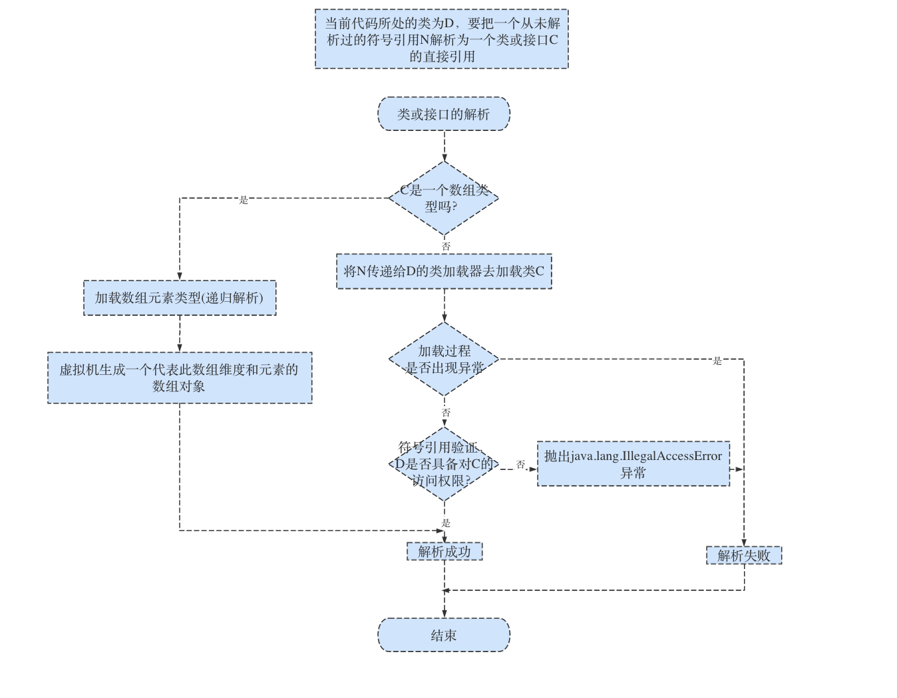
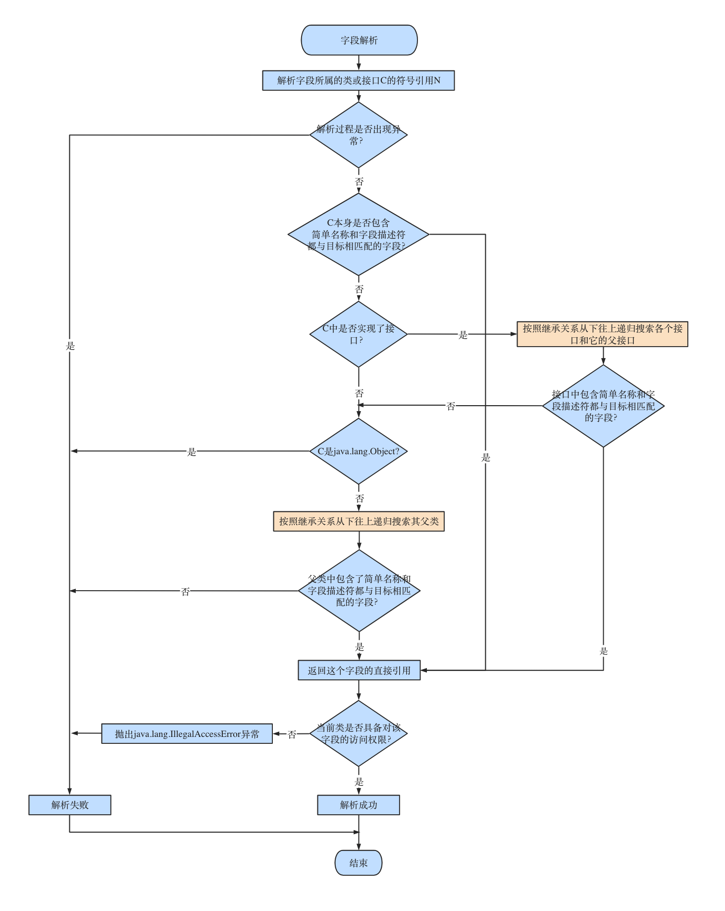
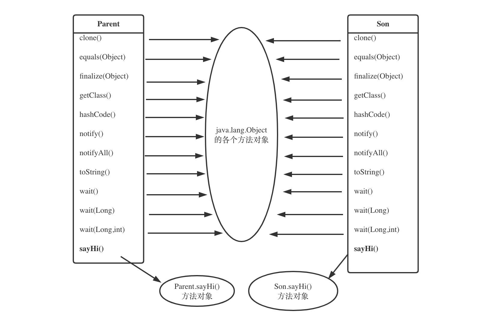
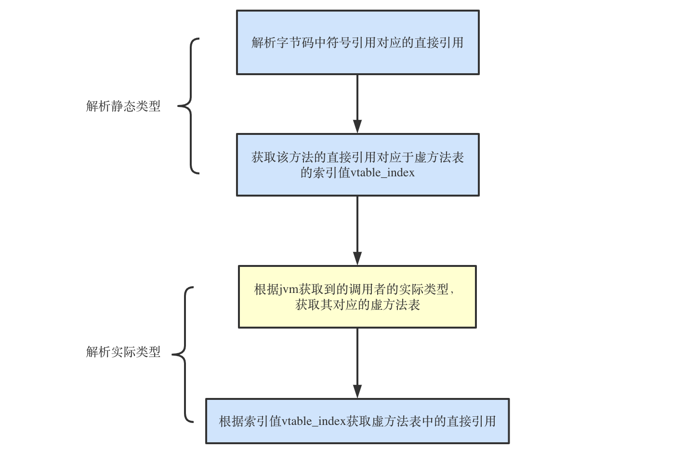

# 链接

[toc]

VM完成 Java 类加载之后，接着便开始进行链接。所谓链接，虽然与编译原理中的链接不是同一件事，然而本质上是相同的。总体而言，链接最主要的作用是将字节码指令中常量池中的符号引用转换为直接引用。链接包含 3 个步骤 ：验证、准备和解析

## 1 验证

其实在类加载阶段（也即类的生命周期的第一个阶段）JVM会对字节码文件进行验证，只不过该阶段的验证着重于字节码文件格式本身，与“链接”阶段的验证侧重点不同

在链接阶段，着重于由**字节码信息**出发进行反向验证，例如，验证根据字节码文件中的类名是否能够找到对应的类模板。这些都验证无误之后，JVM才能放心地加载当前类，也才能放心地将字节码指令中对常量池索引号的引用重写为直接引用

具体的验证主要是针对以下几点：

- **文件格式验证**，验证字节流是否符合Class文件规范，能否被当前版本虚拟机处理，如是否以魔数0xCAFEBABE开头，主次版本号是否受当前JVM支持等
- **元数据验证**，验证是否符合java语言规范, 对字节码描述的信息进行语义分析，如：这个类是否有父类（除了java.lang.Object之外，所有的类都应该父类，没有显式继承父类的类，都默认继承java.lang.Object类），这个类是否继承了不允许被继承的类，非抽象类是否实现了父类中或接口中的所有抽象方法，类中的字段、方法是否与父类产生矛盾等
- **字节码验证**，确保程序语义合法，符合逻辑，这是整个验证阶段过程中最复杂的一个阶段，主要是通过**数据流分析和控制流分析**，确定程序语义是合法的、符合逻辑的。在第二阶段的基础上，此阶段对类的方法体进行校验分析，保证被校验类不会在运行时作出危害虚拟机的行为，如：保证任意时刻操作数栈的数据类型与指令代码序列都能配合工作，保证任何跳转指令都不会跳转到方法体以外的字节码指令上等
- **符号引用验证**，确保下一步的解析能正常执行, 可以看作是对类自身以外（**常量池中的各种符号引用**）的各类信息进行匹配校验。如：符号引用种通过字符串描述的全限定名是否能找到对应的类，符号引用中的类、字段、方法、的可访问性是否可被当前类访问。


## 2 准备

接下来是准备阶段，这个很好理解，它最主要的作用在于**为静态变量在方法区分配内存，并设置默认初始值**

准备阶段为**静态变量**分配内存并设置变量的初始值，通常情况为该数据类型的“零值”。如果是final类静态变量，也可能在准备阶段直接赋值。注意此阶段内存分配仅包括静态变量，而实例变量会在对象实例化时随着对象一起分配在堆中


## 3 解析

解析是整个链接过程中的重中之重，本文会着重进行介绍

首先思考一个问题，字节码中的常量池里存放的都只是符号引用，那jvm是如何通过符号引用定位到真正的地址呢

这也是Java与c不同的地方，c语言将.c源文件编译成.o文件后，.o文件中的引用直接就是使用的分配好的虚拟地址，而java的class文件中引用就仅仅是一个描述性的符号，并没有保存最终的内存布局信息，那么引出两个问题

- java编译器如何保证能够让虚拟机**准确定位**到符号引用指向的实际引用**，**
- 虚拟机在什么时候将符号引用转为实际引用

> 符号引用：是以一组符号来描述所引用的目标，符号可以是任何形式的字面量，只要使用时能无歧义地定位到目标即可. 符号引用的目标不一定要加载到内存中.
>
> 直接引用：是直接指向目标的指针、相对偏移量或是一个能间接定位到目标的句柄. 如果有了直接引用，那引用的目标必定存在于内存中.

第一个问题在之前的章节也有提到，字节码文件中的**符号引用包含足够的信息**，以供jvm实际使用时可以找到相应的位置,比如：`“java/io/PrintStream.println:(Ljava/lang/String;)V”`，虚拟机就会将其转为实际引用,这个过程叫做**解析**，但是解析的时机并不是固定的

> 虚拟机规范中并没有明确规定解析阶段发生的具体时间，只要求了在执行 anewarray、checkcast、getfield、getstatic、instanceof、invokedynamic、invokeinterface、invokespecial、invokestatic、invokevirtual、ldc、ldc_w、multianewarray、new、putfield、putstatic 用于操作符号引用的字节码指令前，先对它们所使用的符号进行解析. 所以虚拟机实现可以根据需要来判断到底是在类被加载时就对常量池中的符号进行解析，还是等到一个符号将要被使用前才解析它.

那么可以明确一点，解析是将**符号引用转换成直接引用**的过程，再思考一个问题，符号引用一定是在编译期间就生成好的吗，有没有运行时生成的符号引用呢？答案是有的，Java的新特性---动态语言特性允许在运行时生成符号引用，所以我们可以把解析的目标分为编译时和运行时生成的符号引用两种

### 3.1 解析编译时生成的符号引用

在之前的章节里就有介绍过，常量池中的符号引用有许多种，那么对应的解析过程也各不相同，主要可以分为：

**类或接口的解析、方法符号的解析以及字段符号的解析**，重点在于方法符号的解析，下文将简单介绍一下类或接口的解析以及字段符号的解析，这两者不复杂比较好理解，然后重点介绍方法符号的解析

#### 3.1.1 类或接口的解析

如果当前处于类D代码中，要把一个未解析符号引用N解析为一个类或接口的直接引用C，大致需要三步：

- 如果C不是数组类型，那么将由D的类加载器根据N的全限定名区加载类C。在加载过程中可能触发其他相关类的加载，如父类或实现的接口，一旦失败， 解析过程就失败了
- 如果C是一个数组类型，如Integer数组类型，则N的描述符会是“[Ljava/lang/Integer”的形式，则会加载java.lang.Interger,接着由JVM生成一个代表该数组维度和元素的数组对象。
- 如果上两步通过，则C即成为一个实际有效的类或接口了，解析完成前，还需要验证D对C的访问权限，如果D不具备，抛出java.lang.IllegalAccessError异常。



#### 3.1.2 字段的解析

当解析一个字段的时候，首先会对字段所属的类C或接口的符号引用进行解析，一旦失败，则解析失败，如果解析成功，将会按照以下步骤解析类C的后续字段：

先在**类C自身**范围查找→失败则从下往上递归在**实现的接口**中查找→失败则从下往上递归在**继承的父类**中查找，仍然失败则抛出java.lang.NoSuchFieldError异常。如果查找成功返回了引用，则进行权限验证，验证失败则抛出java.lang.IllegalAccessError异常。

在实际情况中，虽然查找的范围是依次进行，但是如果一个字段在父类或实现的接口中多次出现，按照规则依然可以保证唯一性，但是多数编译器会拒绝编译代码。



#### 3.1.3 方法的解析

根据方法的类型，可以将方法的解析分为**非虚方法的解析**与**虚方法的解析**，二者的区别在于虚方法的解析是**运行时可变**的，而非虚方法的解析是**运行时不可变**的

非虚方法包括：**静态方法、私有方法、实例构造方法、父类方法**，除此之外都是虚方法

这里要注意一点，虽然**final方法**在规范中是定义为虚方法的，走的也是虚方法的解析流程，但是实际上，它运行时也是不可变的，详情见 3.1.3.2.2 小节

> Java 字节码中与调用相关的指令共有五种:
> invokestatic：用于调用静态方法
> invokespecial：用于调用私有实例方法、构造器，以及使用 super 关键字调用父类的实例方法或构造器，和所实现接口的默认方法
> invokevirtual：用于调用非私有实例方法
> invokeinterface：用于调用接口方法
> invokedynamic：用于调用动态方法

##### 3.1.3.1 非虚方法的解析

从字节码的角度来看，非虚方法的的调用对应` invokestatic` 和` invokespecial` 指令

按照jvm规范，非虚方法的解析只要在调用方法之前能解析出来就行

但是在实际的jvm实现中，对于非虚方法，由于其**运行时不可变**，通常会将其在类加载过程中便进行解析

接下来介绍具体的解析流程：

- 在本类中根据方法符号引用来找到匹配的方法
- 如果找不到，就去向上递归地在父类中找
- 还找不到，就递归地从实现的接口中找

整体的解析流程还是比较清晰的，那么具体是怎么个找法呢，其实也很简单：

在之前对字节码的介绍中，我们知道它有着**方法表**这个一个区域，当其加载到了jvm内存之后就进了**方法区**，其抽象结构都是类似的，那我们就可以遍历**类的方法列表**，根据符号引用找相匹配的方法，并返回它的直接引用

**感兴趣的**可以看看以下**HotSpot VM 解析逻辑**的具体实现，源码的注释比较清晰

这是解析方法的外层逻辑：

```c++
methodHandle LinkResolver::resolve_method(const LinkInfo& link_info,
                                         Bytecodes::Code code, TRAPS) {

 Handle nested_exception;
 KlassHandle resolved_klass = link_info.resolved_klass();

 // 1. For invokevirtual, cannot call an interface method
 ...
 // 2. check constant pool tag for called method - must be JVM_CONSTANT_Methodref
 ...
 // 3. lookup method in resolved klass and its super klasses
 methodHandle resolved_method = lookup_method_in_klasses(link_info, true, false, CHECK_NULL);
 // 4. lookup method in all the interfaces implemented by the resolved klass
 if (resolved_method.is_null() && !resolved_klass->is_array_klass()) { // not found in the class hierarchy
   resolved_method = lookup_method_in_interfaces(link_info, CHECK_NULL);
   if (resolved_method.is_null()) {
     // JSR 292:  see if this is an implicitly generated method MethodHandle.linkToVirtual(*...), etc
     resolved_method = lookup_polymorphic_method(link_info, (Handle*)NULL, (Handle*)NULL, THREAD);
     if (HAS_PENDING_EXCEPTION) {
       nested_exception = Handle(THREAD, PENDING_EXCEPTION);
       CLEAR_PENDING_EXCEPTION;
     }
   }
 }
 // 5. method lookup failed
 ...
 // 6. access checks, access checking may be turned off when calling from within the VM.
 ...
 return resolved_method;
}
```

这是具体从一个类中匹配方法的逻辑：

```c++
int InstanceKlass::find_method_index(const Array<Method*>* methods,
                                    const Symbol* name,
                                    const Symbol* signature,
                                    OverpassLookupMode overpass_mode,
                                    StaticLookupMode static_mode,
                                    PrivateLookupMode private_mode) {
 const bool skipping_overpass = (overpass_mode == skip_overpass);
 const bool skipping_static = (static_mode == skip_static);
 const bool skipping_private = (private_mode == skip_private);
 const int hit = binary_search(methods, name);
 if (hit != -1) {
   const Method* const m = methods->at(hit);
   // Do linear search to find matching signature.  First, quick check
   // for common case, ignoring overpasses if requested.
   if (method_matches(m, signature, skipping_overpass, skipping_static, skipping_private)) {
         return hit;
   }
   // search downwards through overloaded methods
   int i;
   for (i = hit - 1; i >= 0; --i) {
       const Method* const m = methods->at(i);
       assert(m->is_method(), "must be method");
       if (m->name() != name) {
         break;
       }
       if (method_matches(m, signature, skipping_overpass, skipping_static, skipping_private)) {
         return i;
       }
   }
   // search upwards
   for (i = hit + 1; i < methods->length(); ++i) {
       const Method* const m = methods->at(i);
       assert(m->is_method(), "must be method");
       if (m->name() != name) {
         break;
       }
       if (method_matches(m, signature, skipping_overpass, skipping_static, skipping_private)) {
         return i;
       }
   }
   // not found
	...
 return -1;
}
```


##### 3.1.3.2 虚方法的解析

从字节码的角度来看，非虚方法的的调用对应` invokevirtual` 和` invokeinterface` 指令，之前说到，虚方法的解析是**运行时可变**的，这其实对应的是Java的**多态特性**

有个问题需要搞清楚，为什么说虚方法的解析是运行时可变的？明明代码都写好了，为什么一定要在运行时才能确定？不理解的话看以下这段代码就清楚了：

Son和Daughter类继承于Parent类，均重写了sayHi()方法：

```java
public Class Parent{
		void sayHi(){}
}
public Class Son extends Parent{
    @override
  	void sayHi(){}
}
public Class Daughter extends Parent{
  	@override
  	void sayHi(){}
}
```

再看这段函数：

```java
public void test(){
	Parent people = new Parent（）；
  Random r = new Random();
  //获取0-9之间的随机数
  int number = r.nextInt(10);
  if（number%2 ==1）{
    people = new Son();
  }else{
    people = new Daughter();
  }
  people.sayHi();
}
```

可以看到，虽然代码已经确定了，但 `people.sayHi()`到底调用的是Son类的sayHi()方法还是Daughter类的sayHi()方法呢？**不到运行时是确定不了的**

再看`people.sayHi()`这条代码对应的字节码：

```
9: invokevirtual #7                  // Method Parent.sayHi:()V
```

可以看出，其**符号引用**其实指向的是**父类方法引用**`Parent.sayHi:()V`,那么jvm是怎么在运行时知道**真正应该调用的方法**呢？接下来具体介绍非虚方法的解析过程

非虚方法的解析过程总体上可以分为两个步骤：

- **第一步：解析静态类型**

  这一步与非虚方法的解析过程是基本一致的，以上述例子来看，就是将`Parent.sayHi:()V`解析成了直接引用，但是显然，这不是最终jvm需要的直接引用

- **第二步：解析实际类型**

  根据第一步获得的静态类型的直接引用，通过**虚方法表**和**运行时的调用者类型**获取实际类型的直接引用

下面重点介绍第二步是如何**解析实际类型**的，首先介绍一下**虚方法表**

###### 3.1.3.2.1 虚方法表

熟悉C++的同学，应该对虚方法表这个概念不会陌生，实际上，C++中也有虚方法表这个概念，它是动态绑定技术（多态）的核心，而Java的虚方法表与C++的虚方法本质上原理都一样，下面开始介绍Java的虚方法表

针对于invokevirtual指令，虚拟机会在类的方法区建立一个虚方法表的数据结构(virtual method table,**vtable**)，针对于invokeinterface指令来说，虚拟机会建立一个叫做接口方法表的数据结构(interface method table,**itable**)，二者机制基本一致，下文将以虚方法表为例进行介绍

虚方法表会在**类加载过程中**初始化，虚方法表存储的是该类方法入口的一个映射，比如父类的方法A的索引号是1，方法B的索引号是2

- 如果子类继承了父类，但是某个父类的方法没有被子类重写，那么在子类的方法表里边，该方法对应映射指向的是**父类方法的入口**
- 如果子类重写了父类的方法，那么在子类的方法表里边，该方法对应映射指向的是**子类方法的入口**，这里要注意一点，该方法在子类和父类虚方法表中的**索引号是一致的**

在**Hotspot**中，vtable用一个klassVtable类型表示，klassVtable对象提供了一种对vtable较为便捷的访问方式，并未实际持有vatble数据，其成员如下：

```c++
class klassVtable : public ResourceObj {
  KlassHandle  _klass;            // my klass
  int          _tableOffset;      // offset of start of vtable data within klass
  int          _length;           // length of vtable (number of entries)
}
```

其中，`_klass`指向所在类，`_tableOffset`表示vtable在klass中的地址偏移量，`_length`表示vtable的长度

vtable表是有一组变长连续的**vtableEntry**元素构成的数组，其中每个vtableEntry指向类的一个函数(Method*)

在类初始化vtable表时，虚拟机将复制父类的虚函数表，然后根据自己的函数定义更新vtableEntry(重写)，或向vatble表增加新的元素（父类没有的方法）：

- 若java方法时**重写**父类方法，虚拟机将更新虚函数表中**相同顺序**的元素，使其指向重写后的实现方法

  这一点非常重要，保证了对于相同的方法，出现在父类和子类的vtable中的顺序是一样的，那么有什么用呢？试想一下，如果已经知道了**父类方法**在vtable中的顺序，那只要再拿到子类的vtable，岂不是就能直接拿到**子类方法**了，而不用再走一次查找过程

- 若是**重载**方法，或者自身新增的方法，虚拟机将按顺序添加到虚函数中



上图是上文java代码中，Parent类和Son类生成的**虚方法表**模型，用于辅助理解

###### 3.1.3.2.2 运行时的调用者类型

了解了虚方法表，整个虚方法的解析过程就呼之欲出了，如下图所示，但还差最后一块拼图—在**运行时**获取调用者的实际类型



直接从Hotspot源码看**解析动态类型**的函数，代码很短，但是很重要也很容易理解：

```C++
void LinkResolver::runtime_resolve_virtual_method(CallInfo& result,
                                                 const methodHandle& resolved_method,
                                                 KlassHandle resolved_klass,
                                                 Handle recv,
                                                 KlassHandle recv_klass,
                                                 bool check_null_and_abstract,
                                                 TRAPS) {
  ...
    //根据解析静态类型得到的方法直接引用，获取它在虚方法表中的索引vtable_index
  	vtable_index = resolved_method->vtable_index();
   // We could get a negative vtable_index for final methods,
   // because as an optimization they are they are never put in the vtable,
   // unless they override an existing method.
   // If we do get a negative, it means the resolved method is the the selected
   // method, and it can never be changed by an override.
   // 如果是final方法，直接返回静态类型的方法直接引用
   if (vtable_index == Method::nonvirtual_vtable_index) {
     assert(resolved_method->can_be_statically_bound(), "cannot override this method");
     selected_method = resolved_method;
   } else {
     //从运行时调用者类的虚方法表中根据vtable_index取出方法直接引用
     selected_method = methodHandle(THREAD, recv_klass->method_at_vtable(vtable_index));
   }
  ...
}
```

函数入参中，`resolved_method`就是**解析静态类型**后得到的**方法**直接引用，`resolved_klass`就是**运行时调用者类**的直接引用：

- 根据解析静态类型得到的方法直接引用，获取它在虚方法表中的索引`vtable_index`

- 如果是`final`方法，直接返回静态类型的方法直接引用

  从源码注释里可以看出，尽管final方法被划分在虚方法里，但是在语义上它是不能被重写的，所以只是表面上进行了这么一次动态解析，实际上是将**静态解析**得到的直接引用返回了

- 从**运行时调用者类**的虚方法表中根据`vtable_index`取出方法直接引用

至此，虚方法的解析过程就介绍完了


### 3.2 解析运行时生成的符号引用


