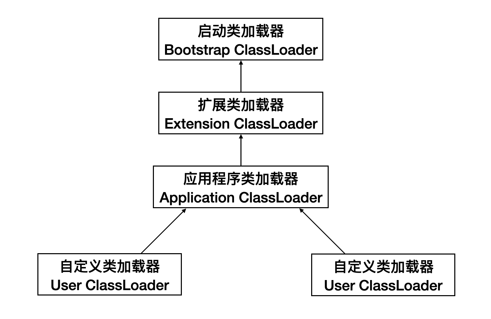

# 加载

### 加载的过程

加载是类加载（Class Loading）过程的一个阶段，在加载阶段，虚拟机需要完成以下3件事情：

1）通过一个类的全限定名来获取定义此类的二进制字节流；

2）将这个字节流所代表的静态存储结构转化为方法区的运行时数据结构；

3）在内存中生成一个代表这个类的java.lang.Class对象，作为方法区这个类的各种数据的访问入口。

注意：“通过一个类的全限定名来获取定义此类的二进制字节流”这条，它没有指明二进制字节流要从一个Class文件中获取，比如它还可以从Jar包中获取、从网络中获取（最典型的应用便是Applet）、由其他文件生成（JSP应用）等。

相对于类加载的其他阶段而言，加载阶段（准确地说，是加载阶段获取类的二进制字节流的动作）是可控性最强的阶段，因为开发人员既可以使用系统提供的类加载器来完成加载，也可以自定义自己的类加载器来完成加载。

加载阶段完成后，虚拟机外部的 二进制字节流就按照虚拟机所需的格式存储在方法区之中，方法区中的数据存储格式由虚拟机实现自行定义，虚拟机规范未规范此区域的具体数据结构。然后在Java堆内存中实例化一个java.lang.Class类的对象，这个对象将作为程序访问方法区中的这些类型数据的外部接口。

### 类加载器

“通过一个类的全限定名来获取定义此类的二进制字节流”这个动作是在Java虚拟机外部实现的，目的是让应用程序可以自己决定如何获取所需要的类。实现这个动作的代码模块称为“类加载器”。类加载器在类层次划分、OSGi、热部署、代码加密等领域有着广泛的应用。

#### 类与类加载器

类加载器虽然只用于实现类的加载动作，但它在Java程序中起到的作用却远远不限于类的加载阶段。对于任意一个类，都需要由它的类加载器和这个类本身一同确定其在就Java虚拟机中的唯一性，也就是说，即使两个类来源于同一个Class文件，只要加载它们的类加载器不同，那这两个类就必定不相等。这里的“相等”包括了代表类的Class对象的equals()、isAssignableFrom()、isInstance()等方法的返回结果，也包括了使用instanceof关键字对对象所属关系的判定结果。

#### 双亲委派模型

从Java虚拟机的角度来讲，只存在两种不同的类加载器：

1）启动类加载器（Bootstrap ClassLoader）：它使用C++实现（这里仅限于Hotspot，也就是JDK1.5之后默认的虚拟机，有很多其他的虚拟机是用Java语言实现的），是虚拟机自身的一部分；

2）所有其他的类加载器：这些类加载器都由Java语言实现，独立于虚拟机之外，并且全部继承自抽象类java.lang.ClassLoader，这些类加载器需要由启动类加载器加载到内存中之后才能去加载其他的类。

 站在Java开发人员的角度来看，类加载器可以大致划分为以下三类：

1）启动类加载器：Bootstrap ClassLoader，跟上面相同。它负责加载存放在JDK\jre\lib(JDK代表JDK的安装目录，下同)下，或被-Xbootclasspath参数指定的路径中的，并且能被虚拟机识别的类库（如rt.jar，所有的java.*开头的类均被Bootstrap ClassLoader加载）。启动类加载器是无法被Java程序直接引用的；

2）扩展类加载器：Extension ClassLoader，该加载器由sun.misc.Launcher$ExtClassLoader实现，它负责加载JDK\jre\lib\ext目录中，或者由java.ext.dirs系统变量指定的路径中的所有类库（如javax.*开头的类），开发者可以直接使用扩展类加载器；

3）应用程序类加载器：Application ClassLoader，该类加载器由sun.misc.Launcher$AppClassLoader来实现，它负责加载用户类路径（ClassPath）所指定的类，开发者可以直接使用该类加载器，如果应用程序中没有自定义过自己的类加载器，一般情况下这个就是程序中默认的类加载器。

应用程序都是由这三种类加载器互相配合进行加载的，如果有必要，我们还可以加入自定义的类加载器。这几种类加载器的层次关系如下图所示：



上图也称为双亲委派模型（Parents Delegation Model）。双亲委派模型要求除了顶层的启动类加载器外，其余的类加载器都应当有自己的父类加载器。这里类加载器之间的父子关系一般不会以继承（Inheritance）的关系来实现，而是都是用组合（Composition）关系来复用父加载器的代码。双亲委派模型的工作过程是：如果一个类加载器收到了类加载的请求，它首先不会自己去尝试加载这个类，而是把这个请求委派给父类加载器去完成，每一个层次的类加载器都是如此，因此所有的请求最终都会传送到顶层的启动类加载器中，只有当父加载器反馈自己无法完成这个加载请求（它的搜索范围中没有找到所需的类）时，子加载器才会尝试自己去加载。

使用双亲委派模型来组织类加载器之间的关系，有一个很明显的好处，就是Java类随着它的类加载器一起具备了一种带有优先级的层次关系，这对于保证Java程序的稳定运作很重要。例如，类java.lang.Object类存放在JDK\jre\lib下的rt.jar之中，因此无论是哪个类加载器要加载此类，最终都会委派给启动类加载器进行加载，因此Object类在程序中的各种类加载器环境中都是同一个类。相反，如果没有使用双亲委派模型，由各个类加载器自行去加载的话，如果用户自己编写了一个称为java.lang.Object的类，并放在程序的ClassPath中，那系统中将会出现多个不同的Object类，Java类型体系中最为基础的行为也就无法保证。

#### 破坏双亲委派模型

在实际的应用中双亲委派解决了java 基础类统一加载的问题，**但是因为类加载器受到加载范围的限制，在某些情况下父类加载器无法加载到需要的文件，这时候就需要委托子类加载器去加载class文件**。所以一些破坏双亲委派的情况也时有发生。

##### JDBC破坏双亲委派模型

JDBC的Driver接口定义在JDK中，其实现由各个数据库的服务商来提供，比如MySQL驱动包。DriverManager 类中要加载各个实现了Driver接口的类，然后进行管理，但是DriverManager位于 JAVA_HOME中jre/lib/rt.jar 包，由BootStrap类加载器加载，而其Driver接口的实现类是位于服务商提供的 Jar 包，**根据类加载机制，当被装载的类引用了另外一个类的时候，虚拟机就会使用装载第一个类的类装载器装载被引用的类。**也就是说BootStrap类加载器还要去加载jar包中的Driver接口的实现类。我们知道，BootStrap类加载器默认只负责加载 JAVA_HOME中jre/lib/rt.jar 里所有的class，所以需要由子类加载器去加载Driver实现，这就破坏了双亲委派模型。

查看DriverManager类的源码，看到在使用DriverManager的时候会触发其静态代码块，调用 loadInitialDrivers() 方法，并调用ServiceLoader.load(Driver.class) 加载所有在META-INF/services/java.sql.Driver 文件里边的类到JVM内存，完成驱动的自动加载。

```
static {
    loadInitialDrivers();
    println("JDBC DriverManager initialized");
}

private static void loadInitialDrivers() {
    AccessController.doPrivileged(new PrivilegedAction<Void>() {
        public Void run() {
            ServiceLoader<Driver> loadedDrivers = ServiceLoader.load(Driver.class);
            Iterator<Driver> driversIterator = loadedDrivers.iterator();

            try{
                while(driversIterator.hasNext()) {
                    driversIterator.next();
                }
            } catch(Throwable t) {
            // Do nothing
            }
            return null;
        }
    });
}
```

```
public static <S> ServiceLoader<S> load(Class<S> service) {
    ClassLoader cl = Thread.currentThread().getContextClassLoader();
    return ServiceLoader.load(service, cl);
}
```

这个子类加载器是通过 Thread.currentThread().getContextClassLoader() 得到的线程上下文加载器。那么这个上下文类加载器又是什么呢？

```
public Launcher() {
    ...
    try {
        this.loader = Launcher.AppClassLoader.getAppClassLoader(var1);
    } catch (IOException var9) {
        throw new InternalError("Could not create application class loader", var9);
    }
    Thread.currentThread().setContextClassLoader(this.loader);
    ...
}
```

可以看到，在 sun.misc.Launcher 初始化的时候，会获取AppClassLoader，然后将其设置为上下文类加载器，所以**线程上下文类加载器默认情况下就是应用程序类加载器**。


