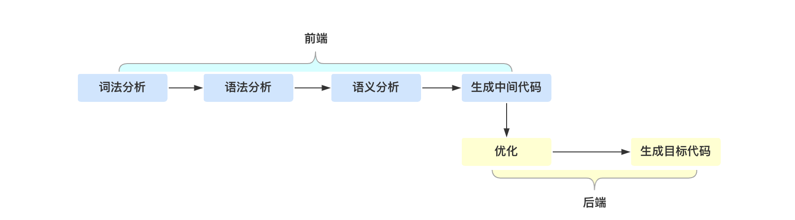
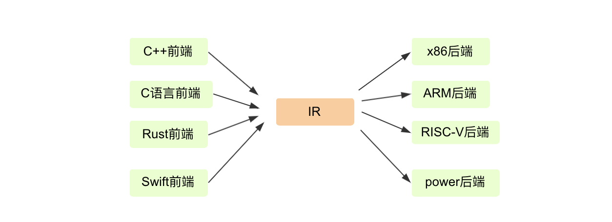
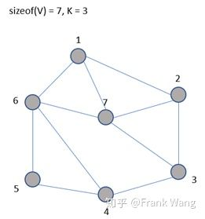

# 符号编译

[toc]

编译原理是这么描述编译的：将某一种语言（源语言）编写的程序，翻译成为一个等价的、用另一种语言（目标语言）编写的程序，那么对于java而言，编译就是将java代码翻译成字节码的过程，

## 1 编译技术

在介绍java语言的编译之前，首先从抽象的语言层面来介绍编译技术，以下是一个编译器的整个编译过程：

在编译原理里，将整个编译过程分成了**前端（Front End）**和**后端（Back End）**部分，这里的前端指的是编译器对**程序代码的分析和理解**过程，它通常只跟**语言的语法**有关，跟目标机器无关；而与之对应的后端则是**生成目标代码的过程**，跟目标机器无关

本文着重介绍**前端技术**，后端部分在后文会再次提到，可以看出，编译器的前端技术分为**词法分析、语法分析、语义分析、生成中间代码**三个部分，主要涉及自动机和形式语言方面的基础计算理论

### 1.1 前端技术

#### 1.1.1 词法分析

通常，编译器的第一项工作叫做词法分析，就像阅读文章一样，文章是由一个个的中文单词组成的。程序处理也一样，只不过这里不叫单词，而是叫做“词法记号”，英文叫 Token

举个例子，看看下面这段代码，如果我们要读懂它，首先要怎么做呢？

```c++
#include <stdio.h>
int main(int argc, char* argv[]){
    int age = 45;
    if (age >= 17+8+20) {
        printf("Hello old man!\\n");
    }
    else{
        printf("Hello young man!\\n");
    }
    return 0;
}
```

我们会识别出 if、else、int 这样的关键字，main、printf、age 这样的标识符，+、-、= 这样的操作符号，还有花括号、圆括号、分号这样的符号，以及数字字面量、字符串字面量等，这些都是 **Token**

那么，如何写一个程序来识别 Token 呢？在英文内容中，通常会使用空格和标点把单词分开，方便读者阅读和理解，但在计算机程序中，仅仅用空格和标点分割是不行的，比如“age >= 45”应该分成“age”，“>=”，“45”这三个 Token，但在代码里它们可以是连在一起的，中间没有空格

所以最开始的一步就是指定规则来将Token分割开，这就有点像自然语言处理里的分词了，我们可以设置一些简单的规则来进行区分，比如：

- **识别 age 这样的标识符**，它以字母开头，后面可以是字母或数字，直到遇到第一个既不是字母又不是数字的字符时结束。
- **识别 >= 这样的操作符**，当扫描到一个 > 字符的时候，就要注意，它可能是一个 GT（Greater Than，大于）操作符。但由于 GE（Greater Equal，大于等于）也是以 > 开头的，所以再往下再看一位，如果是 =，那么这个 Token 就是 GE，否则就是 GT。
- **识别 45 这样的数字字面量**，当扫描到一个数字字符的时候，就开始把它看做数字，直到遇到非数字的字符。

这些规则可以通过手写程序来实现，事实上，很多编译器的词法分析器都是手写实现的，例如 GNU 的 C 语言编译器

也有一些工具能够用来生成词法分析器，比如 Lex（或其 GNU 版本，Flex），这些生成工具是基于一些规则来工作的，这些规则用“正则文法”表达，符合正则文法的表达式称为“正则表达式”，生成工具可以读入正则表达式，然后生成一种叫“有限自动机”的算法，来完成具体的词法分析工作

>有限自动机（finite automaton），也叫有限状态机（finite state machine），是一台极简的计算机模型。下面是一个非常简单的有限自动机：
>
>

> - a被称之为**输入**；圆圈1和2我们称之为**状态**，
> - 其中1为**起始状态**，2为**接受状态**；
> - 在状态1的时候输入了a，此时会转移到状态2，这种转移我们可以称之为**转移规则**；
> - 如果一系列的输入能够使得一台有限自动机**最终处于接受状态**，那么这个输入是可以被这台有限自动机接受的，这个输入的内容可以称之为这台有限自动机的正则语言；否则，这种输入就是被该有限自动机**拒绝**的；

有限自动机是**有限个状态**的自动机器, 对于词法分析器来说，它分析整个程序的字符串，当遇到不同的字符时，会驱使它**迁移到不同的状态**。例如，词法分析程序在扫描 age 的时候，处于“标识符”状态，等它遇到一个 > 符号，就切换到“比较操作符”的状态。词法分析过程，就是这样一个个**状态迁移**的过程


#### 1.1.2 语法分析

编译器下一个阶段的工作是语法分析,词法分析是识别一个个的单词，而语法分析就是在词法分析的基础上识别出程序的语法结构。这个结构是一个**树状结构**，是计算机容易理解和执行的

以自然语言为例。自然语言有定义良好的语法结构，比如，"我吃了又难吃又贵的外卖"，这个句子包含了“主、谓、宾”三个部分。主语是“我”，谓语是“吃了”，宾语部分是“又难吃又贵的外卖”。其中宾语部分又可以拆成两部分，“又难吃又贵”是定语部分，用来修饰“外卖”。定语部分又可以分成“难吃”和“贵”两个最小的单位。

这样拆下来，会构造一棵树，里面的每个子树都有一定的结构，而这个结构要符合语法，比如，汉语是用“主谓宾”的结构，日语是用“主宾谓”的结构。这时，我们说汉语和日语的语法规则是不同的。


程序也有定义良好的语法结构，它的语法分析过程，就是构造这么一棵树，一个程序就是一棵树，这棵树叫做**抽象语法树**（Abstract Syntax Tree，AST），树的每个节点（子树）是一个语法单元，这个单元的构成规则就叫“语法”，每个节点还可以有下级节点

层层嵌套的树状结构，是我们对计算机程序的直观理解。计算机语言总是一个结构套着另一个结构，大的程序套着子程序，子程序又可以包含子程序，接下来，我们直观地看一下这棵树长什么样子, 以一段简单的js代码举例，生成的AST如下（一个生成AST的网址：https://resources.jointjs.com/demos/javascript-ast）

```js
var a = 42;
function addA() {
    return a + 1;
}
```


可以看到，生成的语法树里包含了11个节点，16个token

**形成 AST 以后有什么好处呢**？就是计算机很容易去处理。比如，针对表达式形成的树，从根节点遍历整棵树就可以获得表达式的值，如果再把循环语句、判断语句、赋值语句等节点加到 AST 上，并解释执行它，那么实际上就实现了一个脚本语言，而执行脚本语言的过程，就是**遍历 AST** 的过程

**那么怎样写程序来构造AST呢**？一种非常直观的构造思路是自上而下进行分析。首先构造根节点，代表整个程序，之后向下扫描 Token 串，构建它的子节点。当它看到一个 int 类型的 Token 时，知道这儿遇到了一个变量声明语句，于是建立一个“变量声明”节点；接着遇到 age，建立一个子节点，这是第一个变量；之后遇到 =，意味着这个变量有初始化值，那么建立一个初始化的子节点；最后，遇到“字面量”，其值是 45。这样，一棵子树就扫描完毕了。程序退回到根节点，开始构建根节点的第二个子节点。这样递归地扫描，直到构建起一棵完整的树

这个算法就是非常常用的**递归下降算法**（Recursive Descent Parsing），递归下降算法是一种自顶向下的算法，与之对应的，还有**自底向上**的算法。这个算法会先将最下面的叶子节点识别出来，然后再组装上一级节点。有点儿像搭积木，我们总是先构造出小的单元，然后再组装成更大的单元。

#### 1.1.3 语义分析

讲完了词法分析、语法分析，编译器接下来做的工作是**语义分析**,说白了，语义分析就是要让计算机理解我们的真实意图，把一些模棱两可的地方消除掉

以“You can never drink too much water.” 这句话为例。它的确切含义是什么？是“你不能喝太多水”，还是“你喝多少水都不嫌多”？实际上，这两种解释都是可以的，我们只有联系上下文才能知道它的准确含义。

理解自然语言的含义是很难的，但是计算机语言的语义分析没那么复杂，因为计算机语言的语义一般可以表达为一些规则，只需要检查是否符合这些规则就行了。比如：

- 某个表达式的计算结果是什么数据类型？
- 如果有数据类型不匹配的情况，是否要做自动转换？
- 如果在一个代码块的内部和外部有相同名称的变量，我在执行的时候到底用哪个？

语义分析工作的某些成果，会作为属性标注在抽象语法树上，比如在 age 这个标识符节点和 45 这个字面量节点上，都会标识它的数据类型是 int 型的

在这个树上还可以标记很多属性，有些属性是在之前的两个阶段就被标注上了，比如所处的源代码行号，这一行的第几个字符，这样，在编译程序报错的时候，就可以比较清楚地了解出错的位置

做了这些属性标注以后，编译器在后面就可以依据这些信息生成目标代码了

#### 1.1.4 生成中间代码（IR）

前几步的重点，是让编译器能够读懂程序，让无结构的代码文本经处理以后就变成了 Token、AST 和语义属性、符号表等结构化的信息，接下来，我们需要继续把程序编译成机器能读懂的代码，并高效运行。

理论上，经过词法、语法、语义分析之后，编译器已经读懂了程序，那么是可以直接将AST给输出成汇编代码，并编译成可执行文件的

**但是问题在于**，写汇编很核心的一点就是要关心 **CPU 和内存**这样具体的硬件。比如，你需要了解不同的 **CPU 指令集**的差别，你还需要知道 CPU 是 64 位的还是 32 位的，有几个**寄存器**，每个寄存器可以用于什么指令，等等，这样导致的问题是，每种语言，针对每种不同的硬件，都要生成不同的汇编代码

所以，为了降低后端工作量，提高软件复用度，就需要引入**中间代码（Intermediate Representation，IR）**的机制，它是**独立于具体硬件**的一种代码格式。各个语言的前端可以先翻译成 IR，然后再从 IR 翻译成不同硬件架构的汇编代码。如果有 n 个前端语言，m 个后端架构，本来需要做 m*n 个翻译程序，现在只需要 m+n 个了。这就大大降低了总体的工作量。



其实，IR 这个词直译成中文，是“**中间表示方式**”的意思，不一定非是像汇编代码那样的一条条的指令，所以，AST 其实也可以看做一种 IR

每种 IR 的目的和用途是不一样的：

- AST 主要用于前端的工作
- Java 的字节码，是设计用来在虚拟机上运行的
- LLVM 的中间代码，主要是用于做代码翻译和编译优化的


**总结一下前端部分的重点内容**：

- **词法分析**是把程序分割成一个个 Token 的过程，可以通过构造有限自动机来实现

- **语法分析**是把程序的结构识别出来，并形成一棵便于由计算机处理的抽象语法树。可以用递归下降的算法来实现

- **语义分析**是消除语义模糊，生成一些属性信息，让计算机能够依据这些信息生成代码

- **生成中间代码**是生成机器无关的代码，不涉及具体的硬件架构

  

### 1.2 后端技术

编译器后端的最终结果，就是生成目标代码。如果目标是在计算机上直接运行，就像 C 语言程序那样，那这个目标代码指的是汇编代码

在编译器前端技术中，已经将各种语言翻译成了中间代码，后端只要再针对每一种目标架构，通过一个程序将中间代码翻译成相应的汇编代码就可以了，但是其中还穿插着很重要步骤，就是**代码分析和优化**

#### 1.2.1 代码分析和优化

生成正确的、能够执行的代码比较简单，可这样的代码执行效率很低

因为直接翻译生成的代码往往不够简洁，比如会生成大量的临时变量，指令数量也较多，因为翻译程序首先照顾的是正确性，很难同时兼顾是否足够优化

另一方面，由于高级语言本身的限制和程序员的编程习惯，也会导致代码不够优化，不能充分发挥计算机的性能。所以我们一定要对代码做优化。程序员在比较各种语言的时候，一定会比较它们的性能差异。一个语言的性能太差，就会影响它的使用和普及。

优化工作又分为“**独立于机器的优化**”和“**依赖于机器的优化**”两种。

##### 1.2.1.1 独立于机器的优化

**独立于机器的优化**，是基于 IR 进行的，它可以通过对代码的分析，用更加高效的代码代替原来的代码，具体的优化策略有：局部优化和全局优化，常数折叠、拷贝传播、删除公共子表达式等等

```c++
int foo(){
    int a = 10*10;  //这里在编译时可以直接计算出100这个值
    int b = 20;     //这个变量没有用到，可以在代码中删除
    if (a>0){       //因为a一定大于0，所以判断条件和else语句都可以去掉
        return a+1; //这里可以在编译器就计算出是101
    }
    return a;
}
int a = foo(); //这里可以直接地换成 a=101;
```

上面的代码，通过优化，可以消除很多冗余的逻辑。这就好比你正在旅行，先从北京飞到了上海，然后又飞到厦门，最后飞回北京。然后你朋友问你现在在哪时，你告诉他在北京。那么他虽然知道你在北京，但并没有意识到你已经在几个城市折腾了一圈，因为他只关心你现在在哪儿，并不关心你的中间过程。 我们在给 a 赋值的时候，只需要知道这个值是 101 就行了。完全不需要在运行时去兜一大圈来计算

##### 1.2.1.2 依赖于机器的优化

**依赖于机器的优化**，则是依赖于硬件的特征。现代的计算机硬件设计了很多特性，以便提供更高的处理能力，比如并行计算能力，多层次内存结构（使用多个级别的高速缓存）等等。编译器要能够充分利用硬件提供的性能，比如 ：

- **寄存器优化**:对于频繁访问的变量，最好放在寄存器中，并且尽量最大限度地利用寄存器，不让其中一些空着，有不少算法是解决这个问题的，教材上一般提到的是染色算法；

- **充分利用高速缓存**。高速缓存的访问速度可以比内存快几十倍上百倍，所以我们要尽量利用高速缓存。比如，某段代码操作的数据，在内存里尽量放在一起，这样 CPU 读入数据时，会一起都放到高速缓存中，不用一遍一遍地重新到内存取。

- **并行**性。现代计算机都有多个内核，可以并行计算。我们的编译器要尽可能把充分利用多个内核的计算能力。 这在编译技术中是一个专门的领域

- **指令选择**。有的时候，CPU 完成一个功能，有多个指令可供选择。而针对某个特定的需求，采用 A 指令可能比 B 指令效率高百倍。比如 X86 架构的 CPU 提供 SIMD 功能，也就是一条指令可以处理多条数据，而不是像传统指令那样一条指令只能处理一条数据

- 其他优化。比如可以针对专用的 AI 芯片和 GPU 做优化，提供 AI 计算能力，等等

  下节会介绍一些具体的优化方案

#### 1.2.2 生成目标代码

我们的编译器模型的最后一个步骤是代码生成。它将以优化过的IR和相关的符号表信息为输入，输出语义等价的目标程序，代码生成器有三个主要任务:指令选择、寄存器分配和指派、以及指令排序：

- **指令选择**考虑的问题是选择适当的目标机指令来实现 IR 语句。
- **寄存器分配和指派**考虑的问题是把哪个值放在哪个寄存器中
- **指令排序**考虑的问题是按照什么顺序来安排指令的执行。

##### 1.2.2.1 指令选择

指令选择可能是一个大型的排列组合任务，对于像 CISC 这样的具有丰富寻址模式的机器尤其如此

我们可以把指令选择当作一个树重写问题来处理， 目标结令的树形表示已经在AST的生成过程中得到了有效使用，

##### 1.2.2.2 寄存器分配和指派

代码生成的关键问题之一是决定哪个值放在静个寄存器里。寄存器是目标机上运行速度最快的计算单元，但是我们通常没有足够的寄存器来存放所有的值。没有存放在寄存器中的值必须存放在内存中。使用寄存器的指令总是要比使用内存的指令短并且快。因此，有效利用寄存器非常重要

寄存器的使用经常被分解为两个子问题:

- 寄存器分配:对于源程序中的每个点，我们选择一组将被存放在寄存器中的变量 
- 寄存器指派:我们指定一个变量被存放在哪个寄存器中

 即使对于单寄存器机器，找到一个从寄存器到变量的最优指派也是很困难的，从数学上讲，这个问题是 NP完全的

> **NP完全**问题(**NP**-C问题)，是世界七大数学难题之一。 **NP**的英文全称是Non-deterministic Polynomial Complete的问题，即多项式复杂程度的非确定性问题。

可以把**寄存器分配问题抽象成图着色问题**，下面先简单介绍什么是图着色，有兴趣可以具体找资料了解

> 给定一个无向连通图，其中V为顶点集合{1, 2, …, n}，E为边集合。图着色问题即为用K种颜色为图的顶点着色，每个顶点着一种颜色。要求G的每条边相连的两个顶点着不同颜色。
>
> 以下图为例，图中顶点数为7，颜色数为3。
>
> 
>
> 下图是其中的一种着色方案，图中的每个顶点被着以不同的颜色，同一条边两端的顶点颜色不同。
>
> 
>
> 图着色算法一般采用m叉搜索树，搜索策略采用深度优先。约束条件是在节点<x1, x2, … , xk>处，顶点k+1的邻接表中节点已经用过的颜色不能再用；如果邻接表中节点已用过m种颜色，则节点k+1没法着色，从该节点回溯到其父节点

如果寄存器分配问题被抽象成图着色问题，那么图中的每个节点代表某个变量的活跃期或生存期（Live range）。活跃期定义是从变量第一次被定义（赋值）开始，到它下一次被赋值前的最后一次被使用为止。

两个节点之间的边表示这两个变量活跃期因为生命期（lifetime）重叠导致互相冲突或干涉。一般说来，如果两个变量在函数的某一点是同时活跃（live）的，它们就相互冲突，不能占有同一个寄存器。

##### 1.2.2.3 指令排序