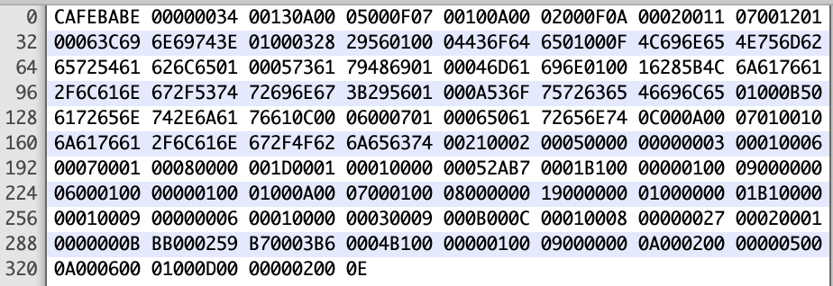
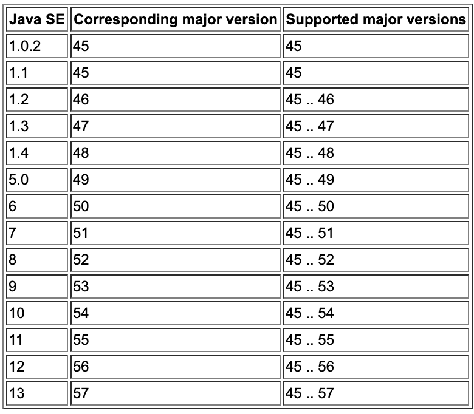

# 字节码

[toc]

上文从编译技术的角度对整个编译过程进行了介绍，本节将进一步对编译的结果**字节码**进行介绍，并结合几种常见的语义配合理解

## 1 编译前-java代码

```
public class Parent {
  public void sayHi(){
  }
 public static void main(String[] args) {
    new Parent().sayHi();
  }
}
```
那么从java语义上看，表达的意思大概就是：
1、有个public的Parent类 
2、这个类有个类方法叫sayHi 
3、类方法sayHi是个没有参数也没有返回值的public方法
4、main函数调用了sayHi函数
如同你画我猜一般，如何将这些意思精确的传递给jvm直到最终程序的运行呢

## 2.编译后-字节码
编译的过程就是将某一种语言编写的程序翻译成为一个等价的、用另一种语言编写的程序。那么对于java而言，编译就是将java代码翻译成字节码，具体过程在上文已有介绍，主要看编译的结果--字节码

通过javac Parent.java命令后得到Parent.class文件，它长这样:（mac可以用Hex Fiend查看）



也可以通过` javap -verbose Parent.class` 来查看处理后的字节码文件

```java
Classfile /Users/laitao/java_test/Parent.class
  Last modified May 31, 2020; size 333 bytes
  MD5 checksum 0a4deecbfc4288f5966493b8427fd743
  Compiled from "Parent.java"
public class Parent
  minor version: 0
  major version: 52
  flags: ACC_PUBLIC, ACC_SUPER
Constant pool:
   #1 = Methodref          #5.#15         // java/lang/Object."<init>":()V
   #2 = Class              #16            // Parent
   #3 = Methodref          #2.#15         // Parent."<init>":()V
   #4 = Methodref          #2.#17         // Parent.sayHi:()V
   #5 = Class              #18            // java/lang/Object
   #6 = Utf8               <init>
   #7 = Utf8               ()V
   #8 = Utf8               Code
   #9 = Utf8               LineNumberTable
  #10 = Utf8               sayHi
  #11 = Utf8               main
  #12 = Utf8               ([Ljava/lang/String;)V
  #13 = Utf8               SourceFile
  #14 = Utf8               Parent.java
  #15 = NameAndType        #6:#7          // "<init>":()V
  #16 = Utf8               Parent
  #17 = NameAndType        #10:#7         // sayHi:()V
  #18 = Utf8               java/lang/Object
{
  public Parent();
    descriptor: ()V
    flags: ACC_PUBLIC
    Code:
      stack=1, locals=1, args_size=1
         0: aload_0
         1: invokespecial #1                  // Method java/lang/Object."<init>":()V
         4: return
      LineNumberTable:
        line 1: 0

  public void sayHi();
    descriptor: ()V
    flags: ACC_PUBLIC
    Code:
      stack=0, locals=1, args_size=1
         0: return
      LineNumberTable:
        line 3: 0

  public static void main(java.lang.String[]);
    descriptor: ([Ljava/lang/String;)V
    flags: ACC_PUBLIC, ACC_STATIC
    Code:
      stack=2, locals=1, args_size=1
         0: new           #2                  // class Parent
         3: dup
         4: invokespecial #3                  // Method "<init>":()V
         7: invokevirtual #4                  // Method sayHi:()V
        10: return
      LineNumberTable:
        line 5: 0
        line 6: 10
}
SourceFile: "Parent.java"
```

短短几行java代码编译完后成了一长串，首先把Class文件的结构讲清楚就比较好理解了

### 2.1 Class文件结构

首先从整体上看Class文件的结构，这些模块都是按顺序排放的，下面会具体讲解

```
ClassFile {
    u4             magic;
    u2             minor_version;
    u2             major_version;
    u2             constant_pool_count;
    cp_info        constant_pool[constant_pool_count-1];
    u2             access_flags;
    u2             this_class;
    u2             super_class;
    u2             interfaces_count;
    u2             interfaces[interfaces_count];
    u2             fields_count;
    field_info     fields[fields_count];
    u2             methods_count;
    method_info    methods[methods_count];
    u2             attributes_count;
    attribute_info attributes[attributes_count];
}
```

#### 2.1.1 魔数

魔数：所有的.class字节码文件的前4个字节都是魔数，文件中魔数为：CAFEBABE，魔数值为固定值：0xCAFEBABE（咖啡宝贝），这个值的作用是是确定这个文件是否为一个能被虚拟机接受的Class文件。

#### 2.1.2 版本号

版本号：**魔数之后的4个字节**为Class文件版本信息，前两个字节表示**minor version**（次版本号），后两个字节表示**major version**（主版本号）。

从上图看，这里的版本号为00 00 00 34，换算成十进制（3 * 16 + 4 = 52），表示次版本号为0，主版本号为52，（可视化版本也能直接的看见这个信息）

所以，该文件的版本号为：1.8.0。可以通过`java -version`命令来验证这一点。Java的版本号是从45开始的，JDK1.0之后大的主版本号线上加1，如JDK1.1（45）、JDK1.2（46）以此类推JDK1.8（52）



#### 2.1.3 常量池

常量池（constant pool）：紧接着主版本号之后的就是常量池入口。

一个Java类中定义的很多信息都是由常量池来维护和描述的，可以将常量池看作是Class文件的资源仓库，比如说Java类中定义的方法与变量信息，都是存储在常量池中。由于常量池中常量的数量是不固定的，故在常量池入口需要放置一项u2类型的数据，代表常量池容量计数值（constant_pool_count）。

这里的容量计数是从1开始的，十六进制数为：0013，转换为十进制为19，但是Java字节码文件中constant_pool中只看到了18个常量，这是因为常量池数组中元素的个数 = 常量池数 - 1（其中0暂时不使用），之所以只有18个，目的是满足某些常量池索引值的数据在特定情况下需要表达「不引用任何一个常量池」的含义；根本原因在于，索引为0也是一个常量（保留常量），只不过它不位于常量表中，这个常量就对应null值

常量池中主要存储两类常量：

- **字面量：**字面量如文本字符串，Java中声明为final的常量值等。
- **符号引用：**类和接口的全局限定名，字段的名称和描述符，方法的名称和描述符等。

#### 2.1.4 访问标志

访问标志信息用于表示对类或接口的访问权限以及一些属性

Access_Flag访问标志结构表：

| Flag Name        | Value  | Interpretation                                               |
| ---------------- | ------ | ------------------------------------------------------------ |
| `ACC_PUBLIC`     | 0x0001 | Declared `public`; may be accessed from outside its package. |
| `ACC_FINAL`      | 0x0010 | Declared `final`; no subclasses allowed.                     |
| `ACC_SUPER`      | 0x0020 | Treat superclass methods specially when invoked by the *invokespecial* instruction. |
| `ACC_INTERFACE`  | 0x0200 | Is an interface, not a class.                                |
| `ACC_ABSTRACT`   | 0x0400 | Declared `abstract`; must not be instantiated.               |
| `ACC_SYNTHETIC`  | 0x1000 | Declared synthetic; not present in the source code.          |
| `ACC_ANNOTATION` | 0x2000 | Declared as an annotation type.                              |
| `ACC_ENUM`       | 0x4000 | Declared as an `enum` type.                                  |
| `ACC_MODULE`     | 0x8000 | Is a module, not a class or interface.                       |

Parent类十六进制字节码中的Access_Flag是`0x 00 21`

这个`0x 00 21`是访问标志结构表中的 `0x 00 20` 和` 0x 00 01` 的并集，表示 **ACC_PUBLIC** 与 **ACC_SUPER**。

#### 2.1.5 本类、父类、接口

访问标志之后的是**this_class**，对应十六进制为 `0x 00 032

在常量池项目类型中查找：

```
#2 = Class              #16            // Parent 
```

**this_class**之后的是**super_class**，对应十六进制为 `0x 00 05`

在常量池中查找：

```
#5 = Class              #18            // java/lang/Object
```

再之后是**实现的接口**，包括两部分，第一个是`interfaces_count`(接口个数)，第二部分`interfaces`(接口名)。

当前这个类对应的十六进制：`00 00` 转换为十进制仍然是0，说明当前这个类是没有实现任何接口的。

因此，这个interfaces接口表就不会再出现了。如果接口数量interfaces_count大于等于1的话，那么这个interfaces接口表是存在的。

#### 2.1.6 字段表

字段包括两部分，第一个是**fields_count**(字段个数)，第二部分**fields**(字段列表)。

当前这个类对应的十六进制：`00 00` 转换为十进制值为0，说明这个类内部没有字段。

字段表用于描述**类和接口中声明的变量**，这里的字段包含了**类级别变量以及实例变量**，但是不包括方法内部声明的局部变量。

字段描述结构：

```C++
field_info {
    u2             access_flags;
    u2             name_index;
    u2             descriptor_index;
    u2             attributes_count;
    attribute_info attributes[attributes_count];
}
```

第一个是access_flags访问标志符，如public、private、protected、final、abstract等等，具体如下表

| Flag Name       | Value  | Interpretation                                               |
| --------------- | ------ | :----------------------------------------------------------- |
| `ACC_PUBLIC`    | 0x0001 | Declared `public`; may be accessed from outside its package. |
| `ACC_PRIVATE`   | 0x0002 | Declared `private`; accessible only within the defining class and other classes belonging to the same nest ([§5.4.4](https://docs.oracle.com/javase/specs/jvms/se13/html/jvms-5.html#jvms-5.4.4)). |
| `ACC_PROTECTED` | 0x0004 | Declared `protected`; may be accessed within subclasses.     |
| `ACC_STATIC`    | 0x0008 | Declared `static`.                                           |
| `ACC_FINAL`     | 0x0010 | Declared `final`; never directly assigned to after object construction (JLS §17.5). |
| `ACC_VOLATILE`  | 0x0040 | Declared `volatile`; cannot be cached.                       |
| `ACC_TRANSIENT` | 0x0080 | Declared `transient`; not written or read by a persistent object manager. |
| `ACC_SYNTHETIC` | 0x1000 | Declared synthetic; not present in the source code.          |
| `ACC_ENUM`      | 0x4000 | Declared as an element of an `enum`.                         |

注意，`ACC_VOLATILE`是在这里描述的

第二个name_index是对常量池的一个索引，表示这个字段的非全限定名

第三个descriptor_index页是对常量池的一个索引，表示这个字段的描述符

attributes_count是字段附加属性的数量，如果值是0，后面的attributes也就不存在了。

#### 2.1.6 方法表

方法表同样包括两部分，第一个是**methods_count**(方法个数)，第二部分**methods**(方法列表)。

当前Parent类对应的十六进制：`00 02`转换为十进制值为2，说明这个类内部有三个方法，分别为：

sayHi()、main()，以及默认无参的构造方法Parent()

对于一个方法，其由method_info 结构所定义。在一个 Class 文件中，不会有两个方法同时具有相同的方法名和描述符。

method_info 结构格式如下:

```c++
method_info {
    u2 access_flags;
    u2 name_index; 
    u2 descriptor_index;
    u2 attributes_count;
    attribute_info attributes[attributes_count];
}
```

可以看出，方法的信息和字段的信息从格式上看一摸一样，但是具体的access_flags还是不太一样：

| Flag Name          | Value  | Interpretation                                               |
| ------------------ | ------ | ------------------------------------------------------------ |
| `ACC_PUBLIC`       | 0x0001 | Declared `public`; may be accessed from outside its package. |
| `ACC_PRIVATE`      | 0x0002 | Declared `private`; accessible only within the defining class and other classes belonging to the same nest ([§5.4.4](https://docs.oracle.com/javase/specs/jvms/se13/html/jvms-5.html#jvms-5.4.4)). |
| `ACC_PROTECTED`    | 0x0004 | Declared `protected`; may be accessed within subclasses.     |
| `ACC_STATIC`       | 0x0008 | Declared `static`.                                           |
| `ACC_FINAL`        | 0x0010 | Declared `final`; must not be overridden ([§5.4.5](https://docs.oracle.com/javase/specs/jvms/se13/html/jvms-5.html#jvms-5.4.5)). |
| `ACC_SYNCHRONIZED` | 0x0020 | Declared `synchronized`; invocation is wrapped by a monitor use. |
| `ACC_BRIDGE`       | 0x0040 | A bridge method, generated by the compiler.                  |
| `ACC_VARARGS`      | 0x0080 | Declared with variable number of arguments.                  |
| `ACC_NATIVE`       | 0x0100 | Declared `native`; implemented in a language other than the Java programming language. |
| `ACC_ABSTRACT`     | 0x0400 | Declared `abstract`; no implementation is provided.          |
| `ACC_STRICT`       | 0x0800 | Declared `strictfp`; floating-point mode is FP-strict.       |
| `ACC_SYNTHETIC`    | 0x1000 | Declared synthetic; not present in the source code.          |

注意，`ACC_SYNCHRONIZED`（是否同步方法）也是在这里描述的


### 2.2 几种java语义对应的字节码

#### 2.2.1 重载语义

看下面这段java代码：
 ```java
public class Parent2 {
  public void sayHi(String string){
    System.out.println("hi,string");
  }

  public void sayHi(Object object){
    System.out.println("hi,object");
  }

  public static void main(String[] args) {
    new Parent2().sayHi("hi");
  }
}
 ```
`void sayHi(String string) `和 `void sayHi(Object object) `构成重载，看下字节码中二者的区别：

 ```java
  public void sayHi(java.lang.String);
    descriptor: (Ljava/lang/String;)V
    flags: ACC_PUBLIC
    ...

  public void sayHi(java.lang.Object);
    descriptor: (Ljava/lang/Object;)V
    flags: ACC_PUBLIC
    ...
  public static void main(java.lang.String[]);
    descriptor: ([Ljava/lang/String;)V
    flags: ACC_PUBLIC, ACC_STATIC
    Code:
      stack=2, locals=1, args_size=1
         0: new           #6                  // class Parent2
         3: dup
         4: invokespecial #7                  // Method "<init>":()V
         7: ldc           #8                  // String hi
         9: invokevirtual #9                  // Method sayHi:(Ljava/lang/String;)V
        12: return

 ```
显然，二者的描述符就不相同（`(Ljava/lang/String;)V`与`(Ljava/lang/Object;)V`），由于二者区分在编译阶段已经完成，我们可以认为对于Java 虚拟机而言，不存在重载这一概念。因此，在某些文章中，**重载也被称为静态绑定（static binding）**，**把重写被称为动态绑定（dynamic binding）**

继续看这个例子，调用方法时传入的参数为"hi",既是String类型，也是Object类型，但是在main()函数对应的字节码中，直接认定了调用(`Ljava/lang/String;)V`，这是为什么呢

>Java 编译器选取重载方法的过程共分为三个阶段：
>1、在不考虑对基本类型自动装拆箱（auto-boxing，auto-unboxing），以及可变长参数的情况下选取重载方法；
>2、如果在第 1 个阶段中没有找到适配的方法，那么在允许自动装拆箱，但不允许可变长参数的情况下选取重载方法；
>3、如果在第 2 个阶段中没有找到适配的方法，那么在允许自动装拆箱以及可变长参数的情况下选取重载方法。
>如果 Java 编译器在同一个阶段中找到了多个适配的方法，那么它会在其中选择一个最为贴切的，而决定贴切程度的一个关键就是形式参数类型的继承关系。

本例中，String和Object均符合，但是java编译器选择了最为贴切的`Ljava/lang/String;)V`方法

#### 2.2.2 遮蔽语义

下面这段代码，在init()函数中定义了一个与类变量同名的局部变量a

```java
public class Parent5 {
  public String a = "out";
  public void init(){
       String a = "in";
       System.out.println(a);
       System.out.println(this.a);
  }
  public static void main(String[] args){
       new Parent5().init();
  }
}
```

首先说结果：**a和this.a的值是不同的**，当使用简单名a的时候，值是“in”，使用this.a时，值为“out”

对应的字节码如下：

**常量池**（部分）

```java
Constant pool:
   #1 = Methodref          #10.#22        // java/lang/Object."<init>":()V
   #2 = String             #23            // out
   #3 = Fieldref           #7.#24         // Parent5.a:Ljava/lang/String;
   #4 = String             #25            // in
   #5 = Fieldref           #26.#27        // java/lang/System.out:Ljava/io/PrintStream;
   #6 = Methodref          #28.#29        // java/io/PrintStream.println:(Ljava/lang/String;)V
   #7 = Class              #30            // Parent5
   #8 = Methodref          #7.#22         // Parent5."<init>":()V
   #9 = Methodref          #7.#31         // Parent5.init:()V
  #10 = Class              #32            // java/lang/Object
```

**init()函数对应的字节码**

```java
public void init();
    descriptor: ()V
    flags: ACC_PUBLIC
    Code:
      stack=2, locals=2, args_size=1
         0: ldc           #4                  // String in
         2: astore_1
         3: getstatic     #5                  // Field java/lang/System.out:Ljava/io/PrintStream;
         6: aload_1
         7: invokevirtual #6                  // Method java/io/PrintStream.println:(Ljava/lang/String;)V
        10: getstatic     #5                  // Field java/lang/System.out:Ljava/io/PrintStream;
        13: aload_0
        14: getfield      #3                  // Field a:Ljava/lang/String;
        17: invokevirtual #6                  // Method java/io/PrintStream.println:(Ljava/lang/String;)V
        20: return
```

基于上面的字节码，我们来看看它是怎么区分this.a 和 a 的打印的

**1、首先看this.a的打印**

常量池中有个Filedrdf类型的符号引用#3，名称和类型在#7和#24常量中存放，拼起来就是 **Parent5.a:Ljava/lang/String**;  这个就是**类变量a对应符号引用**

```java
#3 = Fieldref           #7.#24         // Parent5.a:Ljava/lang/String;
#7 = Class              #30            // Parent5
#24 = NameAndType        #11:#12        // a:Ljava/lang/String;
#11 = Utf8               a
#12 = Utf8               Ljava/lang/String;
```

看看 System.out.println(this.a);这条语句被编译成了什么：

```java
14: getfield      #3                  // Field a:Ljava/lang/String;
17: invokevirtual #6                  // Method java/io/PrintStream.println:(Ljava/lang/String;)V
```

即先根据常量池中的符号引用#3获取值（`Field a:Ljava/lang/String`），然后调用打印函数（`invokevirtual`），显然，#3符号直接指向了**类变量a**，所以打印出来的是类变量“out”

**2、再看简单名a的打印**

局部变量a在常量池中是这样的：

```java
#4 = String             #25            // in
#25 = Utf8               in
```

**常量池**通过这#4、#25两个常量就完成了对局部变量a的表示，仔细一看，**连变量名都没有！**

那么再看`System.out.println(a);`这条语句是如何读取到变量的：

```java
0: ldc           #4                  // String in
2: astore_1
3: getstatic     #5                  // Field java/lang/System.out:Ljava/io/PrintStream;
6: aload_1
7: invokevirtual #6                  // Method java/io/PrintStream.println:(Ljava/lang/String;)V
```

- **ldc**指令将常量池中的常量#4压到栈顶,即字符串“in”
- **astore_1**指令将“in”字符串的引用保存在局部变量表中
- **aload_1**指令从**局部变量表**中的“in”字符串压入**操作数栈**的栈顶
- **invokevirtual**指令执行println方法

整个过程中，并**没有用到局部变量a的变量名**,所以局部变量的名称在字节码看来并**没有意义**

本例是遮蔽的一种典型场景，通过对字节码的分析，可以看出：

尽管在**Java代码**中，类变量this.a和局部变量a有着一样的变量名和类型，但是经过编译后，对于**jvm**而言，二者长的一点都不一样, 甚至如果将局部变量a换成局部变量b，编译出来的字节码也是一模一样

