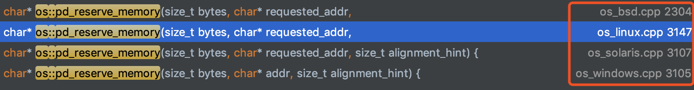

# 堆

## 1、jvm规范

> Java虚拟机具有一个在所有Java虚拟机线程之间共享的_堆_。堆是运行时数据区，从中分配所有类实例和数组的内存。
>
> 堆是在虚拟机启动时创建的。对象的堆存储由自动存储管理系统（称为_垃圾收集器_）_回收_；对象永远不会显式释放。Java虚拟机不假定特定类型的自动存储管理系统，可以根据实现者的系统要求选择存储管理技术。堆的大小可以是固定的，也可以根据计算的要求进行扩展，如果不需要更大的堆，则可以将其收缩。堆的内存不必是连续的。
>
> Java虚拟机实现可以为程序员或用户提供对堆的初始大小的控制，并且，如果可以动态扩展或收缩堆，则可以控制最大和最小堆大小。
>
> 以下异常情况与堆相关联：如果计算需要的堆多于自动存储管理系统可以提供的堆，则Java虚拟机将抛出一个 `OutOfMemoryError`。


## 2、hotspot实现

堆的实现其实主要内容都在GC章节中，里面会涉及到堆的分代管理等等，这里就不赘述了，本节重点通过hotspot源码来分析**站在系统的角度来看，堆的内存在哪里**：

在Hotspot实现中，java堆的初始化主要由Universe模块来完成，堆的初始化对应于`Universe::initialize_heap() `这个方法，具体的代码就不往下追了，直接给出结论，这个函数最终调用了	`os::reserve_memory`方法

```c++
char* os::reserve_memory(size_t bytes, char* addr, size_t alignment_hint,
   MEMFLAGS flags) {
  char* result = pd_reserve_memory(bytes, addr, alignment_hint);
  if (result != NULL) {
    MemTracker::record_virtual_memory_reserve((address)result, bytes, mtNone, CALLER_PC);
    MemTracker::record_virtual_memory_type((address)result, flags);
  }
```

在Hotspot源码中，一般**os模块**下的方法根据不同的操作系统有不同的逻辑，比如上面的`pd_reserve_memory`方法，Hotspot在linux、bsd、solaris、windows下都有实现



这里只看linux下的实现：

```c++
char* os::pd_reserve_memory(size_t bytes, char* requested_addr,
                         size_t alignment_hint) {
  return anon_mmap(requested_addr, bytes, (requested_addr != NULL));
}
```

看到这个方法`anon_mmap`，对linux进程空间熟悉的同学应该已经觉得破案了，最终hotspot使用mmap技术在进程空间的内存映射区分配了一块空间给jvm堆，不了解mmap的话可以倒回去看《前置知识》