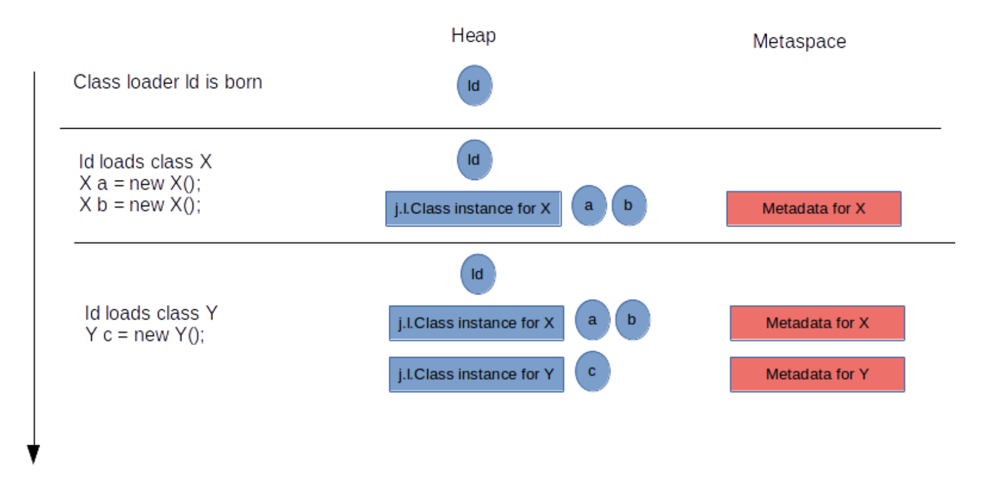
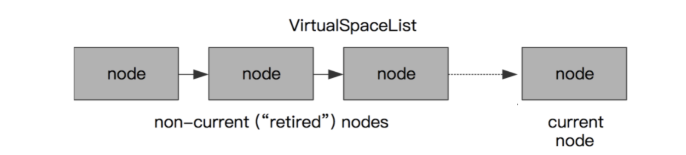
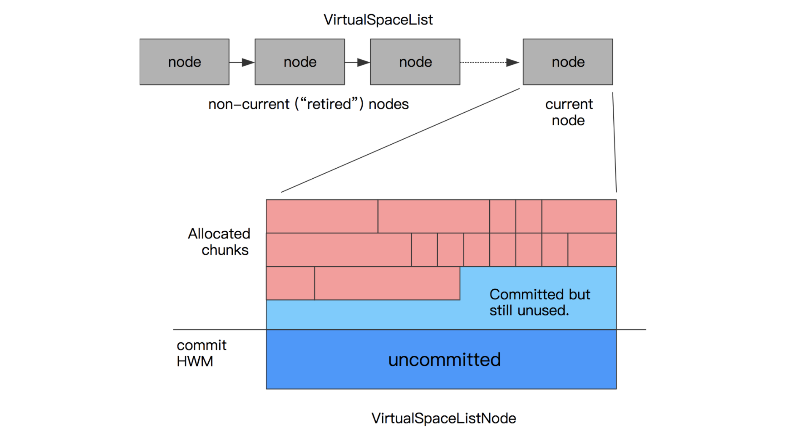
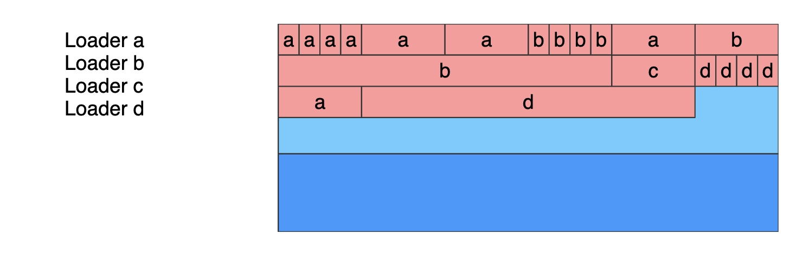
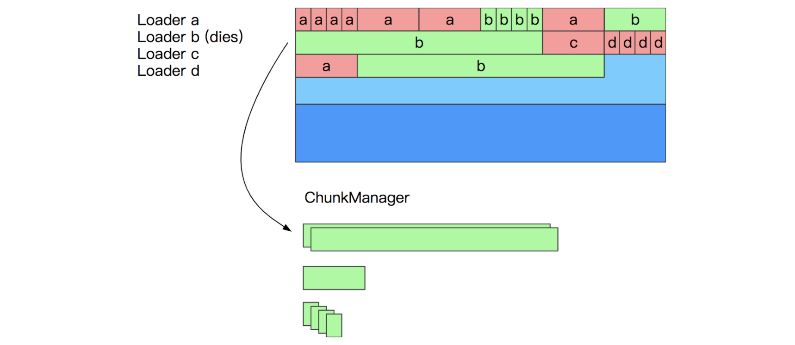
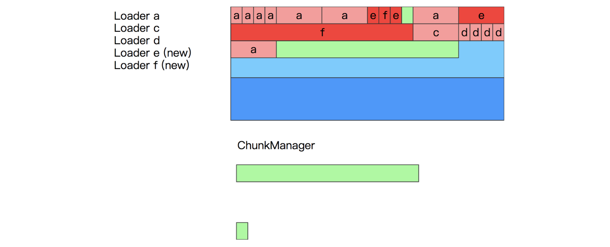
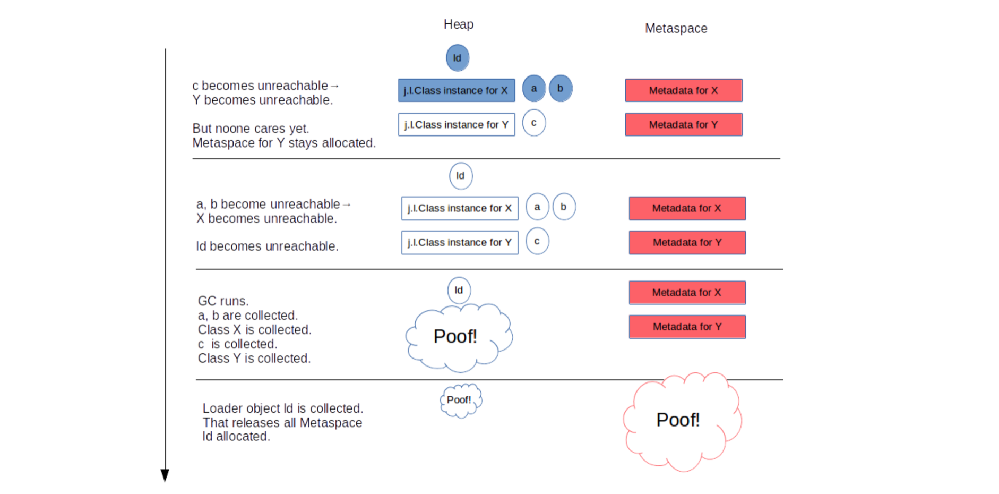
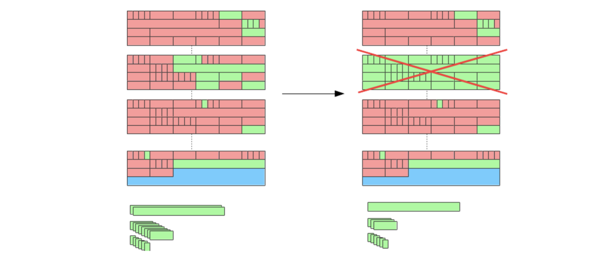

# 方法区

[toc]

## 1、jvm规范

> Java虚拟机中有一个所有Java虚拟机线程共享的**方法区**。该方法区域类似于常规语言的编译代码存储区域，或者**类似于操作系统进程中的“.text”段**。它存储各个类的结构，例如运行时常量池，字段和方法数据，以及方法和构造函数的代码，包括用于类和接口初始化以及实例初始化的特殊方法。
>
> 方法区是在**虚拟机启动时**创建的。尽管方法区在逻辑上是堆的一部分，但是简单的实现可以选择不进行垃圾回收或压缩。该规范没有规定方法区的位置或用于管理编译代码的策略。方法区域可以是固定大小的，或者可以根据计算的需要进行扩展，如果不需要更大的方法区域，则可以缩小。方法区域的内存不必是连续的。
>
> Java虚拟机实现可以为程序员或用户提供对方法区域初始大小的控制，以及在方法区域大小可变的情况下，可以控制最大和最小方法区域大小。
>
> 以下异常条件与方法区域相关联：如果无法提供方法区域中的内存来满足分配请求，则Java虚拟机将抛出一个`OutOfMemoryError`。

如规范中所述，方法区**类似于操作系统进程中的“.text”段**，它存储各个类的结构，例如运行时常量池，字段和方法数据等，说到类结构，很容易就想到编译生成的class类文件，它与方法区确实也有着很紧密的联系，比如class类文件中的**常量池**，加载入jvm内存中就成了**运行时常量池**，方法区的其他数据也大多源于class文件

## 2、hotspot实现

JVM规范中并没有规定方法区的位置，而在hotspot的实现中，不同的版本也有不同的实现，比如**永久带**、**元空间**，这二者都是Hotspot对于**方法区**的具体实现

**永久代**也叫 PermGen，内存上它是挨着堆的，为了垃圾回收方便，HotSpot 在永久代上一直是使用老年代的垃圾回收算法，永久代主要存放以下数据：

- JVM internal representation of classes and their metadata
- Class statics
- Interned strings

从 **JDK7** 开始，JDK 开发者们就有消灭永久代的打算了。有部分数据移到永久代之外了：

- Symbols => native memory
- Interned strings => Java Heap
- Class statics => Java Heap

到了 JDK8，这个工作终于完成了，彻底废弃了 PermGen，**Metaspace(元空间)**取而代之。

### 2.1 永久带

永久带既已废弃，这里就不在详述，但是有几点可以注意：

首先从**永久带**这个名称可以看出，它与堆的分代策略有非常紧密的联系，甚至垃圾回收也用的是堆的老年代垃圾回收算法，像是堆的一部分，可能JDK开发者也觉得这很别扭吧

此外，用的jdk版本较旧的程序员可能对 “**java.lang.OutOfMemoryError: PermGen space**“这个异常不会陌生。这里的 “**PermGen space**”其实指的就是永久代，新版本的jdk就不会有这个异常了

### 2.2 元空间

对于元空间的描述，Thomas Stüfe 的 [Metaspace 系列文章](https://stuefe.de/posts/metaspace/what-is-metaspace/)描述的很好，本小节节选了部分内容并重新组织了层次结构，更细节的描述可以直接看原文, 也可以看这一篇完整的译作[深入理解堆外内存 Metaspace](https://www.javadoop.com/post/metaspace)

Metaspace 区域位于堆外，所以它的最大内存大小取决于系统内存，而不是堆大小，我们可以指定MaxMetaspaceSize 参数来限定它的最大内存。

Metaspace 是用来存放 class metadata 的，class metadata 用于记录一个 Java 类在 JVM 中的信息，包括但不限于 **JVM class file format**的运行时数据： 

- Klass 结构，这个非常重要，把它理解为一个 Java 类在虚拟机内部的表示吧；
- method metadata，包括方法的字节码、局部变量表、异常表、参数信息等；
- 常量池；
- 注解；
- 方法计数器，记录方法被执行的次数，用来辅助 JIT 决策；
- 其他

虽然每个 Java 类都关联了一个 `java.lang.Class` 的实例，而且它是一个贮存在堆中的 Java 对象。但是类的 class metadata 不是一个 Java 对象，它不在堆中，而是在 Metaspace 中。

#### 2.2.1 元空间的空间分配

当一个类被加载时，它的类加载器会负责在 Metaspace 中分配空间用于存放这个类的元数据。

上面这个示意图非常简单，可以看到在 `Id` 这个类加载器第一次加载类 `X` 和 `Y` 的时候，在 Metaspace 中为它们开辟空间存放元信息

到具体的空间分配，Metaspace 在实现上分为三层:

- 最底层，负责向操作系统申请大块的内存；
- 中间层，负责分出一小块一小块给每个类加载器；
- 最顶层，类加载器负责把这些申请到的内存块用来存放 class metadata。

##### 2.2.1.1 最底层(node)

在最底层，JVM 通过 `mmap(3)` 接口向操作系统申请内存映射，在 64 位平台上，每次申请 **2MB** 空间。

> 当然，这里的 2MB 不是真的就消耗了主存的 2MB，只有之后在使用的时候才会真的消耗内存。这里是虚拟内存映射。

**tips: 看到这个mmap的时候,就有种破案的感觉，原来在Hotspot的实现中，方法区最终也是存放在进程的内存映射区之中**

每次申请过来的内存区域，放到一个链表中 [*VirtualSpaceList*](http://hg.openjdk.java.net/jdk/jdk11/file/1ddf9a99e4ad/src/hotspot/share/memory/metaspace/virtualSpaceList.hpp#l39)，作为其中的一个 Node。看下图。

一个 Node 是 2MB 的空间，前面说了在使用的时候再向操作系统申请实际的内存，但是频繁的系统调用会降低性能，所以 Node 内部需要维护一个水位线，当 Node 内已使用内存快达到水位线的时候，向操作系统要新的内存页。并且相应地提高水位线。

直到一个 Node 被完全用完，会分配一个新的 Node，并且将其加入到链表中，老的 Node 就 “退休” 了。下图中，前面的三个 Node 就是退休状态了。

##### 2.2.1.2 中间层(chunk)

从一个 Node 中分配内存，每一块称为 MetaChunk，chunk 有三种规格，在 64 位系统中分别为 1K、4K、64K

链表 VirtualSpaceList 和每个节点 Node 是全局的，而 Node 内部的一个个 MetaChunk 是分配给每个类加载器的。所以一个 Node 通常由分配给多个类加载器的 chunks 组成。

当一个类加载器和它加载的所有的类都卸载的时候，它占用的 chunks 就会加入到一个全局的空闲列表中：[*ChunkManager*](http://hg.openjdk.java.net/jdk/jdk11/file/1ddf9a99e4ad/src/hotspot/share/memory/metaspace/chunkManager.hpp#l44)，看下图：

这些 chunks 会被复用：如果其他的类加载器加载新的类，它可能就会得到一个空闲列表中的 chunk，而不是去 Node 中申请一个新的 chunk。

后面会说到，如果刚好把整个 Node 都清空了，那么这整个 Node 的内存会直接还给操作系统。

> 后面会说到，如果刚好把整个 Node 都清空了，那么这整个 Node 的内存会直接还给操作系统。
>
> 当然，由这个 Node 进入到空闲列表的节点也要删除。

通常一个类加载器在申请 Metaspace 空间用来存放 metadata 的时候，也就需要几十到几百个字节，但是它会得到一个 Metachunk，一个比要求的内存大得多的内存块。

为什么？因为前面说了，要从全局的 `VirtualSpaceList` 链表的 Node 中分配内存是昂贵的操作，需要加锁。我们不希望这个操作太频繁，所以一次性给一个大的 MetaChunk，以便于这个类加载器之后加载其他的类，这样就可以做到多个类加载器并发分配了。只有当这个 chunk 用完了，类加载器才需要又去 `VirtualSpaceList` 申请新的 chunk。

前面说了，chunk 有三种规格，那 Metaspace 的分配器怎么知道一个类加载器每次要多大的 chunk 呢？这当然是基于猜测的：

- 通常，一个标准的类加载器在第一次申请空间时，会得到一个 4K 的 chunk，直到它达到了一个随意设置的阈值（4），此时分配器失去了耐心，之后会一次性给它一个 64K 的大 chunk。
- bootstrap classloader 是一个公认的会加载大量的类的加载器，所以分配器会给它一个巨大的 chunk，一开始就会给它 4M。可以通过 InitialBootClassLoaderMetaspaceSize 进行调优。
- 反射类类加载器 (`jdk.internal.reflect.DelegatingClassLoader`) 和匿名类类加载器只会加载一个类，所以一开始只会给它们一个非常小的 chunk（1K），因为给它们太多就是一种浪费。

类加载器申请空间的时候，每次都给类加载器一个 chunk，这种优化，是建立在假设它们立马就会需要新的空间的基础上的。这种假设可能正确也可能错误，可能在拿到一个很大的 chunk 后，这个类加载器恰巧就不再需要加载新的类了。

##### 2.2.1.3 最顶层(Metabolck)

在 Metachunk 上，我们有一个二级分配器（class-loader-local allocator），它将一个 Metachunk 分割成一个个小的单元，这些小的单元称为 Metablock，它们是实际分配给每个调用者的，即每个InstanceKlass占用一个单元。

这个二级分配器非常原始，它的速度也非常快：

前面说过，class metadata 的生命周期是和类加载器绑定的，所以在类加载器卸载的时候，JVM 可以大块大块地释放这些空间。

下面展示一个 Metachunk 的结构：

这个 chunk 诞生的时候，它只有一个 header，之后的分配都只要在顶部进行分配就行。

由于这个 chunk 是归属于一个类加载器的，所以如果它不再加载新的类，那么 unused 空间就将真的浪费掉。

在 JVM 内部，一个类加载器以一个 [*ClassLoaderData*](http://hg.openjdk.java.net/jdk/jdk11/file/1ddf9a99e4ad/src/hotspot/share/classfile/classLoaderData.hpp#l176) 结构标识，这个结构引用了一个 [*ClassLoaderMetaspace*](http://hg.openjdk.java.net/jdk/jdk11/file/1ddf9a99e4ad/src/hotspot/share/memory/metaspace.hpp#l230) 结构，它维护了该加载器使用的所有的 Metachunk。

当这个类加载器被卸载的时候，这个 `ClassLoaderData` 和 `ClassLoaderMetaspace` 会被删除。并且会将所有的这个加载器用到的 chunks 归还到空闲列表中。这部分内存是否可以直接归还给操作系统取决于是否满足其他条件

#### 2.2.2 元空间的空间回收

分配给一个类的空间，是归属于这个类的类加载器的，只有当这个类加载器卸载的时候，这个空间才会被释放。

所以，只有当这个类加载器加载的所有类都没有存活的对象，并且没有到达这些类和类加载器的引用时，相应的 Metaspace 空间才会被 GC 释放。看下图：

所以，一个 Java 类在 Metaspace 中占用的空间，它是否释放，取决于这个类的类加载器是否被卸载。

Metaspace 只在 GC 运行并且卸载类加载器的时候才会释放空间。当然，在某些时候，需要主动触发 GC 来回收一些没用的 class metadata，即使这个时候对于堆空间来说，还达不到 GC 的条件。

Metaspace 可能在两种情况下触发 GC：

- 分配空间时：虚拟机维护了一个阈值，如果 Metaspace 的空间大小超过了这个阈值，那么在新的空间分配申请时，虚拟机首先会通过收集可以卸载的类加载器来达到复用空间的目的，而不是扩大 Metaspace 的空间，这个时候会触发 GC。这个阈值会上下调整，和 Metaspace 已经占用的操作系统内存保持一个距离。
- 碰到 Metaspace OOM：Metaspace 的总使用空间达到了 MaxMetaspaceSize 设置的阈值，或者 Compressed Class Space 被使用光了，如果这次 GC 真的通过卸载类加载器腾出了很多的空间，这很好，否则的话，我们会进入一个糟糕的 GC 周期，即使我们有足够的堆内存。

以上所述的释放 Metaspace 空间，并不意味着将这部分空间还给系统内存，那**什么时候才会还给系统内存**呢？

当一个 VirtualSpaceListNode 中的所有 chunk 都是空闲的时候，这个 Node 就会从链表 VirtualSpaceList 中移除，它的 chunks 也会从空闲列表中移除，这个 Node 就没有被使用了，会将其内存归还给操作系统。

对于一个空闲的 Node 来说，拥有其上面的 chunks 的所有的类加载器必然都是被卸载了的。

至于这个情况是否可能发生，主要就是取决于碎片化：

一个 Node 是 2M，chunks 的大小为 1K, 4K 或 64K，所以通常一个 Node 上有约 150-200 个 chunks，如果这些 chunks 全部由同一个类加载器拥有，回收这个类加载器就可以一次性回收这个 Node，并且把它的空间还给操作系统。

但是，如果这些 chunks 分配给不同的类加载器，每个类加载器都有不同的生命周期，那么什么都不会被释放。这也许就是在告诉我们，要小心对待大量的小的类加载器，如那些负责加载匿名类或反射类的加载器。