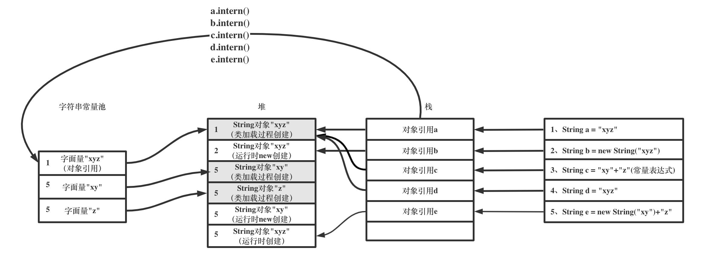

# 字符串常量池

[toc]

刚入门java的同学，对涉及到字符串的"=="比较总是容易被绕晕，其根源就在于**字符串常量池**在从中做怪，本文主要围绕为什么java会有这样一个设计，以及**字符串常量池**具体如何实现来进行分析，并给出一些例子以供参考

首先需要明确**字符串常量池**这个概念是哪个层级的问题，java标准，jvm标准，还是hotspot实现，不妨一层一层来看：

## JAVA标准层面

在java标准中，通篇没有出现**字符串常量池**这个名词，但是在对字符串的表述中提到了**字面量**相关的概念：

>3.10.5 String Literals
>
>A *string literal* consists of zero or more characters enclosed in double quotes. Characters such as newlines may be represented by escape sequences
>
>....
>
>At run time, a string literal is a reference to an instance of class `String` ([§4.3.3](https://docs.oracle.com/javase/specs/jls/se15/html/jls-4.html#jls-4.3.3)) that denotes the string represented by the string literal.
>
>Moreover, a string literal always refers to the *same* instance of class `String`. This is because string literals - or, more generally, strings that are the values of constant expressions ([§15.29](https://docs.oracle.com/javase/specs/jls/se15/html/jls-15.html#jls-15.29)) - are "interned" so as to share unique instances, as if by execution of the method `String.intern` ([§12.5](https://docs.oracle.com/javase/specs/jls/se15/html/jls-12.html#jls-12.5)).

从这段表述中可以得出几点结论：

- **字符串字面量**是指被引号(")括起来的那个东西，它其实是一个**指向String对象的引用**，
- 一个字符串字面量总是指向同一个String对象（**字符串字面量的指向不会发生变化，先到先得**）
- 不同的String对象可以通过String.intern方法得到同一个字符串字面量，即**同一个String对象的引用**

尽管标准中没有提到**字符串常量池**，但姑且根据常识和上面的描述推测出一个简单模型：


按照这个模型，可以推出几个简单的判断

```java
String a = "xyz";
String b = new String("xyz");
System.out.println(a==b); //false
System.out.println(a==a.intern()); //true
System.out.println(a==b.intern()); //true
System.out.println(b==b.intern()); //false
```

为什么`a="xyz"`和`b=new String("xyz")`对应的是两个对象呢，来看另一段创建类实例的标准描述，可能会推翻你之前的认识：

> 12.5. Creation of New Class Instances
>
> A new class instance is explicitly created when evaluation of a class instance creation expression ([§15.9](https://docs.oracle.com/javase/specs/jls/se15/html/jls-15.html#jls-15.9)) causes a class to be instantiated.
>
> A new class instance may be implicitly created in the following situations:
>
> - **Loading of a class or interface** that contains a string literal ([§3.10.5](https://docs.oracle.com/javase/specs/jls/se15/html/jls-3.html#jls-3.10.5)) or a text block ([§3.10.6](https://docs.oracle.com/javase/specs/jls/se15/html/jls-3.html#jls-3.10.6)) may create a new `String` object to denote the string represented by the string literal or text block. (This object creation will not occur if an instance of `String` denoting the same sequence of Unicode code points as the string represented by the string literal or text block has previously been interned.)
> - Execution of an operation that causes boxing conversion ([§5.1.7](https://docs.oracle.com/javase/specs/jls/se15/html/jls-5.html#jls-5.1.7)). Boxing conversion may create a new object of a wrapper class (`Boolean`, `Byte`, `Short`, `Character`, `Integer`, `Long`, `Float`, `Double`) associated with one of the primitive types.
> - Execution of a string concatenation operator `+` ([§15.18.1](https://docs.oracle.com/javase/specs/jls/se15/html/jls-15.html#jls-15.18.1)) that is not part of a constant expression ([§15.29](https://docs.oracle.com/javase/specs/jls/se15/html/jls-15.html#jls-15.29)) always creates a new `String` object to represent the result. String concatenation operators may also create temporary wrapper objects for a value of a primitive type.
> - Evaluation of a method reference expression ([§15.13.3](https://docs.oracle.com/javase/specs/jls/se15/html/jls-15.html#jls-15.13.3)) or a lambda expression ([§15.27.4](https://docs.oracle.com/javase/specs/jls/se15/html/jls-15.html#jls-15.27.4)) may require that a new instance of a class that implements a functional interface type be created.
>
> ...
>
> 15.29. Constant Expressions
>
> Constant expressions of type `String` are always "interned" so as to share unique instances, using the method `String.intern`.

从这段表述中可以得出几点结论：

- `String a = new String()`这种显式创建的写法，必定会在堆中创建一个新的对象
- `String a = "xyz"`这种写法一般情况下会在**类加载过程中**隐式在堆中创建一个新的对象并将字面量“xyz”驻留，但是若"xyz"字面量已经被驻留的话，则不创建新对象
- `String a = new String("xy")+new String("z")`，这种通过"+"连接的写法，**运行时会创建一个新的String对象**表示结果，但是并不会将"xyz"驻留（这里要注意了）
- 但如果是一个常量表达式 ([§15.29](https://docs.oracle.com/javase/specs/jls/se15/html/jls-15.html#jls-15.29)) `String a = "xy"+"z"`则不同，它与`String  a= "xyz"`一样，对应的"xyz"字面量已在类加载过程中被驻留(interned)了（可以理解为编译期间已经被优化为了"xyz"），且运行时不会创建新对象

这里再重点强调一遍，对于`String a = "xyz"`，**在类加载过程中，就已经生成了一个代表"xyz"的对象（识别到了引号）**，在运行这行代码时仅仅是从字符串常量池中获取了该对象的引用并返回，但是对于`String a = new String("xyz")`，虽然在类加载过程中就已经生成了一个代表"xyz"的对象(同样识别到了引号)，但是由于是显式的使用了`new`关键字，所以仍会创建一个新的对象

**那么根据这几点表述，继续完善模型**：


按照这个模型，可以推出几个简单的判断：

```java
String a = "xyz";
String b = new String("xyz");
String c = "xy"+"z";
String d = "xyz";
String e = new String("xy")+"z";
System.out.println(a==b); //false
System.out.println(a==c); //true
System.out.println(a==d); //true
System.out.println(a==e); //false
```

此外，整理出现过的标准，可以给出一个推论，当且仅当出现以下三种情况下，字面量才有可能会驻留(interned)：

- 代码中出现**被引号包含的字面量** ,如：String a = "xyz"，字面量"xyz"在类加载过程被驻留
- 代码中出现**String类型的常量表达式**([§15.29](https://docs.oracle.com/javase/specs/jls/se15/html/jls-15.html#jls-15.29)) ,如：String a = "xy"+"z"，字面量"xyz"在类加载过程被驻留
- 调用了**intern()方法**，如 a.intern()，若a对应的字面量没有被驻留过，则驻留该字面量，否则返回之前驻留的字面量(即对象引用)

可以结合以下例子理解：

例1:

```java
String f = new String("ab")+new String("c"); //字面量abc既未被引号包围，也不是一个常量表达式，仅创建对象
String g = "abc";//字面量abc被引号包围，类加载过程中创建对象并驻留其引用
System.out.println(f==g); //false
```

例2:

```java
String f = new String("ab")+new String("c"); //字面量abc即未被引号包围，也不是一个常量表达式，仅创建对象
f.intern();//将字面量abc驻留(即f对象引用)
String g = "abc";//字面量abc被引号包围，类加载过程中，发现字面量abc已被驻留，则直接返回f对象引用
System.out.println(f==g); //true
```

*这里要注意一点`f.intern()`与`f = f.intern() `是不一样的，`f.intern()`并不更改f本身的值*

细心的同学可能会对例2有疑惑，明明g是在**类加载过程**中就将字面量"abc"驻留了，那么在**运行时**执行`f.intern()`时字符串常量池中应该已经存在字面量"abc"了吧，那照理说`f.intern()`应该没有任何作用才对？

其实不然，在JVM规范中，将类加载过程分为**加载-链接-初始化**几个过程，对字面量驻留这个操作真正发生的时机是在链接中的解析阶段，而解析这个步骤一般是发生在运行时，所以实际上当代码运行时到`String g = "abc"`之前时，才完成了解析这个步骤，具体怎么个解析过程，后文会基于HotSpot实现进行解释

**到这里，可以看出，java语言层面中尽管没有提到字符串常量池这个字眼，但时对驻留(interned)这个概念的解释已经非常通透了，根据以上根据标准的推论，所有字符串的==问题都能够得到答案，如果大家有兴趣可以继续看下面的实现细节**


## JVM标准层面

在JAVA语言标准中，定义**字面量**是被引号包围的东西，实际上是一个对象引用，那么JVM标准层面是如何描述**字面量**这个概念的呢：

> **5.1 The Runtime Constant Pool**
>
> The static constants in the run-time constant pool are also derived from entries in the constant_pool table in accordance with the structure of each entry: 
>
> - **A string constant** is a reference to an instance of class String, and is derived from a **CONSTANT_String_info** structure (§4.4.3). To derive a string constant, the Java Virtual Machine examines the sequence of code points given by the CONSTANT_String_info structure: 
>
> -  If the method String.intern has previously been invoked on an instance of class String containing a sequence of Unicode code points identical to that given by the CONSTANT_String_info structure, then the string constant is a reference to that same instance of class String. – Otherwise, a new instance of class String is created containing the sequence of Unicode code points given by the CONSTANT_String_info structure. The string constant is a reference to the new instance. Finally, the method String.intern is invoked on the new instance.
>
> **4.4.3 The CONSTANT_String_info Structure**
>
>  The CONSTANT_String_info structure is used to represent constant objects of the type String:
>
>  CONSTANT_String_info { 
>
> ​		u1 tag;
>
> ​		u2 string_index;
>
>  } 
>
> The items of the CONSTANT_String_info structure are as follows: 
>
> - tag 
>
>   The tag item has the value CONSTANT_String (8). 
>
> - string_index 
>
>   The value of the string_index item must be a valid index into the constant_pool table. The constant_pool entry at that index must be a CONSTANT_Utf8_info structure (§4.4.7) representing the sequence of Unicode code points to which the String object is to be initialized.
>
> **4.4.7 The CONSTANT_Utf8_info Structure**
>
> The CONSTANT_Utf8_info structure is used to represent constant string values: 
>
> CONSTANT_Utf8_info { 
>
> ​    u1 tag; 
>
> ​    u2 length; 
>
> ​    u1 bytes[length]; 
>
> }

这段描述中，`string constant`就是java语言标准中的字面量（string literals），对其特性又描述了一遍，基本与java标准中描述的一致，但是提供了更多的细节：

- 字面量是通过**运行时常量池**中的`CONSTANT_String_info`结构来获取的
- `CONSTANT_String_info`结构只持有了一个`CONSTANT_Utf8_info`结构在运行时常量池中的index
- `CONSTANT_Utf8_info`持有了一个Unicode字节序列，JVM可以通过这个序列来做唯一性检测

通过上面的几点描述，**字符串常量池**的轮廓已经差不多了，规范中说要通过`CONSTANT_String_info`来获取字面量，那怎么获取呢，很容易推断出JVM中应该存在一个类似HashMap的结构，key可能是根据`CONSTANT_String_info`获取到的`CONSTANT_Utf8_info`中的Unicode字节序列（`bytes[length]`）(这里只是一个猜测，实际如何得看HotSpot层面的实现了)，value就是字面量（对象引用）

那么可以推断出一个简单的模型：



至于`CONSTANT_Utf8_info`究竟是个什么东西，就得看具体JVM是如何实现的了，对于Hotspot而言，所谓的Unicode字节序列可能就是个C++的bytes数组

## HotSpot实现层面

回顾一下JAVA语言层面与JVM标准层面的描述：JVM可以通过类运行时常量池中的`CONSTANT_String_info`来找到对应的字面量（即对象引用），于是我们假设存在一个类似HashMap结构的字符串常量池来辅助完成这件事情，那么真的有这么个结构吗，可以从HotSpot代码中找到答案：

HotSpot VM里实现字符串常量池功能的是StringTable类，在hotspot/src/share/vm/classfile/symbolTable.[hpp|cpp]中，看它的定义：

```
class StringTable : public Hashtable<oop, mtSymbol>
```

在C++层面的确是个Hashtable类型，key是`oop`类型（oop类型就是Java层面的对象引用），value是`mySymbol`类型，乍眼一看不知道是什么东西，那么可以从往这个Stringtable里插入的代码入手：

```C++
oop StringTable::basic_add(int index_arg, Handle string, jchar* name,
                           int len, unsigned int hashValue_arg, TRAPS) {
  // ...
  // Check if the symbol table has been rehashed, if so, need to recalculate
  // the hash value and index before second lookup.
  unsigned int hashValue;
  int index;
  if (use_alternate_hashcode()) {
    hashValue = hash_string(name, len);
    index = hash_to_index(hashValue);
  } else {
    hashValue = hashValue_arg;
    index = index_arg;
  }
  // Since look-up was done lock-free, we need to check if another
  // thread beat us in the race to insert the symbol.
  oop test = lookup(index, name, len, hashValue); // calls lookup(u1*, int)
  if (test != NULL) {
    // Entry already added
    return test;
  }
  HashtableEntry<oop, mtSymbol>* entry = new_entry(hashValue, string());
  add_entry(index, entry);
  return string();
}
```

首先根据`jchar* name`算了个hash值index，然后调用了`lookup`方法去判断`StringTable`中是否已经存在对应的字面量，结合JVM规范来看，`jchar* name`这个入参应该就是运行时常量池中`CONSTANT_Utf8_info`类型变量持有的Unicode字节序列(`bytes[length]`)

再看lookup函数：

```C++
oop StringTable::lookup(int index, jchar* name,
                        int len, unsigned int hash) {
  int count = 0;
  for (HashtableEntry<oop, mtSymbol>* l = bucket(index); l != NULL; l = l->next()) {
    count++;
    if (l->hash() == hash) {
      if (java_lang_String::equals(l->literal(), name, len)) {
        return l->literal();
      }
    }
  }
  // If the bucket size is too deep check if this hash code is insufficient.
  if (count >= BasicHashtable<mtSymbol>::rehash_count && !needs_rehashing()) {
    _needs_rehashing = check_rehash_table(count);
  }
  return NULL;
}
```

逻辑非常简单，根据index找到了hashtable对应的拉链节点的位置，然后挨个对节点的key进行判断，对比`jchar* name`是否与对象表示的字符串是一个东西（`java_lang_String::equals`）,若一致，则直接把key（对象引用）返回

**所以，StringTable的结构就可以当成是个简单的hashtable（拉链式），hashcode是根据对应的Unicode字节序列计算而来，节点中存放的就是对象引用（字面量）**

最后，把字符串的解析过程串一遍，以简单的String a = "xyz"为例：

这条语句翻译成字节码就是：

```java
16: ldc           #6                  // String ab
18: astore_2
```

对应的运行时常量池如下(与类文件常量池结构基本一致)：

```java
 #6 = String             #26 
 #26 = Utf8               ab
```

这里的常量#6就是`CONSTANT_String_info`类型，常量#26就是`CONSTANT_Utf8_info`类型

当要执行`ldc    #6 `这条语句前，首先需要将常量#6进行解析，发现它指向了常量#26，常量#26是个`CONSTANT_Utf8_info`类型的常量，它持有了一个表示字符串ab的Unicode字节序列ab，于是需要根据这个序列获取对应的String对象引用，过程如下：

根据这个字节序列去**字符串常量池**中寻找：

- 若存在一个字符串字面量(对象引用)，其表示的字符串与该字节序列ab一致，则返回该字面量
- 若没有找到，则根据该字节序列在堆中创建一个对象，将其引用放入字符串常量池，并返回该引用


