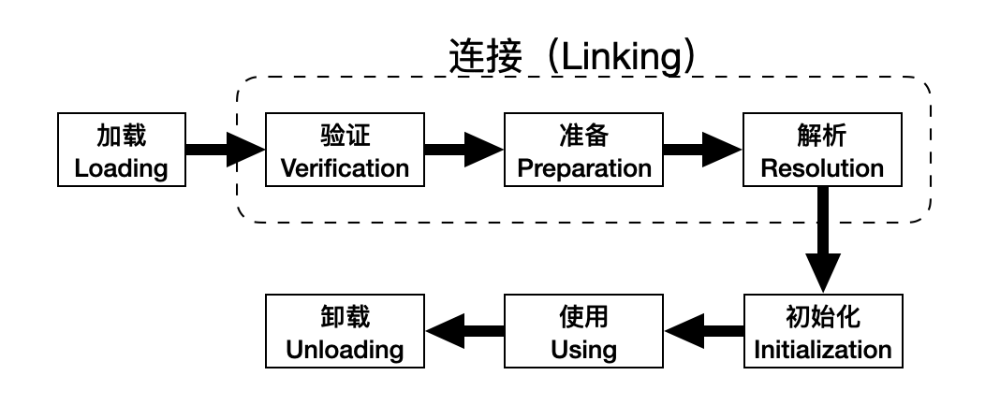

# 程序的运行过程

类从被加载到虚拟机内存中开始，到卸载出内存为止，它的整个生命周期包括：加载（Loading）、验证（Verification）、准备（Preparation）、解析（Resolution）、初始化（Initialization）、使用（Using）和卸载（Unloading）7个阶段。其中验证、准备、解析三个部分统称为连接（Linking），这7个阶段的发生顺序如图所示。

图中加载、验证、准备、初始化、卸载这5个阶段的顺序是确定的，类的加载过程必须按照这种顺序按部就班地开始，而解析阶段则不一定：它在某些情况下可以在初始化阶段后再开始，这是为了支持Java语言的运行时绑定（也称为动态绑定），注意：这里说的是按部就班地开始，而不是按部就班地进行或完成，强调这点是因为这些阶段通常都是互相交叉地混合式进行的，通常会在一个阶段的执行过程中调用、激活另外一个阶段。

Java虚拟机规范并没有强制约束加载（Loading）阶段何时开始，这要看虚拟机的具体实现。但是对于初始化阶段，虚拟机规范严格地规定了有且只有5种情况必须立即对类进行初始化（而加载、验证、准备自然是在初始化之前开始）：

1）遇到new、getstatic、putstatic或invokestatic这4条字节码指令时，如果类没有进行过初始化，则需要先触发其初始化。生成这4条指令的最常见的Java代码场景是：使用new关键字实例化对象的时候、读取或设置一个类的静态字段（被final修饰、已在编译期把结果放入常量池中的静态字段除外）时，以及调用一个类的静态方法的时候。

2）使用java.lang.reflect包的方法对类进行反射调用的时候，如果类没有进行过初始化，则需要先触发其初始化。

3）当初始化一个类的时候，发现其父类还没有进行过初始化，则需要先触发其父类的初始化。

4）当虚拟机启动时，用户需要指定一个要执行的主类（包含main()方法的那个类），虚拟机会先初始化这个主类。

5）当使用jdk1.7的动态语言支持时，如果一个java.lang.invoke.MethodHandle实例最后的解析结果是REF_getStatic、REF_putStatic、REF_invokeStatic的方法句柄，并且这个方法句柄所对应的类没有进行过初始化，则需要先触发其初始化。

以上5种场景中的行为称为对一个类进行主动引用。除此之外，所有引用类的方式都不会触发初始化，称为被动引用。