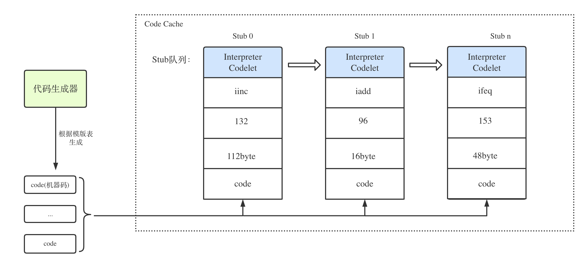
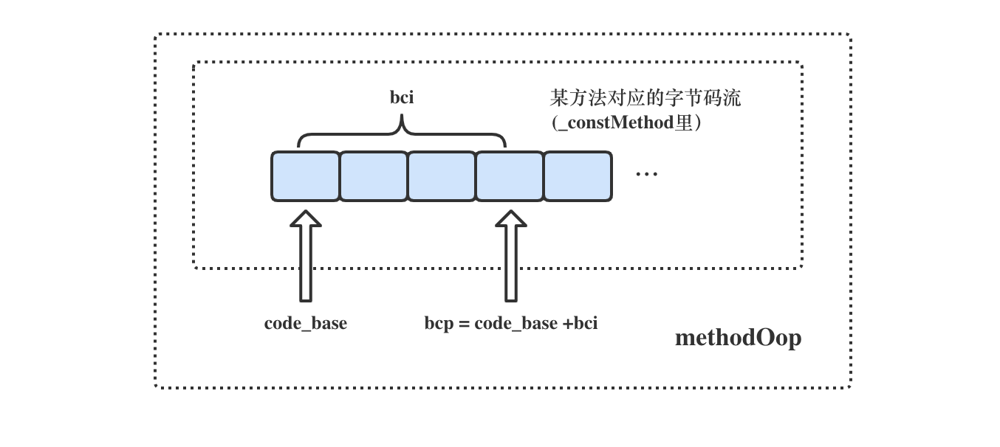
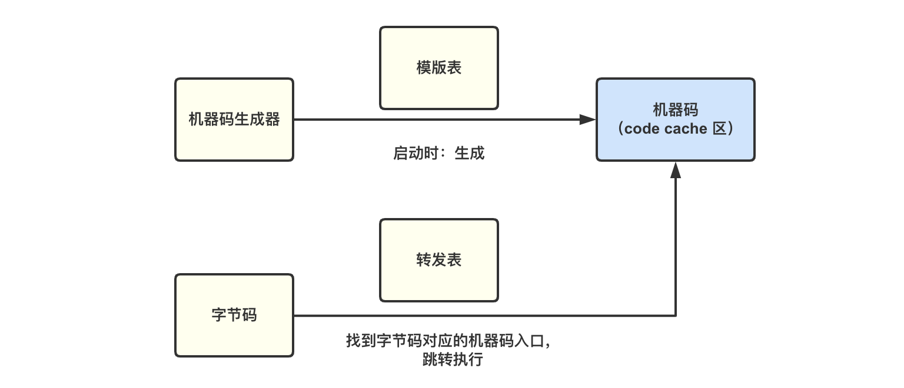

# 解释执行

[toc]

Java 源程序经编译后称为字节码，由运行时环境对字节码进行解释执行。提供解释功能的JVM组件称为解释器

**解释执行**可以与**CPU的处理过程**进行类比，CPU就是在重复进行着“**取指-译码-执行**“这一操作，并在这个过程中完成了一条条指令的执行，实现了程序规定的任务，**解释器**就类似于CPU这个角色，也在不断的“取指-译码-执行”，下文将介绍HopSpot VM解释器的分类与组成，并详细介绍s解释器的运作流程

## 1、解释器的分类与组成

从译码的角度，可以将HotSpot实现解释器分为**C++解释器**与**模版解释器**两种，顾名思义，C++解释器是将**字节码**“译码“成C++代码，这其实很好理解，毕竟HotSpot本身就是用C++实现的；而模版解释器则是将**字节码**“译码“成了机器码，这也是目前HotSpot目前的默认解释器

### 1.1 C++解释器

对于C++解释器而言，是将字节码译码成C++代码，那么在执行性能上应该是不如译码成机器码的

比如在寄存器分配上时，手写汇编在这种很小范围很细节的地方能有效的、精确的控制寄存器的使用，保证不会浪费寄存器

而C++编译器不一定能完美的选择到最好的寄存器分配方式。在比较大规模的代码里编译器可能比手写做得好，因为人能在脑子管理好的复杂度也是有限的；但小规模代码的精确控制通常还是人做得好些。

那按理来说，模版解释器应该是C++解释器的升级版(**很多博客和书籍中都是这么描述的**)，但是并不是，在@RednaxelaFX的豆瓣笔记中翻到了这样一段关于这两类解释器由来的历史，还挺有意思的

> 其实HotSpot从一开始就有模板解释器，而C++解释器反而是后来加进来的。前者源于HotSpot的前身Strongtalk，而后者源于Sun的另一个JVM(CVM)，又名“CDC HotSpot Implementation”或者“CDC-HI”。CVM更早的前身是Sun的Classic VM。 也就是说，这俩解释器没有任何血缘关系，前者并非将后者翻译为汇编。当时Sun之所以把后者加到HotSpot是在实现Itanium（IA-64）的移植时想偷懒，人肉写Itanium汇编挺烦的所以要实现Itanium版模板解释器不方便，他们就想到了把CVM的解释器移植过来，这样可以少写点汇编就能完成移植。结果一直以来HotSpot能运行的平台上只有Itanium版是真的用了这个C++解释器的，而其它平台上默认都在用模板解释器，但还是可以通过编译参数选择使用C++解释器。

### 1.2 模版解释器

模板解释器相对于为每一个**字节码指令**都写了一段实现对应功能的汇编代码，在**JVM初始化**时，汇编器会将汇编代码翻译成机器指令加载到内存中，比如执行iload指令时，直接执行对应的汇编代码即可。如何执行汇编代码？直接跳往汇编代码生成的机器指令在内存中的地址即可。

#### 1.2.1 模版解释器的组成

##### 1.2.1.1 模版表

JVM初始化时会为每个**字节码指令**都创建一个模板，每个模板都关联其对应的**汇编代码生成函数**，所有字节码的模版组合在一起，构成一个模版表。表中每个元素都是一个模版，元素按照字节码值的递增顺序排列，第n号元素表示的就是字节码为n对应的模版

> 我们平时说的iload指令等，其实都只是字节码指令的助记符，帮助我们理解，真正的字节码码指令其实就是一个数字，比如iload是21，虚拟机执行21这个指令时，就是执行iload

以下这段代码就是模版的**汇编代码生成函数**

``` c++
void Template::generate(InterpreterMacroAssembler* masm) {
  // parameter passing
  TemplateTable::_desc = this;
  TemplateTable::_masm = masm;
  // code generation
  _gen(_arg);
  masm->flush();
}
```

##### 1.2.1.2 机器码生成器

在JVM启动时，代码生成器将统一为字节码以及JVM内部例程生成机器码，对于字节码来说，就是在模版表里找到字节码对应的模版，然后根据汇编代码生成函数生成代码，具体到源码层面，机器码生成器就是个C++类`TemplateInterpreterGenerator`,通过它的`generate_all()`函数生成代码

在JVM中，所有由代码生成器生成的代码都由一个Codelet来表示，面向解释器的Codelet称为InterpreterCodelet，通过这些Codelet来完成在JVM内部存储、定位和执行代码的任务

每个InterpreterCodelet具有名称和字节码编号，并能够找到机器码在JVM内存中的起、止地址

```c++
class InterpreterCodelet: public Stub {
 private:
  int         _size;                             // the size in bytes
  Bytecodes::Code _bytecode;                     // associated bytecode if any
 public:
  // Code info
  address code_begin() const                     { return (address)this + round_to(sizeof(InterpreterCodelet), CodeEntryAlignment); }
  address code_end() const                       { return (address)this + size(); }

```

为了方便管理，在解释器中，每个InterpreterCodelet并不是孤立的，它们共同构成了一个**Stub队列**

>刚开始学这块时，总是分不清Stub是个什么东西，明明队列里放的s是Codelet还要叫Stub队列（博客和书籍里），后面看了上面那段源码，原来Stub就是个父类，此外，Stub有个意思是“一小块代码”，通常是有个caller要调用callee的时候，中间需要一些特殊处理的逻辑，就会用这种“小块代码”去做，它们并不是最终的调用目标，而是做一些简单的处理之后“跳”到真正的目标去。




##### 1.2.1.3 字节码模块

字节码模块主要承担了两个职责，一是维护了一张字节码表来提供索引服务，其他模块利用字节码编号从表中相应位置取得字节码信息；二是提供了一个“取码”方法，可以根据方法和偏移量获取字节码的函数(与上文的“取指”过程不是一个东西)

首先看**字节码表**，在JVM启动时会执行一次初始化工作，将创建一张字节码表并将所有字节码的属性逐一填好，这里指的属性包含以下几项：

- 字节码（数字）
- 字节码助记符，如“`iconst_0`”等
- 字节码执行结果类型，这些类型来自HotSpot内部定义的基本数据类型BasicType,包括`T_BOOLEAN、T_CHAR、T_FLOAT、T_DOUBLE、T_BYTE、T_SHORT、T_INT、T_LONG、T_OBJECT、T_ARRAY、T_VOID、T_ADDRESS和T_NARROWOOP`等
- 扩展指令格式(wide format) 
- 指令长度

其中唯一不太好理解的就是**扩展指令格式**（wide f），下面是源码中定义的两条字节码

```c++
//  bytecode(定义好的常量)   bytecode name           format   wide f.   result tp  stk traps
def(_iload               , "iload"               , "bi"   , "wbii"  , T_INT    ,  1, false);
def(_iinc                , "iinc"                , "bic"  , "wbiicc", T_VOID   ,  0, false);
```

> 字节码的指令是单字节的,对于局部变量来说,最多容纳256个局部变量
> wide指令就是用于扩展局部变量数的 ,将8位的索引在扩展8位,也就是16位 最多65536
> wide 要被扩展的操作码比如**iload 操作数**  (wide iload 257 也就是 wide iload byte1 byte2), 则格式记为**“wbii”**
> wide 要被扩展的操作码比如**iinc 操作数,操作数** （wide iinc 257,257 也就是 wide iinc byte1 byte2 constbyte1 constbyte2 ，则格式记为 **“wbiicc”**


再看**“取码”**功能的实现，解释器在执行的时候，往往（并不包括文章开头说的**“取指”**）要根据字节码偏移量（bytecode index，缩写为bci）获取在**该方法内**(**这点要特别注意**)指定位置的字节码，这个过程就是我们说的“取码”（fetch bytecode）

在字节码模块中提供了一个code_at()函数来对“取码”进行实现，该函数可以根据方法对象（methodOop）和bci进行取码

```c++
Bytecodes::Code Bytecodes::code_at(Method* method, int bci) {
  return code_at(method, method->bcp_from(bci));
}
...
address Method::bcp_from(int bci) const {
...
  address bcp = code_base() + bci;
...
  return bcp;
}
```

函数code_at()首先得到该方法对应字节码流在JVM内存中的基地址code_base，接下来根据`bcp = code_base() + bci`计算得到**字节码指针（byte code pointer,缩写为bcp）地址**；最后访问bcp指向内存的指针，即得到目标bytecode，完成“取码”，具体流程如下图：



##### 1.2.1.4 转发表

同样是在JVM的启动过程中，将会创建一张转发表(DispatchTable)，转发表是连接字节码和机器码的桥梁，记录了**字节码**以及其对应的**机器码的入口地址(entry_point)**，这样在JVM需要使用该字节码的机器码时，只用通过转发表就能跳过去执行了


#### 1.2.2 模版解释器的运作过程

在了解了模版解释器的组成之后，它的运作过程也比较清晰了，结合着“**取指-译码-执行**“这一循环操作，各个模块间是这么交互的：




再次回到解释器的主循环“**取指-译码-执行**“，思考一个问题，CPU是如何不断的执行指令的，是有一个统一的管理者，不断的取出下一条指令执行吗，其实不是的，当代码段被加载到内存后，会放到连续的一块内存区域，每条指令都是**线性**排在一起的。CPU利用CS:IP寄存器来记录当前指令地址，因为指令都是连续排在一起的，所以当执行完一条指令后，直接根据当前指令长度进行偏移，就可以拿到下一条指令地址，送入IP寄存器，从而实现连续不断的取指。

HotSpot借用了这一思想，在每个字节码指令对应生成的**机器码末尾**，会插入一段跳转下一条指令的逻辑。这样当前字节码在完成自己的功能后，就会自动取出方法体中排在它后面的下一条指令开始执行

具体逻辑在**机器码生成器**中的一个方法generate_and_dispatch（）中：

```c++
void TemplateInterpreterGenerator::generate_and_dispatch(Template* t, TosState tos_out) {
  ......
  // generate template
  t->generate(_masm);
  // advance
  if (t->does_dispatch()) {
#ifdef ASSERT
    // make sure execution doesn't go beyond this point if code is broken
    __ should_not_reach_here();
#endif // ASSERT
  } else {
    // dispatch to next bytecode
    __ dispatch_epilog(tos_out, step);
  }
}
```

可以看到，根据模版生成了对应机器码之后generate(_masm),还会调用 __ dispatch_epilog(tos_out, step)方法来生成跳转到下一条字节码对应机器码的入口地址，再看具体的实现：

```c++
void InterpreterMacroAssembler::dispatch_next(TosState state, int step) {
  load_unsigned_byte(rbx, Address(_bcp_register, step));
  // advance _bcp_register
  increment(_bcp_register, step);
  dispatch_base(state, Interpreter::dispatch_table(state));
}
```

load_unsigned_byte（）会根据当前指令地址偏移，获取下条指令地址，并通过地址获得指令,放入rbx寄存器

_bcp_register就是rsi寄存器，HotSpot利用rsi寄存器来存储当前指令地址。

取指完成后，调用increment(_bcp_register, step)来更新rsi寄存器，使其指向下一条指令地址。

dispatch_base就是根据转发表跳转的逻辑，Interpreter::dispatch_table(state)即返回了之前生成的转发表


