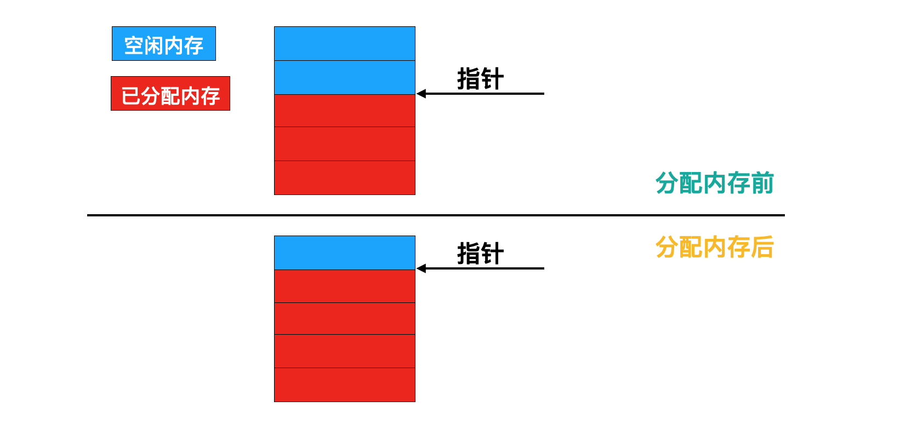
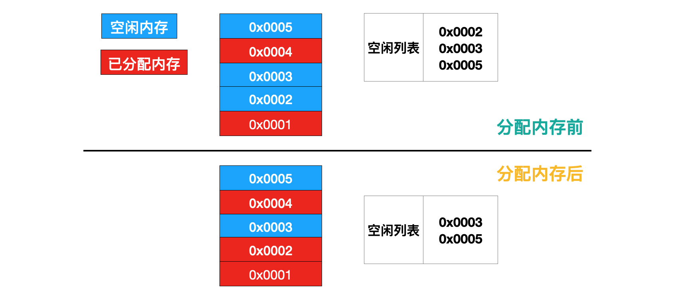

# 创建

Java是一门面向对象的编程语言，在Java程序运行过程中，无时无刻都有对象被创建出来。在语言层面上，创建对象通常仅仅是一个new关键字而已，而在虚拟机中，对象的创建又是怎样一个过程呢？

虚拟机遇到一条new指令时，首先会去检查这个指令的参数是否能在常量池中定位到一个类的符号引用，并且检查这个符号引用代表的类是否已经被加载、解析和初始化。如果没有，则必须先执行相应的类加载过程。

在类加载检查通过后，虚拟机将为新生对象分配内存。对象所需的内存大小在类加载完成后可以确定，为对象分配空间的过程等同于把一块确定大小的内存从Java堆中划分出来。

如果Java堆中的内存是规整的，即所有用过的内存都放在一边，空闲的内存放在另一边，中间通过指针标识分界点，那么分配内存的过程就是指针向空闲内存那边挪动一段与对象大小相等的距离，这种分配方式称为**指针碰撞**（Bump the Pointer）。分配过程如下图所示：

如果Java堆中的内存不是规整的，已使用的内存和空闲内存相互交错，那么就必须通过虚拟机维护一个记录可用内存块的列表，在分配的时候从列表中找到一块足够大的空间划分给对象实例，并更新列表上的记录，这种分配方式称为**空闲列表**（Free List）。分配过程如下图所示：

具体采用哪种分配方式由Java堆是否规整决定，而Java堆是否规整则由所采用的垃圾收集器是否带有压缩/整理功能决定。因此，在使用Serial、ParNew等带有压缩/整理的收集器时，系统采用的分配方式是指针碰撞，而使用CMS这种基于Mark-Sweep算法的收集器时，通常采用空闲列表的分配方式。

对象创建在虚拟机中是非常频繁的行为，即使是仅仅修改一个指针所指向的位置，在并发情况下也不是线程安全的，可能出现正在给对象A分配内存，指针还没来得及修改，对象B又同时使用原来的指针分配内存的情况。这个问题有两种解决方案，一种是对分配内存空间的动作进行同步处理：虚拟机采用**CAS**和**失败重试**的方式保证更新指针操作的原子性；另一种是把内存分配的动作按照线程划分在不同的空间之中进行，即每个线程在Java堆中预先分配一小块内存，称为**本地线程分配缓冲**（Thread Local Allocation Buffer，TLAB），每个线程在自己的TLAB上分配内存，当TLAB用完并分配新的TLAB时，才需要同步锁定。虚拟机是否使用TLAB，可以通过-XX:+/-UseTLAB参数来设定。TLAB的内存空间非常小，默认情况下占整个Eden空间的1%，-XX:TLABWasteTargetPercent参数可以设置此占比。

内存分配完成后，虚拟机需要将分配到的内存空间都初始化为零值（不包括对象头），这一步操作保证了对象的实例字段在Java代码中可以不赋初值就直接使用，程序能访问到这些字段的数据类型所对应的零值。

接下来，虚拟机要为对象进行必要的设置，例如这个对象是哪个类的实例，如何才能找到类的元数据信息、对象的哈希码、对象的GC分代年龄等信息。这些信息存放在对象的对象头（Object Header）中。根据虚拟机当前的运行状态的不同，如是否启用偏向锁等，对象头会有不同的设置方式。

在上面的工作都完成之后，从虚拟机的视角来看，一个新的对象已经产生了，jvm创建对象的过程总结如上图，但是从Java程序的视角来看，对象创建才刚刚开始，因为init方法还没执行，所有的字段都还为零。所以一般来说，执行new指令之后会接着执行init方法，把对象按照程序员的意愿进行初始化，这样一个真正可用的对象才算完全产生出来。
