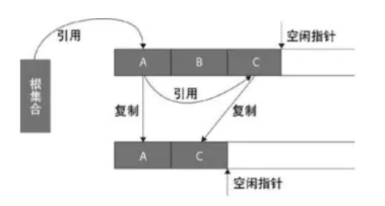
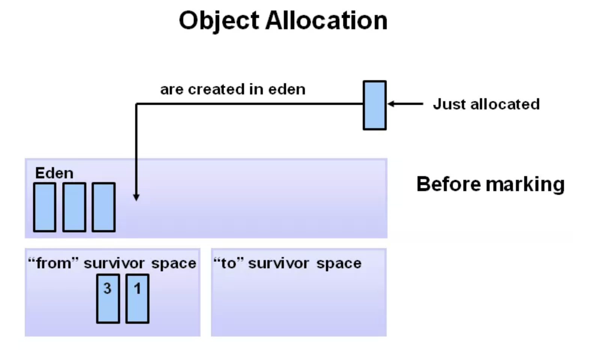
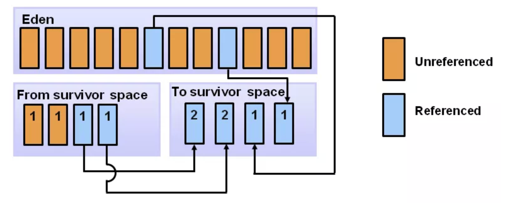

# GC算法

常见的GC算法有四种：标记-清除法（mark-sweep）、复制算法（copying）、标记-整理/压缩法（mark-compact）和分代回收算法（generation-collect）。

### 1. 标记-清除法

算法分为标记和清除两个阶段，首先标记出所有存活的对象和所有待回收的对象，其次会在清除阶段将待回收对象进行回收，当有内存分配需求时，会遍历空闲内存区域以寻找能够满足分配需求的空闲内存。标记-清除法有两点不足：一是效率问题，标记与清除的过程效率都不高；另一个是空间问题，标记-清除之后会产生大量不连续的内存碎片。空间碎片太多可能会导致以后在程序运行过程中需要分配大对象时，无法找到足够的连续内存时会提前再触发一次垃圾回收。

标记清除算法的执行过程如下图所示：

### 2. 复制算法

为了解决效率问题，复制算法应运而生。它将可用内存按容量划分为大小相等的两块，每次只使用其中一块，当一块内存用完之后，会将所有存活的对象复制到另一块内存上，然后再把已使用过的内存空间一次性清理掉。这种方法每次只回收一半的堆内存空间，并且能够避免内存碎片的问题，但与此同时，缺点也很明显，即可使用内存缩小为原来的一半，牺牲内存的代价太高了。

复制算法的执行过程如下图所示：

### 3. 标记-整理算法

标记-整理算法与标记-清除算法类似，都是先对存活的对象进行标记，但是在清除后会把活的对象向左端空闲空间移动（类似于 windows 的磁盘碎片整理），保证它们占用的空间连续，然后再更新其引用对象的指针，这样就避免了内存碎片问题，但是整理过程也会降低 GC 的效率。

标记-整理算法的执行过程如下图所示：

简要对比一下上述三种算法：

|              | 复制                                  | 标记-清除        | 标记-整理        |
| ------------ | ------------------------------------- | ---------------- | ---------------- |
| 速度         | 快                                    | 慢               | 慢               |
| 空间开销     | 通常需要活对象的2倍大小（不堆积碎片） | 少（会堆积碎片） | 少（不堆积碎片） |
| 是否移动对象 | 是                                    | 否               | 是               |

关于时间开销：
mark-sweep：mark阶段与活对象的数量成正比，sweep阶段与整堆大小成正比
mark-compact：mark阶段与活对象的数量成正比，compact阶段与活对象的大小成正比
copying：与活对象大小成正比

如果把mark、sweep、compact、copying这几种动作的耗时放在一起看，大致有这样的关系：
compaction >= copying > marking > sweeping
还有 marking + sweeping > copying

虽然compactiont与copying都涉及移动对象，但取决于具体算法，compact可能要先计算一次对象的目标地址，然后修正指针，然后再移动对象；copying则可以把这几件事情合为一体来做，所以可以快一些。另外还需要留意GC带来的开销不能只看collector的耗时，还得看allocator一侧的。如果能保证内存没碎片，分配就可以用pointer bumping方式，只有挪一个指针就完成了分配，非常快；而如果内存有碎片就得用freelist之类的方式管理，分配速度通常会慢一些。

### 4. 分代回收算法

上述三种算法，每种都有各自的优缺点。在现代 JVM 中，往往是综合使用的，经过大量实际分析，发现内存中的对象大致可以分为两类：有些生命周期很短，比如一些局部变量 、临时对象，而另一些则会存活很久，典型的比如 websocket 长连接中的 connection 对象，如下图：

纵向 y 轴可以理解分配内存的字节数，横向 x 轴理解为随着时间流逝（伴随着 GC），可以发现大部分对象其实相当短命，很少有对象能在 GC 后活下来。因此诞生了分代垃圾回收的思想

#### 4.1 分代情况

堆内存分成两大块：年轻代（Young Genaration），老年代（Old Generation），其中年轻代又细为分 Eden、From Survivor、To Survivor 三个区。

默认的，年轻代 ( Young ) 与老年代 ( Old ) 的比例为 1:2 ( 该值可以通过参数 –XX:NewRatio 来指定 )，即：年轻代 ( Young ) = 1/3 的堆空间大小。老年代 ( Old ) = 2/3 的堆空间大小。
默认的，Eden : from : to = 8 : 1 : 1 ( 可以通过参数 –XX:SurvivorRatio 来设定 )，即： Eden = 8/10 的年轻代空间大小，from = to = 1/10 的新生代空间大小。
JVM 每次只会使用 Eden 和其中的一块 Survivor 区域来为对象服务，所以无论什么时候，总是有一块 Survivor 区域是空闲着的。
因此，年轻代实际可用的内存空间为 9/10 ( 即90% )的新生代空间。

#### 4.2 GC的主要过程

以HotSpot为例，来分析分代垃圾回收的主要过程。分代垃圾回收综合运用了【标记 - 清理 eden】 + 【标记 - 复制 eden->s0】算法。刚开始时，对象分配在 eden 区，s0（即：from survivor）及 s1（即：to survivor）区几乎是空着的，如图所示：

随着应用的运行，越来越多的对象被分配到eden区。当 eden 区放不下时，就会发生 minor GC（也被称为 young GC），第 1 步是先标识出不可达垃圾对象（即：下图中的黄色块），然后将可达对象移动到 s0 区（即：4 个淡蓝色的方块挪到 s0 区），然后将黄色的垃圾块清理掉，这一轮过后，eden 区就成空的了。当 eden 区放不下时，就会发生 minor GC（也被称为 young GC），第 1 步当然是要先标识出不可达垃圾对象（即：下图中的黄色块），然后将可达对象，移动到 s0 区（即：4 个淡蓝色的方块挪到 s0 区），然后将黄色的垃圾块清理掉，这一轮过后，eden 区就成空的了。

随着时间推移，如果eden 区又满了，则再次触发 minor GC。同样还是先做标记，这时 eden 和 s0 区可能都有垃圾对象（下图中的黄色块），注意：这时 s1（即：to）区是空的，s0 区和 eden 区的存活对象将直接被复制到 s1 区。然后将 eden 和 s0 区的垃圾清理掉，这一轮 minor GC 后，eden 和 s0 区就变成了空的了。

对于那些比较“长寿”的对象一直在 s0 与 s1 中挪来挪去，一来很占地方，而且也会造成一定开销，降低 gc 效率，于是有了“代龄 (age)”及“晋升”。对象在年轻代的 3 个区 (eden,s0,s1) 之间，每次从 1 个区移到另 1 区，年龄 +1，在 young 区达到一定的年龄阈值后（默认是15），将晋升到老年代。在年轻代执行gc的时候，如果老年代的连续空间小于年轻代对象的总大小，就会触发一次full gc；当要移动到老年代的对象大于老年代的连续内存大小时，也会触发一次full gc，这是为了保证年轻代的老年对象可以顺利的进入到老年代的内存区。full gc采用的是标记-清除算法，会产生内存碎片。在执行full gc的情况下，会阻塞程序的正常运行，即stop the word。老年代的gc比年轻代的gc效率上慢10倍以上，因此需要尽量避免触发full gc。

另外，如果分配的新对象比较大，eden 区放不下，但是 old 区可以放下时，会直接分配到 old 区（即没有晋升这一过程，直接到老年代了）。