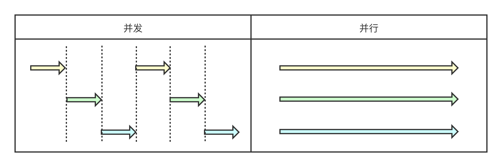

并发计算（concurrent computing）在维基百科上的释义是：一种程序计算的形式，在系统中，至少有两个以上的计算在同时运作，计算结果可能同时发生。

> 并发与并行的区别
> 并行(parallel)：指在同一时刻，有多条指令在多个处理器上同时执行。所以无论从微观还是从宏观来看，二者都是一起执行的。
> 并发(concurrency)：指在同一时刻只能有一条指令执行，但多个进程指令被快速的轮换执行，使得在宏观上具有多个进程同时执行的效果，但在微观上并不是同时执行的。
>
> 

并发计算的历史中有很多种实现形式，也不是Java语言特有的语言特性，但如今在Java中主要通过Java内存模型（JMM）来规范，通过多线程编程技术来实现，这些也是本篇文章主要的讨论范围。