### 锁
> 与`sychronized`、`volatile`等锁不同，Concurrent包中在Java的代码层面上，通过Lock、Condition、AQS、CAS、非阻塞数据结构算法等实现了代码层面的显式锁，通过调用实例对应的方法来进行加锁、解锁等操作。并且这些操作通常是可中断、可超时的，提高了并发条件下锁的灵活性。
#### Lock
> `Lock`是Concurrent包中对于锁的抽象接口，该接口定义了Concurrent包下的相关锁获取锁时候是否中断敏感、是否等待超时等方法。
#### AQS
> AQS是一个抽象类，不可以被实例化。AQS核心思想是，如果被请求的共享资源空闲，则将当前请求资源的线程设置为有效的工作线程，并且将共享资源设置为锁定状态。如果被请求的共享资源被占用，那么就需要一套线程阻塞等待以及被唤醒时锁分配的机制，这个机制AQS是用CLH队列锁实现的，即将暂时获取不到锁的线程加入到队列中。

> CLH(Craig,Landin,and Hagersten)队列是一个虚拟的双向队列(虚拟的双向队列即不存在队列实例，仅存在结点之间的关联关系)。AQS是将每条请求共享资源的线程封装成一个CLH锁队列的一个结点(Node)来实现锁的分配。

AQS中的共享资源是使用一个int成员变量来表示同步状态，通过内置的FIFO队列来完成获取资源线程的排队工作。AQS使用CAS对该同步状态进行原子操作实现对其值的修改。状态信息通过procted类型的getState，setState，compareAndSetState进行操作。

* 资源的共享方式

    AQS定义两种资源共享方式：
    * Exclusive(独占)：只能有一个线程能执行，如ReentrantLock。又可分为公平锁和非公平锁：
        * 公平锁：按照线程在队列中的排队顺序，先到者先拿到锁
        * 非公平锁：当线程要获取锁时，无视队列顺序直接去抢锁，谁抢到就是谁的
    * Share(共享)：多个线程可同时执行，如Semaphore、CountDownLatch等。

>当共享资源被某个线程占有，其他请求该资源的线程会被阻塞，从而进入同步队列。AQS底层的数据结构采用CLH队列，它是一个虚拟的双向队列，即不存在队列的实例，仅存在节点之间的关联关系。AQS是将每条请求共享资源的线程封装成一个CLH锁队列的一个结点(Node)来实现锁的分配。注：Sync queue，即同步队列，是双向链表，包括head结点和tail结点，head结点主要用作后续的调度。而Condition queue不是必须的，它是一个单向链表，只有当使用Condition时，才会存在此单向链表，并且可能会有多个Condition queue。
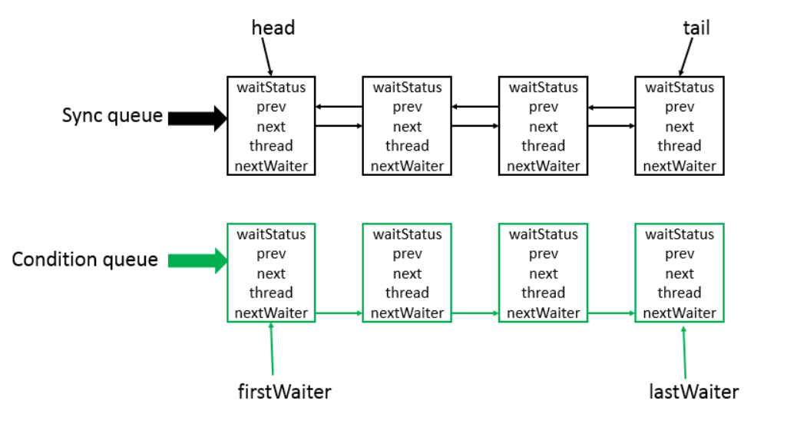
其中节点的类型是AQS的静态内部类Node，代码如下
```
static final class Node {
    //模式，分为共享与独占
    //共享模式
    static final Node SHARED = new Node();
    //独占模式
    static final Node EXCLUSIVE = null;

    //节点状态值：1，-1，-2，-3
    static final int CANCELLED =  1;
    static final int SIGNAL    = -1;
    static final int CONDITION = -2;
    static final int PROPAGATE = -3;

    //节点状态
    volatile int waitStatus;

    //前驱节点
    volatile Node prev;

    //后继节点
    volatile Node next;

    //节点对应的线程
    volatile Thread thread;

    //下一个等待者
    Node nextWaiter;

    //判断节点是否在共享模式下等待
    final boolean isShared() {
        return nextWaiter == SHARED;
    }

    //获取前驱节点，如果为null，则抛异常
    final Node predecessor() throws NullPointerException {
        Node p = prev;
        if (p == null)
            throw new NullPointerException();
        else
            return p;
    }
	
    //无参构造函数
    Node() {    // Used to establish initial head or SHARED marker
    }

    //有参构造函数1
    Node(Thread thread, Node mode) {     // Used by addWaiter
        this.nextWaiter = mode;
        this.thread = thread;
    }

    //有参构造函数2
    Node(Thread thread, int waitStatus) { // Used by Condition
        this.waitStatus = waitStatus;
        this.thread = thread;
    }
}
```
Node节点的状态有如下四种

* CANCELLED = 1

    表示当前节点从同步队列中取消，即当前线程被取消

* SIGNAL = -1

    表示后继节点的线程处于等待状态，如果当前节点释放同步状态会通知后继节点，使得后继节点的线程能够运行

* CONDITION = -2

    表示当前节点在等待condition，也就是在condition queue中

* PROPAGATE = -3

    表示下一次共享式同步状态获取将会无条件传播下去
    
#### 核心方法详解
AQS中方法众多，总体可分为两大类，独占和共享式地获取和释放锁。下面从这个两方面进行详细讲解。
1. 独占式
同一时刻仅有一个线程持有同步状态

    1.1 独占式同步状态获取（acquire方法）
    
    AQS提供的acquire方法是独占式获取同步状态，但是该方法对中断不敏感，也就是说由于线程获取同步状态失败加入到CLH同步队列中，后续对线程进行中断操作时，线程不会从同步队列中移除。代码如下
```
    public final void acquire(int arg) {
        if (!tryAcquire(arg) &&
            acquireQueued(addWaiter(Node.EXCLUSIVE), arg))
            selfInterrupt();
    }
```


   该方法中一共出现了四个方法
    
   tryAcquire：尝试获取锁，获取成功则设置锁状态并返回true，否则返回false。该方法由自定义同步组件自己去实现，该方法必须要保证线程安全的获取同步状态。
    
   addWaiter：入队，即将当前线程加入到CLH同步队列尾部。
    
   acquireQueued：当前线程会根据公平性原则来进行阻塞等待（自旋）,直到获取锁为止；并且返回当前线程在等待过程中有没有中断过。
    
   selfInterrupt：自我中断
    
   我们来分析一下acquire方法的执行的流程

   1）首先调用方法tryAcquire方法（该方法需要自定义同步组件自己实现，这里先不赘述，后续讲解各个组件时再详细描述）尝试获取锁，如果成功返回true，整个acquire方法全部返回，获取锁成功，否则获取锁失败，进行往下执行；

   2）tryAcquire返回false，获取锁失败，则继续执行方法acquireQueued，在此之前会先执行方法addWaiter，将当前线程加入到CLH同步队列尾部；
```
private Node addWaiter(Node mode) {
    //new一个代表当前线程的新节点，默认为独占模式
    Node node = new Node(Thread.currentThread(), mode);
    // Try the fast path of enq; backup to full enq on failure
    //保存尾结点
    Node pred = tail;
    //如果尾结点不为空，说明队列已经被初始化了，直接入队尾
    if (pred != null) {
        //将新节点的前驱连接到原尾结点上
        node.prev = pred;
        //修改尾结点为当前新节点
        if (compareAndSetTail(pred, node)) {
            //原尾结点的后继指向新节点
            pred.next = node;
            //返回新节点
            return node;
        }
    }
    //如果尾结点为空(表示队列未初始化)或者CAS操作失败(有其他线程抢先修改了尾结点信息)，则会调用该方法进行初始化队列后自旋，直到入队成功，或者直接自旋入队操作
    enq(node);
    return node;
}

//CAS方式修改尾结点
private final boolean compareAndSetTail(Node expect, Node update) {
    return unsafe.compareAndSwapObject(this, tailOffset, expect, update);
}

//自旋操作，确保节点成功入队
private Node enq(final Node node) {
    //无限循环（也叫自旋），目的是确保节点能够成功入队
    for (;;) {
        //保存尾结点，这里每次循环都会重新取一次最新的尾结点
        Node t = tail;
        //如果尾结点为空，则需要先初始化
        if (t == null) { // Must initialize
            //new一个空Node作为头结点和尾结点
            if (compareAndSetHead(new Node()))
                tail = head;
        } 
        //如果尾结点不为空，说明队列已经初始化了，再次尝试入队，入队成功直接返回原尾结点，否则继续下一次循环
        else {
            node.prev = t;
            if (compareAndSetTail(t, node)) {
                t.next = node;
                return t;
            }
        }
    }
}
```
   3）入队操作结束后执行方法acquireQueued，该方法是一个自旋的过程，即每个线程进入同步队列中，都会自旋地观察自己是否满足条件且获取到同步状态，则就可以从自旋过程中退出，否则继续自旋下去
```
final boolean acquireQueued(final Node node, int arg) {
    //表示执行过程中是否发生异常，初始值为true
    boolean failed = true;
    try {
        //表示当前线程是否被中断过，初始值为false
        boolean interrupted = false;
        //自旋过程
        for (;;) {
            //获取当前节点的前驱节点
            final Node p = node.predecessor();
            //如果前驱节点是头结点，表示可以进行获取锁，此时就会调用方法tryAcquire，否则无法参与获取锁，获取锁成功后进入if内
            if (p == head && tryAcquire(arg)) {
                //此时当前节点获取到了锁，设置头结点为当前节点，同时该节点的Thread的引用设置为空
                setHead(node);
                //清除p的引用
                p.next = null; // help GC
                //执行过程未发生异常，failed标记为false
                failed = false;
                //返回中断标志
                return interrupted;
            }
            //当获取同步状态失败后，判断是否需要park
            if (shouldParkAfterFailedAcquire(p, node) &&
                parkAndCheckInterrupt())
                interrupted = true;
        }
    } finally {
        //如果执行过程发生任何异常则执行
        if (failed)
            cancelAcquire(node);
    }
}

//设置node为头节点
private void setHead(Node node) {
    //头结点引用设置为node
    head = node;
    //node的thread引用置为空
    node.thread = null;
    ////node的prev引用置为空
    node.prev = null;
}
```
        自旋获取同步状态，如果获取同步状态失败，会执行方法shouldParkAfterFailedAcquire判断是否需要进行park，代码如下
```
//判断是否需要对当前线程进行park
//pred：当前线程节点的前驱节点
//node：当前线程节点
private static boolean shouldParkAfterFailedAcquire(Node pred, Node node) {
    //获取当前线程节点的前驱节点的状态
    int ws = pred.waitStatus;
    //如果状态是SIGNAL，表示node可以被安全park
    if (ws == Node.SIGNAL)
        //返回true，即node可以被安全park
        return true;
    //如果状态大于0，即为CANCELLED，表示pred节点的线程被取消，则需要找到从后往前找到第一个态不为CANCELLED的结点作为node的前驱
    if (ws > 0) {
        //从后往前找到第一个态不为CANCELLED的结点
        do {
            node.prev = pred = pred.prev;
        } while (pred.waitStatus > 0);
        pred.next = node;
    } 
    // 表示节点状态为为PROPAGATE（-3）或者是0（表示无状态）或者是CONDITION（-2，表示此节点在condition queue中）
    else {
        //比较并设置前驱结点的状态为SIGNAL
        compareAndSetWaitStatus(pred, ws, Node.SIGNAL);
    }
    return false;
}
```
   如果shouldParkAfterFailedAcquire返回false，则继续下次自旋，否则执行方法parkAndCheckInterrupt来park当前线程，代码如下
```
// 进行park操作并且返回该线程是否被中断
private final boolean parkAndCheckInterrupt() {
    //阻塞当前线程
    LockSupport.park(this);
    //被唤醒后返回当前线程是否被中断过，会清除中断标记
    return Thread.interrupted();
}
```
   返回结果表示当前线程是否被中断过。最后我们来看一下finally块中的cancelAcquire方法（只有在自旋过程中发生异常时才执行，因为此时failed为true），该方法的作用就是取消当前线程对资源的获取，即设置该结点的状态为CANCELLED，代码如下
```
private void cancelAcquire(Node node) {
    // Ignore if node doesn't exist
    //如果节点为空直接返回
    if (node == null)
        return;

    //将当前节点的thread引用置空
    node.thread = null;

    // Skip cancelled predecessors
    //保存当前节点的前驱
    Node pred = node.prev;
    //找到node前驱结点中第一个状态不为CANCELLED状态的结点
    while (pred.waitStatus > 0)
        node.prev = pred = pred.prev;

    // predNext is the apparent node to unsplice. CASes below will
    // fail if not, in which case, we lost race vs another cancel
    // or signal, so no further action is necessary.
    //获取pred的后继节点
    Node predNext = pred.next;

    // Can use unconditional write instead of CAS here.
    // After this atomic step, other Nodes can skip past us.
    // Before, we are free of interference from other threads.
    //设置当前节点node的状态为CANCELLED
    node.waitStatus = Node.CANCELLED;

    // If we are the tail, remove ourselves.
    //如果当前节点是尾结点，设置尾结点为前驱节点
    if (node == tail && compareAndSetTail(node, pred)) {
        //比较并设置pred结点的next节点为null
        compareAndSetNext(pred, predNext, null);
    } 
    //如果node结点不为尾结点，或者比较设置不成功
    else {
        // If successor needs signal, try to set pred's next-link
        // so it will get one. Otherwise wake it up to propagate.
        int ws;
        //两种情况满足其一，则if成立
        //情况1：pred结点不为头结点，并且pred结点的状态为SIGNAL 
        //情况2：pred结点状态小于等于0，并且比较并设置等待状态为SIGNAL成功，并且pred结点所封装的线程不为空
        if (pred != head &&
            ((ws = pred.waitStatus) == Node.SIGNAL ||
             (ws <= 0 && compareAndSetWaitStatus(pred, ws, Node.SIGNAL))) &&
            pred.thread != null) {
            //保存node的后继
            Node next = node.next;
            //如果后继不为空并且后继的状态小于等于0
            if (next != null && next.waitStatus <= 0)
                //比较并设置pred.next = next
                compareAndSetNext(pred, predNext, next);
        } 
        //如果不满足上面任何一种情况，则释放node的前一个结点
        else {
            //释放node的后继结点
            unparkSuccessor(node);
        }

        node.next = node; // help GC
    }
}
```
   unparkSuccessor方法的作用就是为了释放node节点的后继结点，细节在下面的释放锁时会细讲。

   4）最后如果acquireQueued方法返回false，acquire方法直接结束，否则返回true表示当前线程被中断过，需要恢复它的中断标记，所以调用方法selfInterrupt进行自我中断。
```
static void selfInterrupt() {
    //中断当前线程
    Thread.currentThread().interrupt();
}
```
>整个acquire方法的主要流程如下图所示
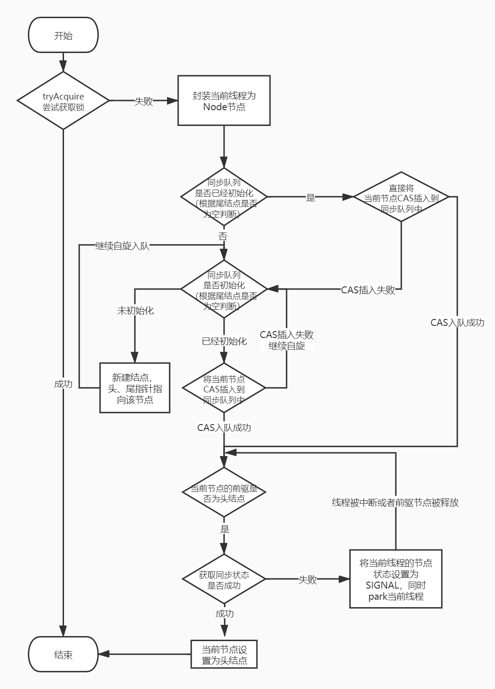

   1.2 独占式同步状态释放（release方法）
    
   当线程获取同步状态后，执行完相应逻辑后就需要释放同步状态。释放锁的逻辑相对简单一些，代码如下
```
public final boolean release(int arg) {
    if (tryRelease(arg)) {
        Node h = head;
        if (h != null && h.waitStatus != 0)
            unparkSuccessor(h);
        return true;
    }
    return false;
}
```
   该方法中包含两个方法

   tryRelease：尝试释放锁，成功则返回true，失败则返回false。同样也是由自定义组件自己实现
        
   unparkSuccessor：释放当前节点的后继结点。

   分析一下release方法的执行的流程，大致分为以下两步

   1）调用方法tryRelease，尝试去释放锁，成功则继续执行，否则返回false

   2）释放锁成功后，如果存在后继节点，则需要调用方法unparkSuccessor唤醒后继节点的线程，代码如下
```
private void unparkSuccessor(Node node) {

    //当前节点的状态
    int ws = node.waitStatus;
    //如果状态小于0,设置状态为0
    if (ws < 0)
        compareAndSetWaitStatus(node, ws, 0);

    //获取当前节点的后继
    Node s = node.next;
    //如果下一个结点为空或者下一个节点的等待状态为CANCELLED，需要继续往后找到第一个状态小于等于0的节点
    if (s == null || s.waitStatus > 0) {
        s = null;
        //从尾结点开始往前遍历，找到第一个在node节点后的状态小于等于0的节点，赋值给s
        for (Node t = tail; t != null && t != node; t = t.prev)
            if (t.waitStatus <= 0)
                s = t;
    }
    //如果s不为空，唤醒s对应的线程
    if (s != null)
        LockSupport.unpark(s.thread);
}
```
整个release方法的主要流程如下图所示
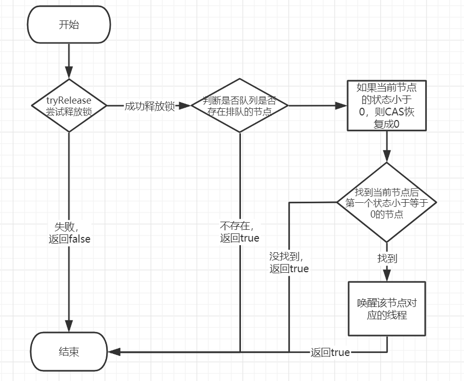


   1.3 独占式获取响应中断（acquireInterruptibly方法）

   前面说到的acquire方法对中断不响应。因此为了响应中断，AQS提供了acquireInterruptibly方法，该方法在等待获取同步状态时，如果当前线程被中断了，会立刻响应中断抛出异常InterruptedException。代码如下
```
public final void acquireInterruptibly(int arg)
    throws InterruptedException {
    if (Thread.interrupted())
        throw new InterruptedException();
    if (!tryAcquire(arg))
        //如果获取锁失败，入队同时响应中断
        doAcquireInterruptibly(arg);
}
```
   由代码可以看出，首先会校验该线程是否已经被中断了，如果是则抛出InterruptedException，否则执行tryAcquire方法（该方法同样由自定义同步器自己实现）获取同步状态，如果获取成功，则直接返回，否则执行doAcquireInterruptibly方法，代码如下
```
private void doAcquireInterruptibly(int arg)
    throws InterruptedException {
    //节点入队
    final Node node = addWaiter(Node.EXCLUSIVE);
    boolean failed = true;
    try {
        for (;;) {
            final Node p = node.predecessor();
            if (p == head && tryAcquire(arg)) {
                setHead(node);
                p.next = null; // help GC
                failed = false;
                return;
            }
            if (shouldParkAfterFailedAcquire(p, node) &&
                parkAndCheckInterrupt())
                //如果发现线程被中断了，直接抛异常
                throw new InterruptedException();
        }
    } finally {
        if (failed)
            cancelAcquire(node);
    }
}
```
   该方法与acquireQueued方法非常类似，唯一不同之处在于如果发现线程被中断了，直接抛异常出去，目的为了响应中断异常。

   1.4 独占式超时获取（tryAcquireNanos方法）
        AQS还提供了一个增强版的获取锁的方法，tryAcquireNanos方法不仅可以响应中断，还有超时控制，即当前线程没有在指定时间内获取同步状态则返回失败。
```
public final boolean tryAcquireNanos(int arg, long nanosTimeout)
    throws InterruptedException {
    if (Thread.interrupted())
        throw new InterruptedException();
    return tryAcquire(arg) ||
        doAcquireNanos(arg, nanosTimeout);
}
```
   方法实现与acquireInterruptibly类似，不过当获取锁失败时，会调用方法doAcquireNanos，代码如下
```
private boolean doAcquireNanos(int arg, long nanosTimeout)
    throws InterruptedException {
    if (nanosTimeout <= 0L)
        return false;
    //计算超时时间，即最迟获取锁的时间
    final long deadline = System.nanoTime() + nanosTimeout;
    //入队
    final Node node = addWaiter(Node.EXCLUSIVE);
    boolean failed = true;
    try {
        //自旋获取锁
        for (;;) {
            final Node p = node.predecessor();
            if (p == head && tryAcquire(arg)) {
                setHead(node);
                p.next = null; // help GC
                failed = false;
                return true;
            }
            //获取同步状态失败，进行中断和超时判断
            //重新计算需要休眠的时间
            nanosTimeout = deadline - System.nanoTime();
            //如果deadline小于等于当前时间，说明超时了，直接返回false
            if (nanosTimeout <= 0L)
                return false;
            //如果未超时，则进行park操作
            if (shouldParkAfterFailedAcquire(p, node) &&
                nanosTimeout > spinForTimeoutThreshold)
                LockSupport.parkNanos(this, nanosTimeout);
            //中断判断
            if (Thread.interrupted())
                throw new InterruptedException();
        }
    } finally {
        if (failed)
            cancelAcquire(node);
    }
}
```
   这里的超时控制需要说明一下，在自旋获取锁之前，先记录一下超时时间dealine，紧接着获取锁，如果获取成功直接返回true，否则会计算deadline与当前时间的差值nanosTimeout ，如果小于等于0，则表示已经到了超时时间，直接返回fasle，否则进行park判断，此处除了之前的shouldParkAfterFailedAcquire方法的判断，还有nanosTimeout和spinForTimeoutThreshold常量的比较，如果大于常量spinForTimeoutThreshold，则会进行park相应的nanosTimeout 时间，如果小于等于常量spinForTimeoutThreshold，说明nanosTimeout 值很小（因为常量spinForTimeoutThreshold本身的值就很小），在非常短的时间等待无法做到十分精确，如果这时再次进行超时等待，相反会让nanosTimeout 的超时从整体上面表现得不是那么精确，所以在超时非常短的场景中，AQS会进行无条件的快速自旋。

   2. 共享式
        同一时刻可以有多个线程获取同步状态

        2.1 共享式同步状态获取（acquireShared方法）
            AQS提供acquireShared方法共享式获取同步状态
```
public final void acquireShared(int arg) {
    //尝试获取锁，小于0表示获取锁失败
    if (tryAcquireShared(arg) < 0)
        //自旋获取同步状态
        doAcquireShared(arg);
}
```
   首先调用tryAcquireShared（自定义同步组件自己实现）方法尝试获取同步状态，如果获取成功直接结束，否则调用doAcquireShared方法获取同步状态，代码如下
```
private void doAcquireShared(int arg) {
	//入队，此时节点为共享式节点
    final Node node = addWaiter(Node.SHARED);
    boolean failed = true;
    try {
        boolean interrupted = false;
        for (;;) {
            //获取当前节点的前驱节点
            final Node p = node.predecessor();
            //如果p是头节点
            if (p == head) {
                //尝试获取锁
                int r = tryAcquireShared(arg);
                //如果r大于等于0，表示获取锁成功
                if (r >= 0) {
                    setHeadAndPropagate(node, r);
                    p.next = null; // help GC
                    if (interrupted)
                        selfInterrupt();
                    failed = false;
                    return;
                }
            }
            if (shouldParkAfterFailedAcquire(p, node) &&
                parkAndCheckInterrupt())
                interrupted = true;
        }
    } finally {
        if (failed)
            cancelAcquire(node);
    }
}
```

   2.2 共享式同步状态释放（releaseShared方法）
            
   AQS提供releaseShared方法释放共享式同步状态
```
public final boolean releaseShared(int arg) {
    //尝试释放锁
    if (tryReleaseShared(arg)) {
        doReleaseShared();
        return true;
    }
    return false;
}
```
   调用方法tryReleaseShared尝试释放锁，如果失败直接返回false，否则调用方法doReleaseShared，代码如下
```
private void doReleaseShared() {
    /*
         * Ensure that a release propagates, even if there are other
         * in-progress acquires/releases.  This proceeds in the usual
         * way of trying to unparkSuccessor of head if it needs
         * signal. But if it does not, status is set to PROPAGATE to
         * ensure that upon release, propagation continues.
         * Additionally, we must loop in case a new node is added
         * while we are doing this. Also, unlike other uses of
         * unparkSuccessor, we need to know if CAS to reset status
         * fails, if so rechecking.
         */
    for (;;) {
        Node h = head;
        //如果队列存在排队的节点
        if (h != null && h != tail) {
            int ws = h.waitStatus;
            if (ws == Node.SIGNAL) {
                //CAS设置不成功则不断循环
                if (!compareAndSetWaitStatus(h, Node.SIGNAL, 0))
                    continue;            // loop to recheck cases
                //CAS操作成功后释放后继节点
                unparkSuccessor(h);
            }
            else if (ws == 0 &&
                     !compareAndSetWaitStatus(h, 0, Node.PROPAGATE))
                continue;                // loop on failed CAS
        }
        //队列不存在排队的节点，直接结束自旋
        if (h == head)                   // loop if head changed
            break;
    }
}
```
   2.3 共享式获取响应中断（acquireSharedInterruptibly方法）
```
public final void acquireSharedInterruptibly(int arg)
    throws InterruptedException {
    if (Thread.interrupted())
        throw new InterruptedException();
    if (tryAcquireShared(arg) < 0)
        doAcquireSharedInterruptibly(arg);
}
```
   与独占式类似，不过调用的方法是doAcquireSharedInterruptibly
```
private void doAcquireSharedInterruptibly(int arg)
    throws InterruptedException {
    final Node node = addWaiter(Node.SHARED);
    boolean failed = true;
    try {
        for (;;) {
            final Node p = node.predecessor();
            if (p == head) {
                int r = tryAcquireShared(arg);
                if (r >= 0) {
                    setHeadAndPropagate(node, r);
                    p.next = null; // help GC
                    failed = false;
                    return;
                }
            }
            if (shouldParkAfterFailedAcquire(p, node) &&
                parkAndCheckInterrupt())
                throw new InterruptedException();
        }
    } finally {
        if (failed)
            cancelAcquire(node);
    }
}
```
   添加中断的相应，直接抛出异常。代码类似，这里不再赘述。

   2.4 共享式超时获取（tryAcquireSharedNanos方法）
```
public final boolean tryAcquireSharedNanos(int arg, long nanosTimeout)
    throws InterruptedException {
    if (Thread.interrupted())
        throw new InterruptedException();
    return tryAcquireShared(arg) >= 0 ||
        doAcquireSharedNanos(arg, nanosTimeout);
}
```
   调用方法doAcquireSharedNanos
```
private boolean doAcquireSharedNanos(int arg, long nanosTimeout)
    throws InterruptedException {
    if (nanosTimeout <= 0L)
        return false;
    final long deadline = System.nanoTime() + nanosTimeout;
    final Node node = addWaiter(Node.SHARED);
    boolean failed = true;
    try {
        for (;;) {
            final Node p = node.predecessor();
            if (p == head) {
                int r = tryAcquireShared(arg);
                if (r >= 0) {
                    setHeadAndPropagate(node, r);
                    p.next = null; // help GC
                    failed = false;
                    return true;
                }
            }
            nanosTimeout = deadline - System.nanoTime();
            if (nanosTimeout <= 0L)
                return false;
            if (shouldParkAfterFailedAcquire(p, node) &&
                nanosTimeout > spinForTimeoutThreshold)
                LockSupport.parkNanos(this, nanosTimeout);
            if (Thread.interrupted())
                throw new InterruptedException();
        }
    } finally {
        if (failed)
            cancelAcquire(node);
    }
}
```
#### Condition
> `Condition`是对Java线程的等待/通知模式的抽象接口，通过与`Lock`的配合，实现了相对于Object Monitor更安全高效的等待/通知模式。
任意一个Java对象，都拥有一组监视器方法（定义在java.lang.Object上），主要包括wait()、wait(long timeout)、notify()以及notifyAll()方法，这些方法与synchronized同步关键字配合，可以实现等待/通知模式。Condition接口也提供了类似Object的监视器方法，与Lock配合可以实现等待/通知模式，但是这两者在使用方式以及功能特性上还是有差别的。
通过对比Object的监视器方法和Condition接口，可以更详细地了解Condition的特性，对比如下：

| 对比项	| Object Monitor Methods | Condition |
| --------   | :-----:   | :----: |
|前置条件	|获取对象的锁	|1.调用Lock.lock()获取  2.调用Lock.newCondition()获取Condition对象
|调用方式	|直接调用，如:object.wait()	|直接调用，如:condition.await()
|等待队列个数	|一个	|多个
|当前线程释放锁并进入等待状态|	支持|	支持
|当前线程释放锁并进入等待状态，在等待状态中不响应终端	|不支持	|支持
|当前线程释放锁并进入超时等待状态	|支持	|支持
|当前线程释放锁并进入等待状态到将来的某个时间	|不支持	|支持
|唤醒等待队列中的一个线程	|支持	|支持
|唤醒等待队列中的全部线程	|支持	|支持

>ConditionObject是同步器AbstractQueuedSynchronizer的内部类，因为Condition的操作需要获取相关联的锁，所以作为同步器的内部类也较为合理。每个Condition对象都包含着一个队列（以下称为等待队列），该队列是Condition对象实现等待/通知功能的关键。

#####等待队列
   等待队列是一个FIFO的队列，在队列中的每个节点都包含了一个线程引用，该线程就是在Condition对象上等待的线程，如果一个线程调用了Condition.await()方法，那么该线程将会释放锁、构造成节点加入等待队列并进入等待状态。事实上，节点的定义复用了同步器中节点的定义，也就是说，同步队列和等待队列中节点类型都是同步器的静态内部类AbstractQueuedSynchronizer.Node。
    
   一个Condition包含一个等待队列，Condition拥有首节点（firstWaiter）和尾节点（lastWaiter）。当前线程调用Condition.await()方法，将会以当前线程构造节点，并将节点从尾部加入等待队列，等待队列的基本结构如图所示。
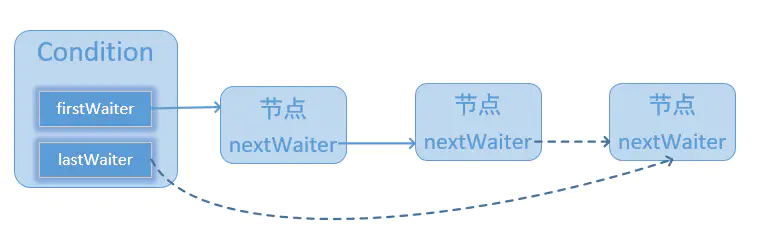
    
   如图所示，Condition拥有首尾节点的引用，而新增节点只需要将原有的尾节点nextWaiter指向它，并且更新尾节点即可。上述节点引用更新的过程并没有使用CAS保证，原因在于调用await()方法的线程必定是获取了锁的线程，也就是说该过程是由锁来保证线程安全的。
    
   在Object的监视器模型上，一个对象拥有一个同步队列和等待队列，而并发包中的Lock（更确切地说是同步器）拥有一个同步队列和多个等待队列，其对应关系如图所示。
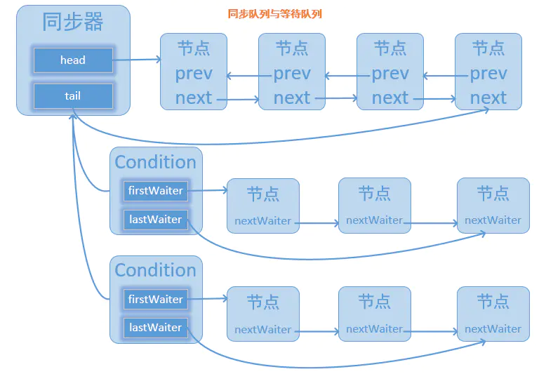
#####等待
调用Condition的await()方法（或者以await开头的方法），会使当前线程进入等待队列并释放锁，同时线程状态变为等待状态。当从await()方法返回时，当前线程一定获取了Condition相关联的锁。

 如果从队列（同步队列和等待队列）的角度看await()方法，当调用await()方法时，相当于同步队列的首节点（获取了锁的节点）移动到Condition的等待队列中。

 Condition的await()方法，如下代码所示。
```
   public final void await() throws InterruptedException {
        if (Thread.interrupted())
            throw new InterruptedException();
        // 当前线程加入等待队列
        Node node = addConditionWaiter();
        // 释放同步状态，也就是释放锁
        int savedState = fullyRelease(node);
        int interruptMode = 0;
        while (!isOnSyncQueue(node)) {
            LockSupport.park(this);
            if ((interruptMode = checkInterruptWhileWaiting(node)) != 0)
                break;
        }
        if (acquireQueued(node, savedState) && interruptMode != THROW_IE)
        interruptMode = REINTERRUPT;
        if (node.nextWaiter != null)
            unlinkCancelledWaiters();
        if (interruptMode != 0)
            reportInterruptAfterWait(interruptMode);
    }
```
  调用该方法的线程成功获取了锁的线程，也就是同步队列中的首节点，该方法会将当前线程构造成节点并加入等待队列中，然后释放同步状态，唤醒同步队列中的后继节点，然后当前线程会进入等待状态。

 当等待队列中的节点被唤醒，则唤醒节点的线程开始尝试获取同步状态。如果不是通过其他线程调用Condition.signal()方法唤醒，而是对等待线程进行中断，则会抛出InterruptedException。

 如果从队列的角度去看，当前线程加入Condition的等待队列，该过程如图示。
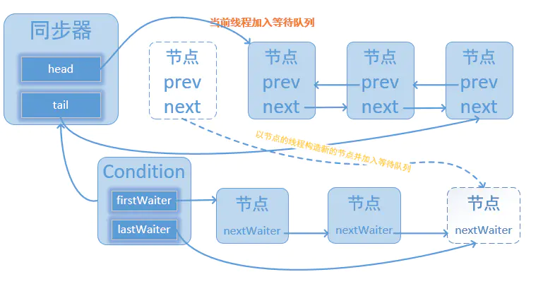
2.3 通知
 调用Condition的signal()方法，将会唤醒在等待队列中等待时间最长的节点（首节点），在唤醒节点之前，会将节点移到同步队列中。
Condition的signal()方法，如代码如下所示：
```
public final void signal() {
        if (!isHeldExclusively())
            throw new IllegalMonitorStateException();
        Node first = firstWaiter;
        if (first != null)
            doSignal(first);
    }
```
调用该方法的前置条件是当前线程必须获取了锁，可以看到signal()方法进行了isHeldExclusively()检查，也就是当前线程必须是获取了锁的线程。接着获取等待队列的首节点，将其移动到同步队列并使用LockSupport唤醒节点中的线程。

 节点从等待队列移动到同步队列的过程如图所示。
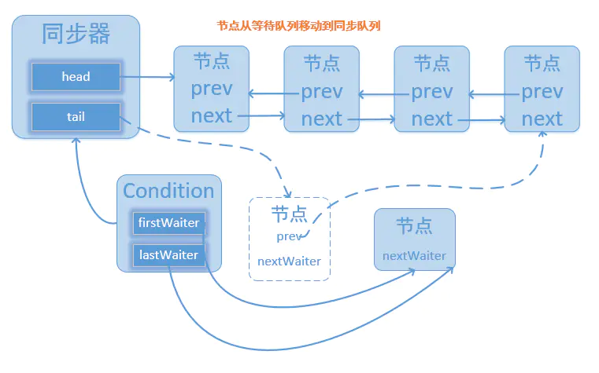

通过调用同步器的enq(Node node)方法，等待队列中的头节点线程安全地移动到同步队列。当节点移动到同步队列后，当前线程再使用LockSupport唤醒该节点的线程。

 被唤醒后的线程，将从await()方法中的while循环中退出（isOnSyncQueue(Node node)方法返回true，节点已经在同步队列中），进而调用同步器的acquireQueued()方法加入到获取同步状态的竞争中。

 成功获取同步状态（或者说锁）之后，被唤醒的线程将从先前调用的await()方法返回，此时该线程已经成功地获取了锁。

 Condition的signalAll()方法，相当于对等待队列中的每个节点均执行一次signal()方法，效果就是将等待队列中所有节点全部移动到同步队列中，并唤醒每个节点的线程。

#### ReentrantLock
ReentrantLock是Java并发包中提供的一个可重入的互斥锁。ReentrantLock和synchronized在基本用法，行为语义上都是类似的，同样都具有可重入性。只不过相比原生的Synchronized，ReentrantLock增加了一些高级的扩展功能，比如它可以实现公平锁，同时也可以绑定多个Conditon。
>可重入性

所谓的可重入性，就是可以支持一个线程对锁的重复获取，原生的synchronized就具有可重入性，一个用synchronized修饰的递归方法，当线程在执行期间，它是可以反复获取到锁的，而不会出现自己把自己锁死的情况。ReentrantLock也是如此，在调用lock()方法时，已经获取到锁的线程，能够再次调用lock()方法获取锁而不被阻塞。

>公平锁/非公平锁

所谓公平锁,顾名思义，意指锁的获取策略相对公平，当多个线程在获取同一个锁时，必须按照锁的申请时间来依次获得锁，排排队，不能插队；非公平锁则不同，当锁被释放时，等待中的线程均有机会获得锁。synchronized是非公平锁，ReentrantLock默认也是非公平的，但是可以通过带boolean参数的构造方法指定使用公平锁，但非公平锁的性能一般要优于公平锁。
synchronized是Java原生的互斥同步锁，使用方便，对于synchronized修饰的方法或同步块，无需再显式释放锁。synchronized底层是通过monitorenter和monitorexit两个字节码指令来实现加锁解锁操作的。而ReentrantLock做为API层面的互斥锁，需要显式地去加锁解锁。　

Sync，NonFairSync，FairSync。Sync作为ReentrantLock中公用的同步组件，继承了AQS（要利用AQS复杂的顶层逻辑嘛，线程排队，阻塞，唤醒等等）；NonFairSync和FairSync则都继承Sync，调用Sync的公用逻辑，然后再在各自内部完成自己特定的逻辑（公平或非公平）。
>NonFairSync
```
static final class NonfairSync extends Sync {//继承Sync
        private static final long serialVersionUID = 7316153563782823691L;
        /** 获取锁 */
        final void lock() {
            if (compareAndSetState(0, 1))//CAS设置state状态，若原值是0，将其置为1
                setExclusiveOwnerThread(Thread.currentThread());//将当前线程标记为已持有锁
            else
                acquire(1);//若设置失败，调用AQS的acquire方法，acquire又会调用我们下面重写的tryAcquire方法。这里说的调用失败有两种情况：1当前没有线程获取到资源，state为0，但是将state由0设置为1的时候，其他线程抢占资源，将state修改了，导致了CAS失败；2 state原本就不为0，也就是已经有线程获取到资源了，有可能是别的线程获取到资源，也有可能是当前线程获取的，这时线程又重复去获取，所以去tryAcquire中的nonfairTryAcquire我们应该就能看到可重入的实现逻辑了。
        }
        protected final boolean tryAcquire(int acquires) {
            return nonfairTryAcquire(acquires);//调用Sync中的方法
        }
    }
```
>nonfairTryAcquire()
```
final boolean nonfairTryAcquire(int acquires) {
            final Thread current = Thread.currentThread();//获取当前线程
            int c = getState();//获取当前state值
            if (c == 0) {//若state为0，意味着没有线程获取到资源，CAS将state设置为1，并将当前线程标记我获取到排他锁的线程，返回true
                if (compareAndSetState(0, acquires)) {
                    setExclusiveOwnerThread(current);
                    return true;
                }
            }
            else if (current == getExclusiveOwnerThread()) {//若state不为0，但是持有锁的线程是当前线程
                int nextc = c + acquires;//state累加1
                if (nextc < 0) // int类型溢出了
                    throw new Error("Maximum lock count exceeded");
                setState(nextc);//设置state，此时state大于1，代表着一个线程多次获锁，state的值即是线程重入的次数
                return true;//返回true，获取锁成功
            }
            return false;//获取锁失败了
        }
```

简单总结下流程：

　　　　1.先获取state值，若为0，意味着此时没有线程获取到资源，CAS将其设置为1，设置成功则代表获取到排他锁了；

　　　　2.若state大于0，肯定有线程已经抢占到资源了，此时再去判断是否就是自己抢占的，是的话，state累加，返回true，重入成功，state的值即是线程重入的次数；

　　　　3.其他情况，则获取锁失败。
> FairSync

```
static final class FairSync extends Sync {
        private static final long serialVersionUID = -3000897897090466540L;

        final void lock() {
            acquire(1);//直接调用AQS的模板方法acquire，acquire会调用下面我们重写的这个tryAcquire
        }

        protected final boolean tryAcquire(int acquires) {
            final Thread current = Thread.currentThread();//获取当前线程
            int c = getState();//获取state值
            if (c == 0) {//若state为0，意味着当前没有线程获取到资源，那就可以直接获取资源了吗？NO!这不就跟之前的非公平锁的逻辑一样了嘛。看下面的逻辑
                if (!hasQueuedPredecessors() &&//判断在时间顺序上，是否有申请锁排在自己之前的线程，若没有，才能去获取，CAS设置state，并标记当前线程为持有排他锁的线程；反之，不能获取！这即是公平的处理方式。
                    compareAndSetState(0, acquires)) {
                    setExclusiveOwnerThread(current);
                    return true;
                }
            }
            else if (current == getExclusiveOwnerThread()) {//重入的处理逻辑，与上文一致，不再赘述
                int nextc = c + acquires;
                if (nextc < 0)
                    throw new Error("Maximum lock count exceeded");
                setState(nextc);
                return true;
            }
            return false;
        }
    }
```

可以看到，公平锁的大致逻辑与非公平锁是一致的，不同的地方在于有了!hasQueuedPredecessors()这个判断逻辑，即便state为0，也不能贸然直接去获取，要先去看有没有还在排队的线程，若没有，才能尝试去获取，做后面的处理。反之，返回false，获取失败。

　　看看这个判断是否有排队中线程的逻辑

> hasQueuedPredecessors()
```
public final boolean hasQueuedPredecessors() {
        Node t = tail; // 尾结点
        Node h = head;//头结点
        Node s;
        return h != t &&
            ((s = h.next) == null || s.thread != Thread.currentThread());//判断是否有排在自己之前的线程
    }
```
需要注意的是，这个判断是否有排在自己之前的线程的逻辑稍微有些绕，我们来梳理下，由代码得知，有两种情况会返回true，我们将此逻辑分解一下（注意：返回true意味着有其他线程申请锁比自己早，需要放弃抢占）

　　1. h !=t && (s = h.next) == null，这个逻辑成立的一种可能是head指向头结点，tail此时还为null。考虑这种情况：当其他某个线程去获取锁失败，需构造一个结点加入同步队列中（假设此时同步队列为空），在添加的时候，需要先创建一个无意义傀儡头结点（在AQS的enq方法中，这是个自旋CAS操作），有可能在将head指向此傀儡结点完毕之后，还未将tail指向此结点。很明显，此线程时间上优于当前线程，所以，返回true，表示有等待中的线程且比自己来的还早。

　　2.h != t && (s = h.next) != null && s.thread != Thread.currentThread()。同步队列中已经有若干排队线程且当前线程不是队列的老二结点，此种情况会返回true。假如没有s.thread !=Thread.currentThread()这个判断的话，会怎么样呢？若当前线程已经在同步队列中是老二结点（头结点此时是个无意义的傀儡结点),此时持有锁的线程释放了资源，唤醒老二结点线程，老二结点线程重新tryAcquire（此逻辑在AQS中的acquireQueued方法中），又会调用到hasQueuedPredecessors，不加s.thread !=Thread.currentThread()这个判断的话，返回值就为true，导致tryAcquire失败。

　　最后，来看看ReentrantLock的tryRelease，定义在Sync中
```
protected final boolean tryRelease(int releases) {
            int c = getState() - releases;//减去1个资源
            if (Thread.currentThread() != getExclusiveOwnerThread())
                throw new IllegalMonitorStateException();
            boolean free = false;
            //若state值为0，表示当前线程已完全释放干净，返回true，上层的AQS会意识到资源已空出。若不为0，则表示线程还占有资源，只不过将此次重入的资源的释放了而已，返回false。
            if (c == 0) {
                free = true;//
                setExclusiveOwnerThread(null);
            }
            setState(c);
            return free;
        }
```

#### ReentrantReadWriteLock
ReentrantReadWriteLock是一种可重入的读写锁。ReentrantReadWriteLock继承了ReadWriteLock接口，ReadWriteLock定义了readLock()和writeLock()两个方法来获取对应的读锁或写锁。将内部分为了writeLock和readLock。
其关系图如下：
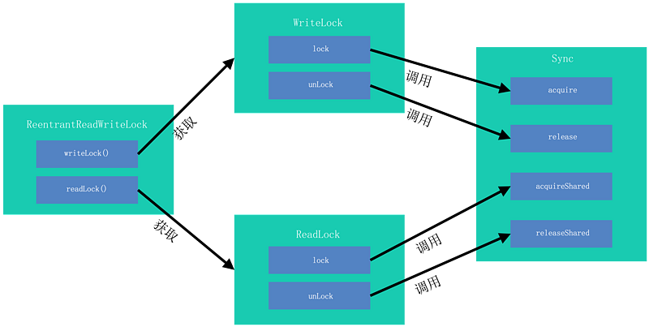
读写锁中Sync类是继承于AQS，并且主要使用上文介绍的数据结构中的state及waitStatus变量进行实现。
实现读写锁与实现普通互斥锁的主要区别在于需要分别记录读锁状态及写锁状态，并且等待队列中需要区别处理两种加锁操作。 
Sync使用state变量同时记录读锁与写锁状态，将int类型的state变量分为高16位与第16位，高16位记录读锁状态，低16位记录写锁状态，如下图所示：
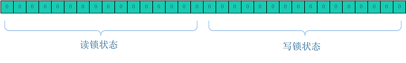
Sync使用不同的mode描述等待队列中的节点以区分读锁等待节点和写锁等待节点。mode取值包括SHARED及EXCLUSIVE两种，分别代表当前等待节点为读锁和写锁。
>写锁加锁

通过对于重要函数关系的分析，写锁加锁最终调用Sync类的acquire函数（继承自AQS）
```
public final void acquire(int arg) {
        if (!tryAcquire(arg) &&
            acquireQueued(addWaiter(Node.EXCLUSIVE), arg))
            selfInterrupt();
    }
```
* 无锁状态

无锁状态AQS内部数据结构如下图所示：
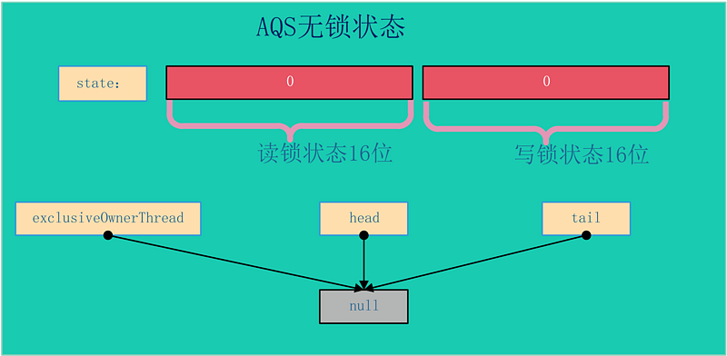
其中state变量为0，表示高位地位地位均为0，没有任何锁，且等待节点的首尾均指向空（此处特指head节点没有初始化时），锁的所有者线程也为空。
在无锁状态进行加锁操作，线程调用acquire 函数，首先使用tryAcquire函数判断锁是否可获取成功，由于当前是无锁状态必然成功获取锁（如果多个线程同时进入此函数，则有且只有一个线程可调用compareAndSetState成功，其他线程转入获取锁失败的流程）。获取锁成功后AQS状态为：
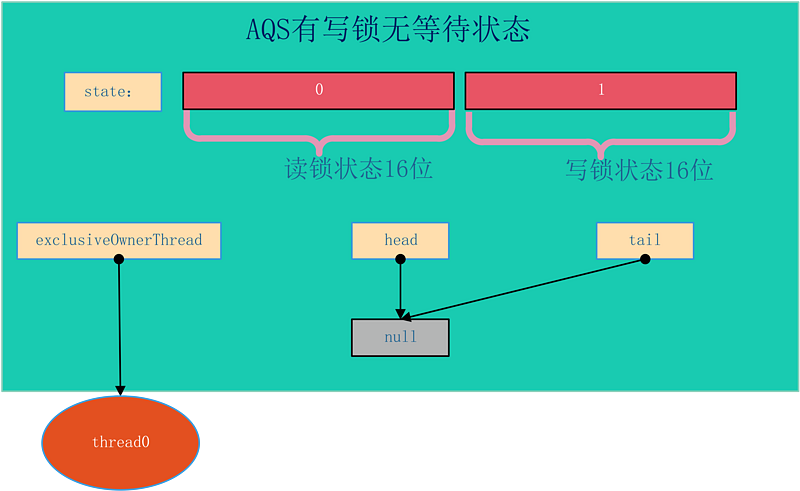

* 有锁状态
在加写锁时如果当前AQS已经是有锁状态，则需要进一步处理。有锁状态主要分为已有写锁和已有读锁状态，并且根据最终当前线程是否可直接获取锁分为两种情况：

1. 非重入：如果满足一下两个条件之一，当前线程必须加入等待队列（暂不考虑非公平锁抢占情况）
a. 已有读锁；
b. 有写锁且获取写锁的线程不为当前请求锁的线程。
2. 重入：有写锁且当前获取写锁的线程与当前请求锁的线程为同一线程，则直接获取锁并将写锁状态值加1。
写锁重入状态如图：

写锁非重入等待状态如图：
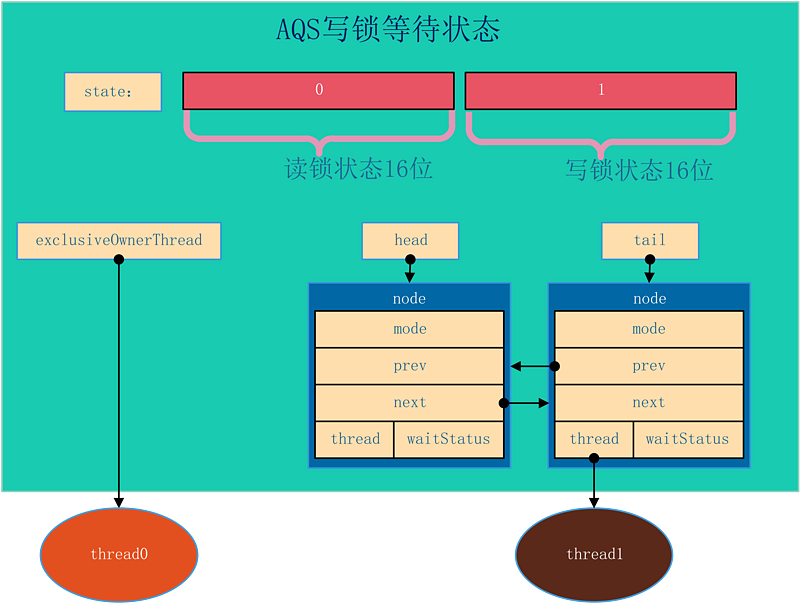
在非重入状态，当前线程创建等待节点追加到等待队列队尾，如果当前头结点为空，则需要创建一个默认的头结点。 
之后再当前获取锁的线程释放锁后，会唤醒等待中的节点，即为thread1。如果当前等待队列存在多个等待节点，由于thread1等待节点为EXCLUSIVE模式，则只会唤醒当前一个节点，不会传播唤醒信号。
> 读锁加锁
通过对于重要函数关系的分析，写锁加锁最终调用Sync类的acquireShared函数（继承自AQS）：
```
public final void acquireShared(int arg) {
        if (tryAcquireShared(arg) < 0)
            doAcquireShared(arg);
    }
```
* 无锁状态
无所状态AQS内部数据状态图与写加锁是无锁状态一致：

在无锁状态进行加锁操作，线程调用acquireShared 函数，首先使用tryAcquireShared函数判断共享锁是否可获取成功，由于当前为无锁状态则获取锁一定成功（如果同时多个线程在读锁进行竞争，则只有一个线程能够直接获取读锁，其他线程需要进入fullTryAcquireShared函数继续进行锁的获取，该函数在后文说明）。当前线程获取读锁成功后，AQS内部结构如图所示：

其中有两个新的变量：firstReader及firstReaderHoldCount。firstReader指向在无锁状态下第一个获取读锁的线程，firstReaderHoldCount记录第一个获取读锁的线程持有当前锁的计数（主要用于重入）。
* 有锁状态
无锁状态获取读锁比较简单，在有锁状态则需要分情况讨论。其中需要分当前被持有的锁是读锁还是写锁，并且每种情况需要区分等待队列中是否有等待节点。
    * 已有读锁且等待队列为空
    
    此状态比较简单，图示如：

此时线程申请读锁，首先调用readerShouldBlock函数进行判断，该函数根据当前锁是否为公平锁判断规则稍有不同。如果为非公平锁，则只需要当前第一个等待节点不是写锁就可以尝试获取锁（考虑第一点为写锁主要为了方式写锁“饿死”）；如果是公平锁则只要有等待节点且当前锁不为重入就需要等待。 
由于本节的前提是等待队列为空的情况，故readerShouldBlock函数一定返回false，则当前线程使用CAS对读锁计数进行增加（同上文，如果同时多个线程在读锁进行竞争，则只有一个线程能够直接获取读锁，其他线程需要进入fullTryAcquireShared函数继续进行锁的获取）。 
在成功对读锁计数器进行增加后，当前线程需要继续对当前线程持有读锁的计数进行增加。此时分为两种情况：

    当前线程是第一个获取读锁的线程，此时由于第一个获取读锁的线程已经通过firstReader及firstReaderHoldCount两个变量进行存储，则仅仅需要将firstReaderHoldCount加1即可;
当前线程不是第一个获取读锁的线程，则需要使用readHolds进行存储，readHolds是ThreadLocal的子类，通过readHolds可获取当前线程对应的HoldCounter类的对象，该对象保存了当前线程获取读锁的计数。考虑程序的局部性原理，又使用cachedHoldCounter缓存最近使用的HoldCounter类的对象，如在一段时间内只有一个线程请求读锁则可加速对读锁获取的计数。
第一个读锁线程重入如图：
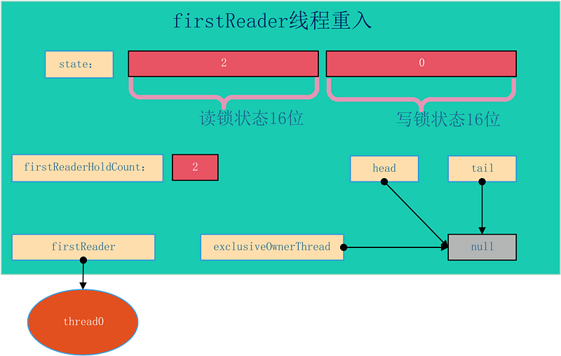
非首节点获取读锁
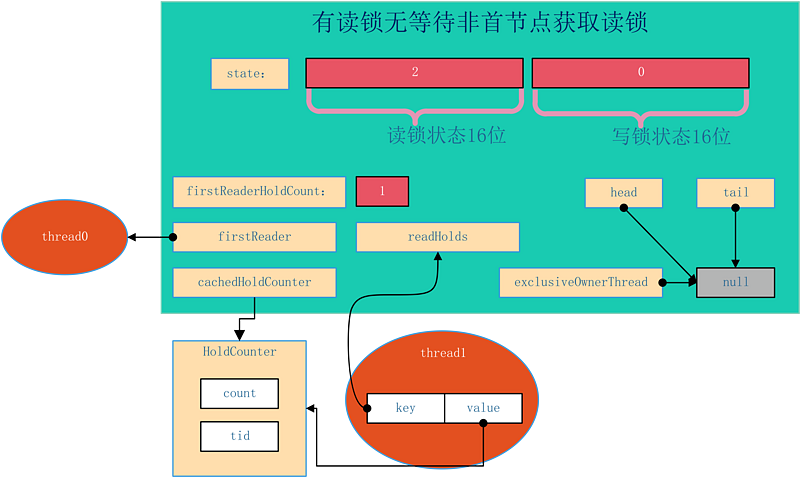
根据上图所示，thread0为首节点，thread1线程继续申请读锁，获取成功后使用ThreadLocal链接的方式进行存储计数对象，并且由于其为最近获取读锁的线程，则cachedHoldCounter对象设置指向thread1对应的计数对象。
    * 已有读锁且等待队列不为空
    在当前锁已经被读锁获取，且等待队列不为空的情况下 ，可知等待队列的头结点一定为写锁获取等待，这是由于在读写锁实现过程中，如果某线程获取了读锁，则会唤醒当前等到节点之后的所有等待模式为SHARED的节点，直到队尾或遇到EXCLUSIVE模式的等待节点（具体实现函数为setHeadAndPropagate后续还会遇到）。所以可以确定当前为读锁状态其有等待节点情况下，首节点一定是写锁等待。如图所示：
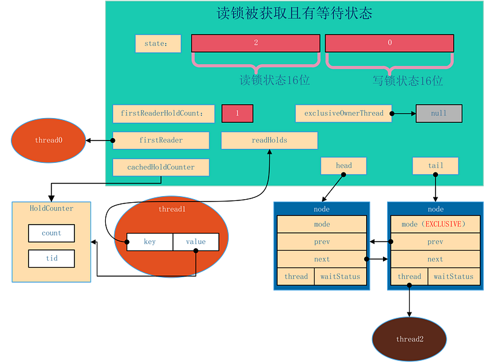
上图展示当前thread0与thread1线程获取读锁，thread0为首个获取读锁的节点，并且thread2线程在等待获取写锁。 
在上图显示的状态下，无论公平锁还是非公平锁的实现，新的读锁加锁一定会进行排队，添加等待节点在写锁等待节点之后，这样可以防止写操作的饿死。申请读锁后的状态如图所示：
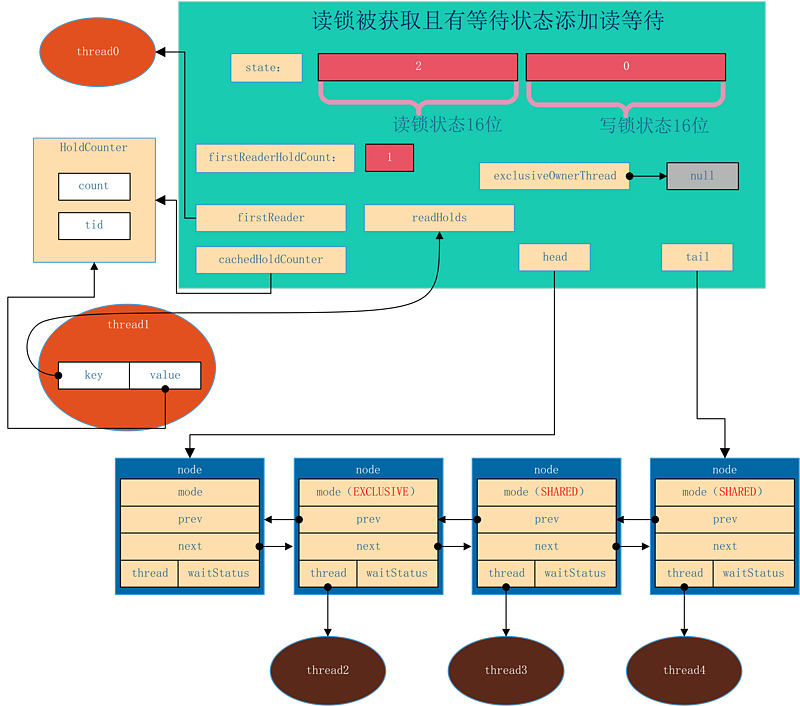
如图所示，在当前锁被为读锁且有等待队列情况下，thread3及thread4线程申请读锁，则被封装为等待节点追加到当前等待队列后，节点模式为SHARED，线程使用LockSupport.park函数进入阻塞状态，让出CPU资源，直到前驱的等待节点完成锁的获取和释放后进行唤醒。
    * 已有写锁被获取
    当前线程申请读锁时发现写锁已经被获取，则无论等待队列是否为空，线程一定会需要加入等待队列（注意在非公平锁实现且前序没有写锁申请的等待，线程有机会抢占获取锁而不进入等待队列）。写锁被获取的情况下，AQS状态为如下状态：
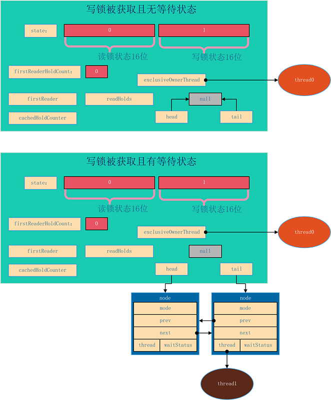
在两种情况下，读锁获取都会进入等待队列等待前序节点唤醒，这里不再赘述。
>读等待节点被唤醒

读写锁与单纯的排他锁主要区别在于读锁的共享性，在读写锁实现中保证读锁能够共享的其中一个机制就在于，如果一个读锁等待节点被唤醒后其会继续唤醒拍在当前唤醒节点之后的SHARED模式等待节点。查看源码：\
```
 private void doAcquireShared(int arg) {
       final Node node = addWaiter(Node.SHARED);
       boolean failed = true;
       try {
           boolean interrupted = false;
           for (;;) {
               final Node p = node.predecessor();
               if (p == head) {
                   int r = tryAcquireShared(arg);
                   if (r >= 0) {
                     //注意看这里
                       setHeadAndPropagate(node, r);
                       p.next = null; // help GC
                       if (interrupted)
                           selfInterrupt();
                       failed = false;
                       return;
                   }
               }
               if (shouldParkAfterFailedAcquire(p, node) &&
                   parkAndCheckInterrupt())
                   interrupted = true;
           }
       } finally {
           if (failed)
               cancelAcquire(node);
       }
   }
```
在for循环中，线程如果获取读锁成功后，需要调用setHeadAndPropagate方法。查看其源码：
```
private void setHeadAndPropagate(Node node, int propagate) {
       Node h = head; // Record old head for check below
       setHead(node);
       if (propagate > 0 || h == null || h.waitStatus < 0 ||
           (h = head) == null || h.waitStatus < 0) {
           Node s = node.next;
           if (s == null || s.isShared())
               doReleaseShared();
       }
   }
```
在满足传播条件情况下，获取读锁后继续唤醒后续节点，所以如果当前锁是读锁状态则等待节点第一个节点一定是写锁等待节点。
> 锁降级

锁降级算是获取读锁的特例，如在t0线程已经获取写锁的情况下，再调取读锁加锁函数则可以直接获取读锁，但此时其他线程仍然无法获取读锁或写锁，在t0线程释放写锁后，如果有节点等待则会唤醒后续节点，后续节点可见的状态为目前有t0线程获取了读锁。 

所降级有什么应用场景呢？引用读写锁中使用示例代码
```
class CachedData {
   Object data;
   volatile boolean cacheValid;
   final ReentrantReadWriteLock rwl = new ReentrantReadWriteLock();

   void processCachedData() {
     rwl.readLock().lock();
     if (!cacheValid) {
       // Must release read lock before acquiring write lock
       rwl.readLock().unlock();
       rwl.writeLock().lock();
       try {
         // Recheck state because another thread might have
         // acquired write lock and changed state before we did.
         if (!cacheValid) {
           data = ...
           cacheValid = true;
         }
         // Downgrade by acquiring read lock before releasing write lock
         rwl.readLock().lock();
       } finally {
         rwl.writeLock().unlock(); // Unlock write, still hold read
       }
     }

     try {
       use(data);
     } finally {
       rwl.readLock().unlock();
     }
   }
 }
```
其中针对变量cacheValid的使用主要过程为加读锁、读取、释放读锁、加写锁、修改值、加读锁、释放写锁、使用数据、释放读锁。其中后续几步（加写锁、修改值、加读锁、释放写锁、使用数据、释放读锁）为典型的锁降级。如果不使用锁降级，则过程可能有三种情况：

* 第一种：加写锁、修改值、释放写锁、使用数据，即使用写锁修改数据后直接使用刚修改的数据，这样可能有数据的不一致，如当前线程释放写锁的同时其他线程（如t0）获取写锁准备修改（还没有改）cacheValid变量，而当前线程却继续运行，则当前线程读到的cacheValid变量的值为t0修改前的老数据；
* 第二种：加写锁、修改值、使用数据、释放写锁，即将修改数据与再次使用数据合二为一，这样不会有数据的不一致，但是由于混用了读写两个过程，以排它锁的方式使用读写锁，减弱了读写锁读共享的优势，增加了写锁（独占锁）的占用时间；
* 第三种：加写锁、修改值、释放写锁、加读锁、使用数据、释放读锁，即使用写锁修改数据后再请求读锁来使用数据，这是时数据的一致性是可以得到保证的，但是由于释放写锁和获取读锁之间存在时间差，则当前想成可能会需要进入等待队列进行等待，可能造成线程的阻塞降低吞吐量。

因此针对以上情况提供了锁的降级功能，可以在完成数据修改后尽快读取最新的值，且能够减少写锁占用时间。 

最后注意，读写锁不支持锁升级，即获取读锁、读数据、获取写锁、释放读锁、释放写锁这个过程，因为读锁为共享锁，如同时有多个线程获取了读锁后有一个线程进行锁升级获取了写锁，这会造成同时有读锁（其他线程）和写锁的情况，造成其他线程可能无法感知新修改的数据（此为逻辑性错误），并且在JAVA读写锁实现上由于当前线程获取了读锁，再次请求写锁时必然会阻塞而导致后续释放读锁的方法无法执行，这回造成死锁（此为功能性错误）。
> 写锁释放锁过程

了解了加锁过程后解锁过程就非常简单，每次调用解锁方法都会减少重入计数次数，直到减为0则唤醒后续第一个等待节点，如唤醒的后续节点为读等待节点，则后续节点会继续传播唤醒状态。

>读锁释放过程

读锁释放过比写锁稍微复杂，因为是共享锁，所以可能会有多个线程同时获取读锁，故在解锁时需要做两件事：

1. 获取当前线程对应的重入计数，并进行减1，此处天生为线程安全的，不需要特殊处理；
2. 当前读锁获取次数减1，此处由于可能存在多线程竞争，故使用自旋CAS进行设置。

完成以上两步后，如读状态为0，则唤醒后续等待节点。

#### StampedLock
tampedLock类，在JDK1.8时引入，是对读写锁ReentrantReadWriteLock的增强，该类提供了一些功能，优化了读锁、写锁的访问，同时使读写锁之间可以互相转换，更细粒度控制并发。

ReentrantReadWriteLock使得多个读线程同时持有读锁（只要写锁未被占用），而写锁是独占的。

但是，读写锁如果使用不当，很容易产生“饥饿”问题：

比如在读线程非常多，写线程很少的情况下，很容易导致写线程“饥饿”，虽然使用“公平”策略可以一定程度上缓解这个问题，但是“公平”策略是以牺牲系统吞吐量为代价的。

tampedLock的主要特点概括一下，有以下几点：

* 所有获取锁的方法，都返回一个邮戳（Stamp），Stamp为0表示获取失败，其余都表示成功；
* 所有释放锁的方法，都需要一个邮戳（Stamp），这个Stamp必须是和成功获取锁时得到的Stamp一致；
* StampedLock是不可重入的；（如果一个线程已经持有了写锁，再去获取写锁的话就会造成死锁）
* StampedLock有三种访问模式：
1. Reading（读模式）：功能和ReentrantReadWriteLock的读锁类似
2. Writing（写模式）：功能和ReentrantReadWriteLock的写锁类似
3. Optimistic reading（乐观读模式）：这是一种优化的读模式。
* StampedLock支持读锁和写锁的相互转换
    我们知道RRW中，当线程获取到写锁后，可以降级为读锁，但是读锁是不能直接升级为写锁的。StampedLock提供了读锁和写锁相互转换的功能，使得该类支持更多的应用场景。
* 无论写锁还是读锁，都不支持Conditon等待

我们知道，在ReentrantReadWriteLock中，当读锁被使用时，如果有线程尝试获取写锁，该写线程会阻塞。

但是，在Optimistic reading中，即使读线程获取到了读锁，写线程尝试获取写锁也不会阻塞，这相当于对读模式的优化，但是可能会导致数据不一致的问题。所以，当使用Optimistic reading获取到读锁时，必须对获取结果进行校验。
>StampedLock示例
```
class Point {
    private double x, y;
    private final StampedLock sl = new StampedLock();

    void move(double deltaX, double deltaY) {
        long stamp = sl.writeLock();    //涉及对共享资源的修改，使用写锁-独占操作
        try {
            x += deltaX;
            y += deltaY;
        } finally {
            sl.unlockWrite(stamp);
        }
    }

    /**
     * 使用乐观读锁访问共享资源
     * 注意：乐观读锁在保证数据一致性上需要拷贝一份要操作的变量到方法栈，并且在操作数据时候可能其他写线程已经修改了数据，
     * 而我们操作的是方法栈里面的数据，也就是一个快照，所以最多返回的不是最新的数据，但是一致性还是得到保障的。
     *
     * @return
     */
    double distanceFromOrigin() {
        long stamp = sl.tryOptimisticRead();    // 使用乐观读锁
        double currentX = x, currentY = y;      // 拷贝共享资源到本地方法栈中
        if (!sl.validate(stamp)) {              // 如果有写锁被占用，可能造成数据不一致，所以要切换到普通读锁模式
            stamp = sl.readLock();             
            try {
                currentX = x;
                currentY = y;
            } finally {
                sl.unlockRead(stamp);
            }
        }
        return Math.sqrt(currentX * currentX + currentY * currentY);
    }

    void moveIfAtOrigin(double newX, double newY) { // upgrade
        // Could instead start with optimistic, not read mode
        long stamp = sl.readLock();
        try {
            while (x == 0.0 && y == 0.0) {
                long ws = sl.tryConvertToWriteLock(stamp);  //读锁转换为写锁
                if (ws != 0L) {
                    stamp = ws;
                    x = newX;
                    y = newY;
                    break;
                } else {
                    sl.unlockRead(stamp);
                    stamp = sl.writeLock();
                }
            }
        } finally {
            sl.unlock(stamp);
        }
    }
}
```
可以看到，上述示例最特殊的其实是distanceFromOrigin方法，这个方法中使用了“Optimistic reading”乐观读锁，使得读写可以并发执行，但是“Optimistic reading”的使用必须遵循以下模式：
```$xslt
long stamp = lock.tryOptimisticRead();  // 非阻塞获取版本信息
copyVaraibale2ThreadMemory();           // 拷贝变量到线程本地堆栈
if(!lock.validate(stamp)){              // 校验
    long stamp = lock.readLock();       // 获取读锁
    try {
        copyVaraibale2ThreadMemory();   // 拷贝变量到线程本地堆栈
     } finally {
       lock.unlock(stamp);              // 释放悲观锁
    }

}
useThreadMemoryVarables();              // 使用线程本地堆栈里面的数据进行操作
```

>StampedLock原理

##### StampedLock的内部常量

StampedLock虽然不像其它锁一样定义了内部类来实现AQS框架，但是StampedLock的基本实现思路还是利用CLH队列进行线程的管理，通过同步状态值来表示锁的状态和类型。

StampedLock内部定义了很多常量，定义这些常量的根本目的还是和ReentrantReadWriteLock一样，对同步状态值按位切分，以通过位运算对State进行操作：
>对于StampedLock来说，写锁被占用的标志是第8位为1，读锁使用0-7位，正常情况下读锁数目为1-126，超过126时，使用一个名为readerOverflow的int整型保存超出数。

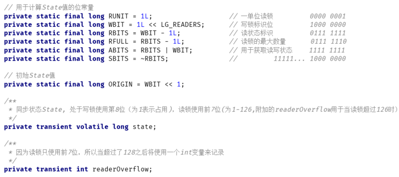

另外，StampedLock相比ReentrantReadWriteLock，对多核CPU进行了优化，可以看到，当CPU核数超过1时，会有一些自旋操作:

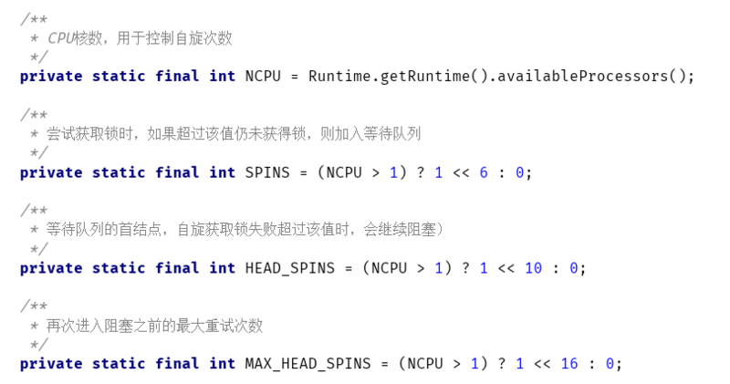
