#  一. synchronized 关键字实现原理及应用方式简述
造成线程安全问题的主要诱因是：多条线程共同操作共享数据。所以存在此种可能性时，需要保证同一时刻有且只有一个线程在操作共享数据，其他线程必须等到该线程处理完数据后再进行。此种方式命名为互斥锁，在Java中，这也是最初的 synchronized 关键字实现的功能，即现在所说的重量级锁。
语言层面上来看，synchronized关键字主要有3种应用方式：
* 修饰实例方法，作用于当前实例加锁，进入同步代码前要获得当前实例的锁
* 修饰静态方法，作用于当前类对象加锁，进入同步代码前要获得当前类对象的锁
* 修饰代码块，指定加锁对象，对给定对象加锁，进入同步代码块前要获得给定对象的锁。

具体不进行举例。但是三种方式的底层原理是相同的，依赖于进入和退出 Monitor （可译为“管程”）对象来实现。
### 1.1. 重量级锁的实现原理
在Java对象头中，会记录指向该对象对应的重量级锁的指针。每个对象都存在着一个 monitor 与之关联，对象与其 monitor 之间的关系又存在多种实现方式，如 monitor 可以与对象一起创建销毁，或当线程试图获取对象锁时自动生成。但当一个 monitor 被某个线程持有后，它便处于锁定状态。在 HotSpot 中，monitor是由 ObjectMonitor 实现的。参考 /hotspot/src/share/vm/runtime/objectMonitor.hpp 中的定义：
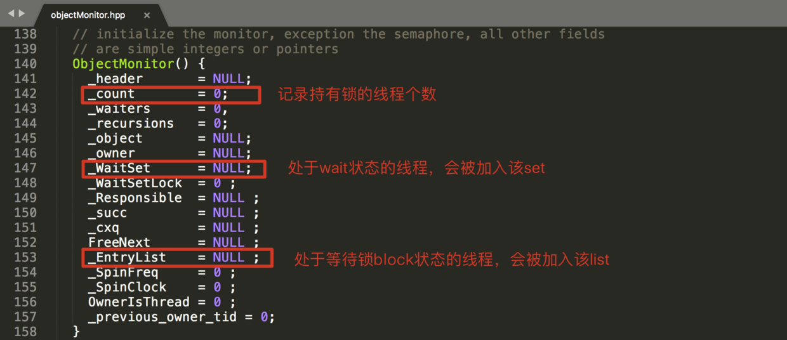
ObjectMonitor中有两个队列，_WaitSet 和 _EntryList，用来保存 ObjectWaiter对象列表 （每个等待锁的线程都会被封装成ObjectWaiter对象，也在objectMonitor.hpp中定义，知道有这么个东西就行了）：
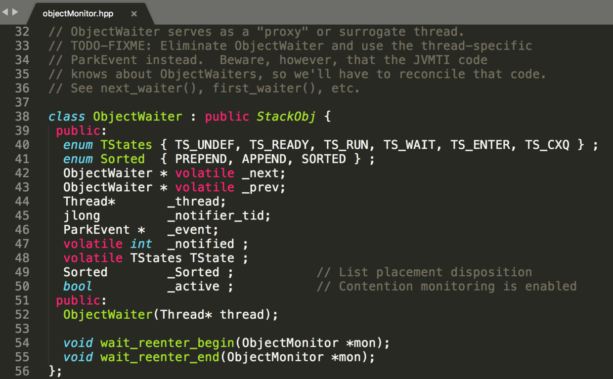

_owner 指向持有 ObjectMonitor 对象的线程，当多个线程同时访问一段同步代码时，首先会进入 _EntryList 集合，当线程获取到对象的 monitor 后进入 _owner 区域并把 monitor 中的 owner 变量设置为当前线程，同时monitor中的计数器 count 加1（这个 count 主要是为了可重入设置）。若当前线程执行完毕将释放 monitor 并复位变量的值，以便其他线程进入获取monitor。
以上简要介绍了获取和释放互斥锁的操作。由此看来，monitor对象存在于每个Java对象的对象头中（存储的指针的指向），synchronized锁便是通过这种方式获取锁的，这也是为什么Java中任意对象可以作为锁的原因。
接下来向上一层分析三种不同应用方式字节码层面的不同原理。

### 1.2. synchronized 代码块如何利用monitor
一个简单的同步代码块：
```
public class SynchronizedTest {
    short a = 1;

    public void test() {
        synchronized (this) {
            a++;
        }
    }
}
```
javap 字节码：

从字节码中可知同步语句块的实现使用的是 monitorenter 和 monitorexit 指令，其中 monitorenter 指令指向同步代码块的开始位置，monitorexit 指令则指明同步代码块的结束位置。当执行monitorenter指令时，当前线程将试图获取对象锁所对应的 monitor 的持有权，当 monitor 的进入计数器count为 0，那线程可以成功取得 monitor，并将计数器值设置为 1，取锁成功。如果当前线程已经拥有  monitor 的持有权，那它可以重入这个 monitor ，重入时计数器的值也会加 1。倘若其他线程已经拥有 monitor 的所有权，那当前线程将被阻塞，直到正在执行线程执行完毕。
注意：编译器会确保无论方法通过何种方式完成，方法中调用过的每条 monitorenter 指令都有执行其对应 monitorexit 指令，而无论这个方法是正常结束还是异常结束。为了保证在方法异常完成时 monitorenter 和 monitorexit 指令依然可以正确配对执行，编译器会自动产生一个异常处理器，这个异常处理器声明可处理所有的异常，它的目的就是用来执行 monitorexit 指令。从字节码中也可以看出多了一个monitorexit 指令，它就是异常结束时被执行的释放monitor 的指令。

### 1.3. synchronized 方法如何利用monitor
一个简单的同步方法：
```
public class SynchronizedTest {
    short a = 1;

    public synchronized void test() {
        a++;
    }
}
```
javap 字节码（整体太长可以自己打印尝试，本文主要关注test方法）：
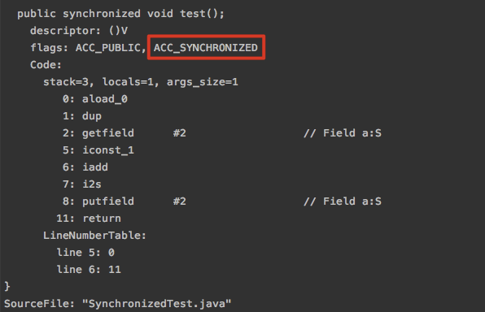
从字节码中可以看出，synchronized修饰的方法并没有 monitorenter 和 monitorexit 指令，取得代之的是 ACC_SYNCHRONIZED 标识，JVM通过该访问标志来辨别一个方法是否声明为同步方法，从而执行相应的同步调用。当方法调用时，调用指令将会检查方法的 ACC_SYNCHRONIZED 访问标志是否被设置，如果设置了，执行线程将先持有 monitor 然后再执行方法，最后在方法完成（无论是正常完成还是非正常完成）时释放 monitor。在方法执行期间，执行线程持有了monitor，其他任何线程都无法再获得同一个 monitor。如果一个同步方法执行期间抛出了异常，并且在方法内部无法处理此异常，那这个同步方法所持有的 monitor 将在异常抛到同步方法之外时自动释放。

> 在Java早期版本中，synchronized 属于重量级锁，效率低下。因为监视器锁（monitor）是依赖于底层的操作系统的 Mutex Lock 来实现的，而操作系统实现线程之间的切换时需要从用户态转换到核心态，这个状态之间的转换需要相对比较长的时间。在 Java 6 之后 Java 官方对从 JVM 层面对 synchronized 较大优化，引入了偏向锁和轻量级锁。

# 二. 优化后的 synchronized 锁级别及锁升级
JDK1.6优化后，加锁存在4种状态：无锁、偏向锁、轻量级锁、重量级锁（锁竞争级别从低到高）。本次实验将分析各种锁是如何升级的，及其简要原理。
## 2.1. 先修知识简述
### 2.1.1. Java对象、对象头的组成
Java对象存储在堆内存中，对象的存储可以分为三部分：对象头、实例变量和填充字节。
- 对象头：由 mark word 和  klass pointer 两部分组成。mark word存储了同步状态、标识、- hashcode、GC状态等；klass pointer存储对象的类元数据的指针，虚拟机通过这个指针来确定这个对象是哪个类的实例，64位虚拟机可对 klass pointer 开启压缩至32位。
- 实例变量：存储对象的属性信息，包括父类的属性信息，按照4字节对齐。
- 填充字节：用于凑齐虚拟机要求的8字节整数倍。
对象头结构图示（具体知识情前置学习）：
32位：

开启压缩后的64位：

其中重要的两个字段：
lock:  锁状态标志位，该标记的值不同，整个mark word表示的含义不同。
biased_lock：偏向锁标记，为1时表示对象启用偏向锁，为0时表示对象没有偏向锁。

### 2.1.2. JOL打印对象信息
```
<dependency>
  <groupId>org.openjdk.jol</groupId>
  <artifactId>jol-core</artifactId>
  <version>0.8</version>
</dependency>
```
一个打印对象信息的工具，详情并非本文重点，请查阅相关资料。
### 2.1.3. 大端小端字节序
参考 [理解字节序-阮一峰](https://www.ruanyifeng.com/blog/2016/11/byte-order.html)
### 2.1.4. 对象信息打印示例
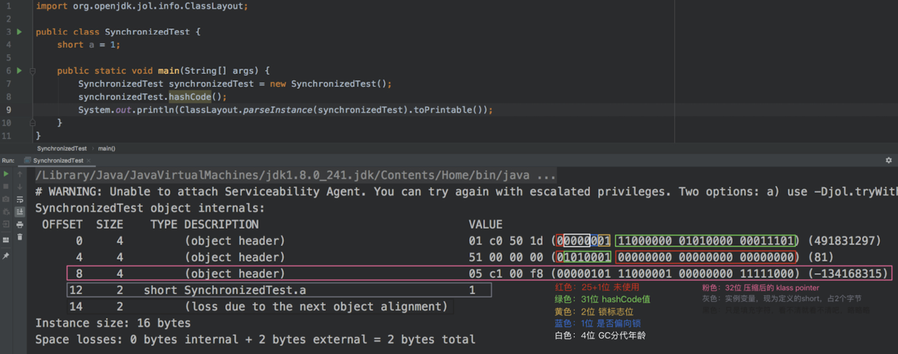

以上对象头信息中可知：该对象现在处于无锁状态，数据读取采取小端字节序。同时注意：hashCode延迟加载，当对象使用 hashCode() 计算后，才会将结果写到该对象头中。
接下来进入正题。

## 2.2. 偏向锁相关实验
在大多数情况下，锁不仅不存在多线程竞争，而且总是由同一线程多次获得，因此为了减少同一线程获取锁（会涉及到一些CAS操作）的代价而引入偏向锁。
偏向锁的核心思想是，如果一个线程获得了锁，那么锁就进入偏向模式，此时 Mark Word 的结构也变为偏向锁结构，当这个线程再次请求锁时，无需再做任何CAS操作，这样就省去了大量有关锁申请的操作，提高了程序的性能。
对于没有锁竞争的场合，偏向锁有很好的优化效果，毕竟极有可能连续多次是同一个线程申请相同的锁。但是对于锁竞争比较激烈的场合，偏向锁就失效了（批量撤销第三部分讲解），因为这样场合极有可能每次申请锁的线程都是不相同的，因此这种场合下不应该使用偏向锁。
可以理解为：偏向锁应用于“一个对象在一段很长的时间内都只被一个线程用做锁对象”的场景，或者干脆说偏向锁是一种特殊状态的“无锁”。
### 2.2.1. 无锁
```
public static void noLock() {
    BiasedLock biasedLock = new BiasedLock();
    System.out.println(ClassLayout.parseInstance(biasedLock).toPrintable());
}
```
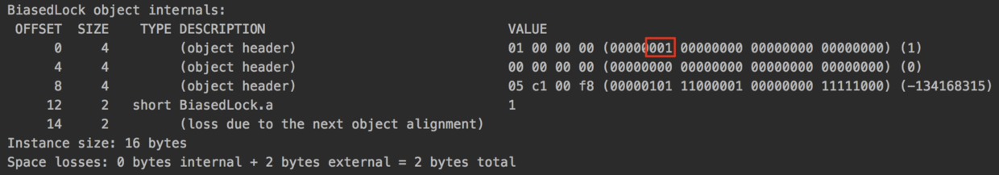
### 2.2.2. 无偏向的偏向锁
```
public static void biasedLockingNoBias() throws InterruptedException {
    Thread.sleep(5000);
    BiasedLock biasedLock = new BiasedLock();
    System.out.println(ClassLayout.parseInstance(biasedLock).toPrintable());
}
```

* 解释：这里并没有需要同步，直觉上应该是无锁，为什么加了偏向锁？
这里占用 thread 和 epoch 的 位置的均为0，说明当前偏向锁并没有偏向任何线程。此时这个偏向锁正处于可偏向状态，也可以理解为此时的偏向锁是一个“特殊状态的无锁”。
偏向锁是默认开启的，如果不想要偏向锁，可以通过-XX:-UseBiasedLocking = false来设置。
* 解释：为什么上一个实验结果是无锁，sleep() 5秒后成为偏向锁？
JVM启动时会进行一系列的复杂活动，比如装载配置，系统类初始化等等。在这个过程中会使用大量synchronized关键字对对象加锁，且这些锁大多数都不是偏向锁。为了减少初始化时间，JVM默认延时加载偏向锁。这个延时的时间为4s左右。
当然我们也可以设置JVM参数 -XX:BiasedLockingStartupDelay=0 来取消延时加载偏向锁。
### 2.2.3. 偏向某个线程的偏向锁
```
public static void biasedLockingWithBias() throws InterruptedException {
    Thread.sleep(5000);
    final BiasedLock biasedLock = new BiasedLock();
    System.out.println("无线程持有锁");
    System.out.println(ClassLayout.parseInstance(biasedLock).toPrintable());

    synchronized (biasedLock) {
        System.out.println("主线程持有锁");
        System.out.println(ClassLayout.parseInstance(biasedLock).toPrintable());
    }

    System.out.println("无线程持有锁");
    System.out.println(ClassLayout.parseInstance(biasedLock).toPrintable());
}
```
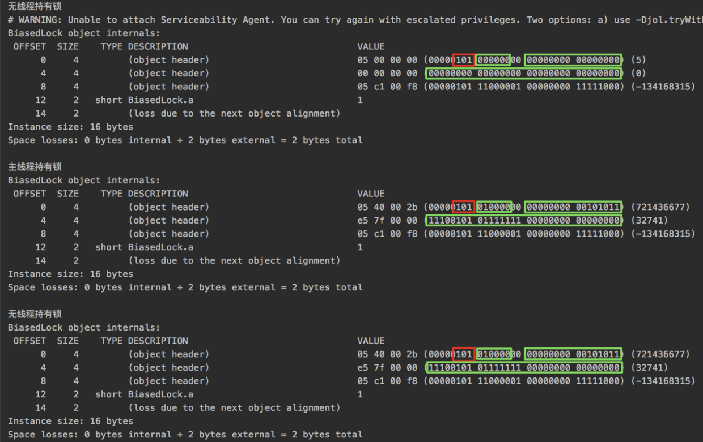
由实验结果看出，一开始是没有偏向的偏向锁。而后主线程持有锁后成为偏向主线程的偏向锁，绿框中存储了被偏向的线程ID。且在该线程不再持有锁之后，偏向锁不会自行释放（准确地说是不会主动更改记录的偏向threadId）。

> 偏向锁什么时候升级
> 当其他线程进入同步块时，发现已经有偏向的线程了，则会进入到撤销偏向锁的逻辑里。会先查看偏向的线程是否还存活，如果存活且还在同步块中则将锁升级为轻量级锁，原偏向的线程继续拥有锁，当前线程则走入到锁升级的逻辑里；如果偏向的线程已经不存活或者不在同步块中，则将对象头的mark word改为无锁状态（unlocked），之后再升级为轻量级锁。
> 综上，偏向锁升级的时机为：当锁已经发生偏向后，只要有另一个线程尝试获得偏向锁，则该偏向锁就会升级成轻量级锁。
> 注意一个例外：批量重偏向，第三部分讲。

## 2.3. 轻量级锁相关实验
JVM的开发者发现在很多情况下，在Java程序运行时，同步块中的代码都是不存在竞争的，不同的线程交替的执行同步块中的代码。这种情况下，用重量级锁是没必要的，因此JVM引入了轻量级锁的概念。如果存在同一时间访问同一锁的场合，就会导致轻量级锁膨胀为重量级锁。
### 2.3.1. 直接升级轻量级锁
```
public static void lightweightLockNoBiased() throws InterruptedException {
    final LightweightLock lightweightLock = new LightweightLock();
    System.out.println("无线程持有锁");
    System.out.println(ClassLayout.parseInstance(lightweightLock).toPrintable());

    synchronized (lightweightLock) {
        System.out.println("主线程持有锁");
        System.out.println(ClassLayout.parseInstance(lightweightLock).toPrintable());
    }

    System.out.println("无线程持有锁");
    System.out.println(ClassLayout.parseInstance(lightweightLock).toPrintable());
}
```
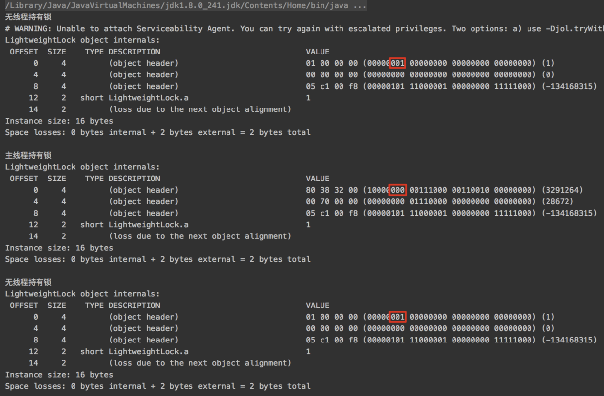
本过程没有经过偏向锁（偏向锁还没回过神儿来）的时候，直接进入了同步代码块，升级为轻量级锁，之后也就没有偏向锁阶段了（不能降级）。

### 2.3.2. 偏向锁升级为轻量级锁
```
public static void startLightweightLock() throws InterruptedException {
    Thread.sleep(5000);
    final LightweightLock lightweightLock = new LightweightLock();
    System.out.println("无线程持有锁");
    System.out.println(ClassLayout.parseInstance(lightweightLock).toPrintable());

    Thread thread1 = new Thread(){
        @Override
        public void run() {
            synchronized (lightweightLock) {
                System.out.println("thread1 持有锁");
                System.out.println(ClassLayout.parseInstance(lightweightLock).toPrintable());
            }
            try {
                Thread.sleep(5000);
            } catch (InterruptedException e) {
                e.printStackTrace();
            }
        }
    };
    thread1.start();
    // 注意，这里 sleep 3秒，保证了thread1已经执行完同步代码块部分，但是线程还存在，手动造成轻量级锁条件
    Thread.sleep(3000);

    System.out.println("无线程持有锁");
    System.out.println(ClassLayout.parseInstance(lightweightLock).toPrintable());

    Thread thread2 = new Thread(){
        @Override
        public void run() {
            synchronized (lightweightLock) {
                System.out.println("thread2 持有锁");
                System.out.println(ClassLayout.parseInstance(lightweightLock).toPrintable());
            }
        }
    };
    thread2.start();
    thread2.join();

    System.out.println("无线程持有锁");
    System.out.println(ClassLayout.parseInstance(lightweightLock).toPrintable());
}
```
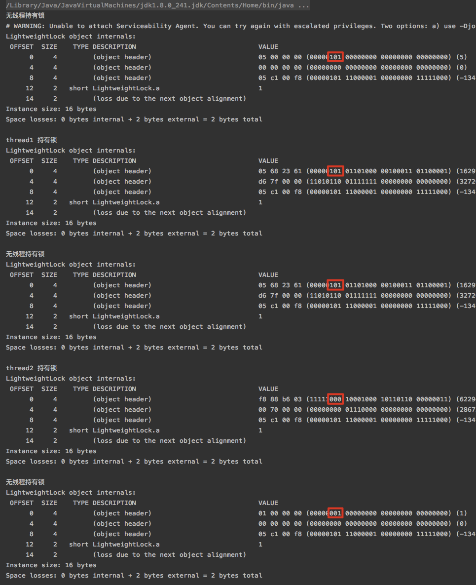
由实验结果看出：起初是无偏向的偏向锁；thread1持有后成为偏向thread1的偏向锁；thread1退出同步代码块后，但是线程还存在，此时锁不会自动取消偏向；thread2持有锁后，成为了轻量级锁；thread2退出同步代码块后，成为无锁状态。

* 注意：我们常说的锁状态只能升级不能降级，是说比如一旦成为轻量级锁，下次加锁的时候就会直接加轻量级锁，不经过偏向锁阶段，成为重量级锁同理不经过轻量级锁阶段。而不是理解为，成为轻量级锁就不能解锁，当没有同步需求时，是会回到001无锁状态的。

## 2.4. 重量级锁相关实验
重量级锁就是1.6之前 synchronized 最原始的锁结构，第一部分已经讲解。
### 2.4.1. 升级重量级锁
```
public static void startHeavyweightLock() throws InterruptedException {
    Thread.sleep(5000);
    final HeavyweightLock heavyweightLock = new HeavyweightLock();
    System.out.println("无线程持有锁");
    System.out.println(ClassLayout.parseInstance(heavyweightLock).toPrintable());

    Thread thread1 = new Thread(){
        @Override
        public void run() {
            synchronized (heavyweightLock) {
                System.out.println("thread1 持有锁");
                System.out.println(ClassLayout.parseInstance(heavyweightLock).toPrintable());
                try {
                    Thread.sleep(4000);
                } catch (InterruptedException e) {
                    e.printStackTrace();
                }

                System.out.println("thread1 仍然持有锁，但是thread2出现了");
                System.out.println(ClassLayout.parseInstance(heavyweightLock).toPrintable());
                try {
                    Thread.sleep(1000);
                } catch (InterruptedException e) {
                    e.printStackTrace();
                }
            }
        }
    };
    thread1.start();
    // 这里延时2秒，保证处于thread1的临界区中
    Thread.sleep(2000);

    Thread thread2 = new Thread(){
        @Override
        public void run() {
            synchronized (heavyweightLock) {
                System.out.println("thread2 持有锁");
                System.out.println(ClassLayout.parseInstance(heavyweightLock).toPrintable());
            }
        }
    };
    thread2.start();
    thread2.join();

    Thread.sleep(5000);
    System.out.println("无线程持有锁");
    System.out.println(ClassLayout.parseInstance(heavyweightLock).toPrintable());
}
```
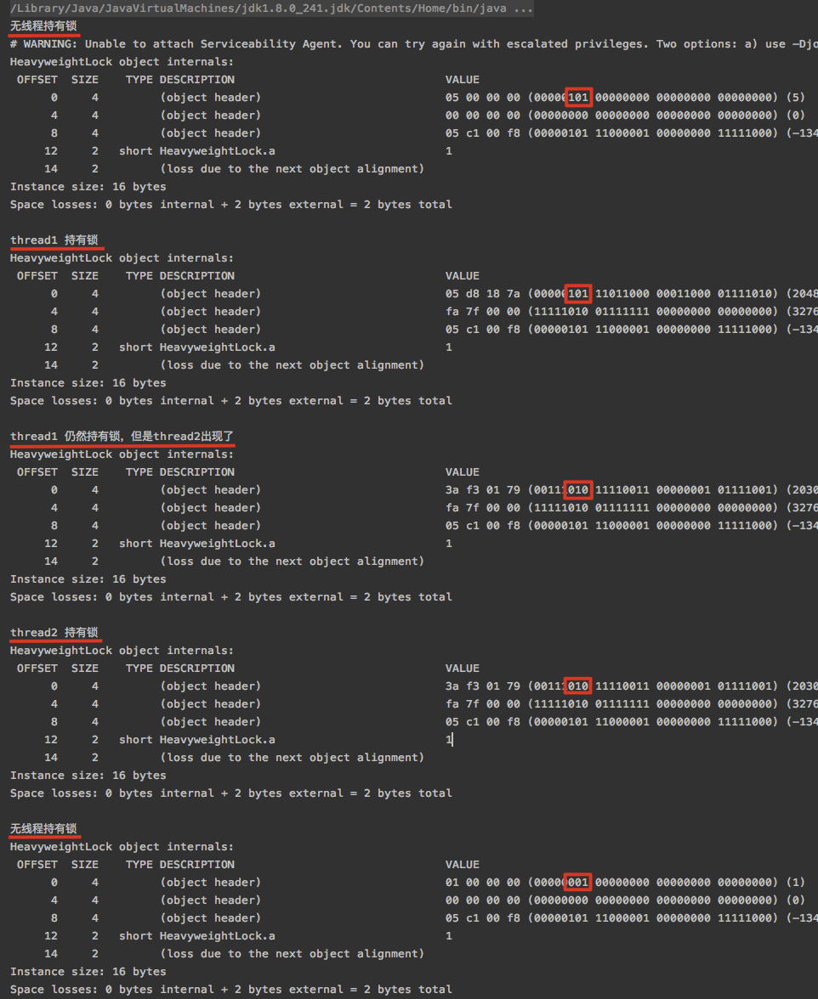
由实验结果看出，thread1 一开始持有偏向锁，当其仍然持有锁的时候，thread2 也竞争锁，就升级成为了重量级锁。

# 三. 偏向锁专题——批量重偏向和批量撤销
## 3.1. 什么是 批量重偏向 和 批量撤销
当只有一个线程反复进入同步块时，偏向锁带来的性能开销基本可以忽略，但是当有其他线程尝试获得锁时，就需要等到 safe point 时将偏向锁撤销为无锁状态或升级为轻量级/重量级锁。safe point（全局安全点）这个词我们在GC中经常会提到，详细可以查阅其他资料。总之，偏向锁的撤销是有一定成本的，如果说运行时的场景本身存在多线程竞争的，那偏向锁的存在不仅不能提高性能，而且会导致性能下降。因此，JVM中增加了批量重偏向、批量撤销的机制。

存在如下两种情况：
1.一个线程 thread1 创建了大量对象并执行了初始的同步操作，之后在另一个线程 thread2 中将这些对象作为锁进行之后的操作。这种情况下，会导致大量的偏向锁撤销操作。
2.存在明显多线程竞争的场景下使用偏向锁是不合适的，撤销开销太大。
批量重偏向（bulk rebias）机制是为了解决第一种场景，批量撤销（bulk revoke）则是为了解决第二种场景。

其做法是：以类为单位，重点，这两个操作都是以类位单位的。为每个类维护一个偏向锁撤销计数器，每一次该类的对象发生偏向撤销操作时，该计数器+1，当这个值达到重偏向阈值（默认20）时，JVM就认为该类的偏向锁有问题，因此会进行批量重偏向。过程原理为：
每个类对象会有一个对应的epoch字段，每个处于偏向锁状态对象的 mark word 中也有该字段，其初始值为创建该对象时类中的epoch的值。每次发生批量重偏向时，就将该值+1，同时遍历JVM中所有线程的栈，找到该类所有正处于加锁状态的偏向锁，将其epoch字段改为新值，其余不更新。也就是说不能重偏向正在使用的锁，否则会破坏锁的线程安全性。下次有线程要获得锁时，如果发现当前对象的 epoch 值和类的 epoch 不相等，那就算当前已经偏向了其他线程，这时不会执行撤销操作，而是直接通过CAS操作将其 mark word 的 threadId 改成当前线程Id。完成重偏向。
超过重偏向阈值后，假设该类计数器继续增长，当其达到批量撤销的阈值后（默认40），JVM就认为该类的使用场景存在多线程竞争，会标记该类为不可偏向，之后对于该类的锁，直接走轻量级锁的逻辑。
可以通过 -XX:BiasedLockingBulkRebiasThreshold 和 -XX:BiasedLockingBulkRevokeThreshold 来手动设置阈值。

## 3.2. 批量重偏向实验
思路步骤：
1. 启动thread1，制造50个偏向thread1的偏向锁，并保持thread1 alive；
2. 启动thread2，竞争前30个偏向锁，此时前19个应该是轻量级锁，第二十个达到重偏向阈值，故第20个到30个应该是偏向thread2的偏向锁；
3. 随机验证前20个、20-30个、30个之后的锁状态，并对比 Mark Word 值。应该分别为thread2持有的轻量级锁释放后的无锁、重偏向thread2的偏向锁、偏向thread1的偏向锁。
实验代码：
```
public static void bulkRebias() throws InterruptedException {
    Thread.sleep(5000);

    //创造50个偏向线程thread1的偏向锁
    List<BiasedLock> list = new ArrayList<BiasedLock>();
    Thread thread1 = new Thread(() -> {
        for (int i = 0; i < 50 ; i++) {
            BiasedLock biasedLock = new BiasedLock();
            synchronized (biasedLock){
                list.add(biasedLock);
            }
        }
        try {
            // 保持线程 thread1 alive
            Thread.sleep(100000);
        } catch (InterruptedException e) {
            e.printStackTrace();
        }
    });
    thread1.start();

    // sleep 3秒保证 thread1 创建对象完成
    Thread.sleep(3000);
    System.out.println("thread1持有过的锁，list 中第19个对象的对象头：");
    System.out.println(ClassLayout.parseInstance(list.get(18)).toPrintable());
    System.out.println("thread1持有过的锁，list 中第20个对象的对象头：");
    System.out.println(ClassLayout.parseInstance(list.get(19)).toPrintable());

    // 创建线程 thread2 竞争线程 thread1 中已经退出同步块的锁
    Thread thread2 = new Thread(() -> {
        // 循环30次
        for (int i = 0; i < 30; i++) {
            BiasedLock biasedLock =list.get(i);
            synchronized (biasedLock){
                //分别打印第19次和第20次偏向锁重偏向结果
                if(i == 18 || i == 19){
                    System.out.println("thread2 第" + (i + 1) + "次偏向结果");
                    System.out.println(ClassLayout.parseInstance(biasedLock).toPrintable());
                }
            }
        }
    });
    thread2.start();

    Thread.sleep(3000);
    System.out.println("打印list中第11个对象的对象头：");
    System.out.println(ClassLayout.parseInstance(list.get(10)).toPrintable());
    System.out.println("打印list中第26个对象的对象头：");
    System.out.println(ClassLayout.parseInstance(list.get(25)).toPrintable());
    System.out.println("打印list中第41个对象的对象头：");
    System.out.println(ClassLayout.parseInstance(list.get(40)).toPrintable());
}
```
实验结果：
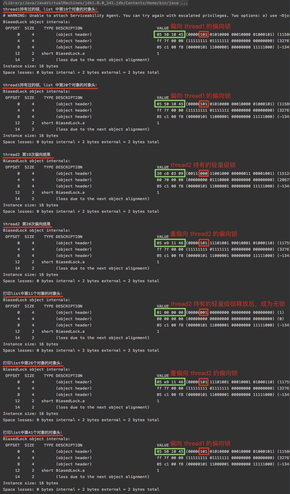
3.3. 批量撤销实验

```
public static void bulkRevoke() throws InterruptedException {
    Thread.sleep(5000);

    // 创造100个偏向线程thread1的偏向锁
    List<BiasedLock> list = new ArrayList<BiasedLock>();
    Thread thread1 = new Thread(() -> {
        for (int i = 0; i < 100 ; i++) {
            BiasedLock biasedLock = new BiasedLock();
            synchronized (biasedLock){
                list.add(biasedLock);
            }
        }
        try {
            // 保持线程 thread1 alive
            Thread.sleep(100000);
        } catch (InterruptedException e) {
            e.printStackTrace();
        }
    });
    thread1.start();
    // sleep 3秒保证 thread1 创建对象完成
    Thread.sleep(3000);
    System.out.println(ClassLayout.parseInstance(list.get(10)).toPrintable());

    // 创建线程 thread2 ，竞争 thread1 中已经退出同步块的锁
    Thread thread2 = new Thread(() -> {
        // 循环40次以上，达到批量撤销阈值
        for (int i = 0; i < 40; i++) {
            BiasedLock biasedLock = list.get(i);
            synchronized (biasedLock){
            }
        }
    });
    thread2.start();

    Thread.sleep(3000);
    System.out.println("打印list中第11个对象的对象头：");
    System.out.println(ClassLayout.parseInstance(list.get(10)).toPrintable());
    System.out.println("打印list中第26个对象的对象头：");
    System.out.println(ClassLayout.parseInstance(list.get(25)).toPrintable());
    System.out.println("打印list中第43个对象的对象头：");
    System.out.println(ClassLayout.parseInstance(list.get(42)).toPrintable());

    Thread thread3 = new Thread(() -> {
        for (int i = 20; i < 40; i++) {
            BiasedLock biasedLock = list.get(i);
            synchronized (biasedLock){
                if(i == 20|| i == 22){
                    System.out.println("thread3 第" + (i + 1) + "次");
                    System.out.println((ClassLayout.parseInstance(biasedLock).toPrintable()));
                }
            }
        }
    });
    thread3.start();

    Thread.sleep(3000);
    BiasedLock newBiasedLock = new BiasedLock();
    System.out.println("一个新的该类实例");
    System.out.println(ClassLayout.parseInstance(newBiasedLock).toPrintable());
    synchronized (newBiasedLock) {
        System.out.println("主线程获取新实例的锁");
        System.out.println(ClassLayout.parseInstance(newBiasedLock).toPrintable());
    }
}
```
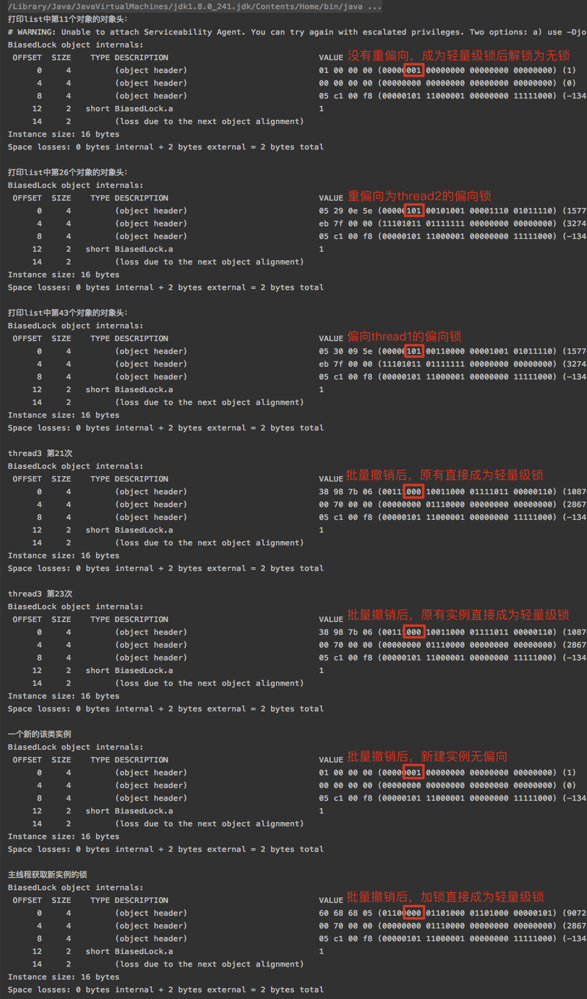


> 参考资料：
> [https://github.com/farmerjohngit/myblog/issues/12](https://github.com/farmerjohngit/myblog/issues/12)
> [https://www.cnblogs.com/LemonFive/p/11246086.html](https://www.cnblogs.com/LemonFive/p/11246086.html)