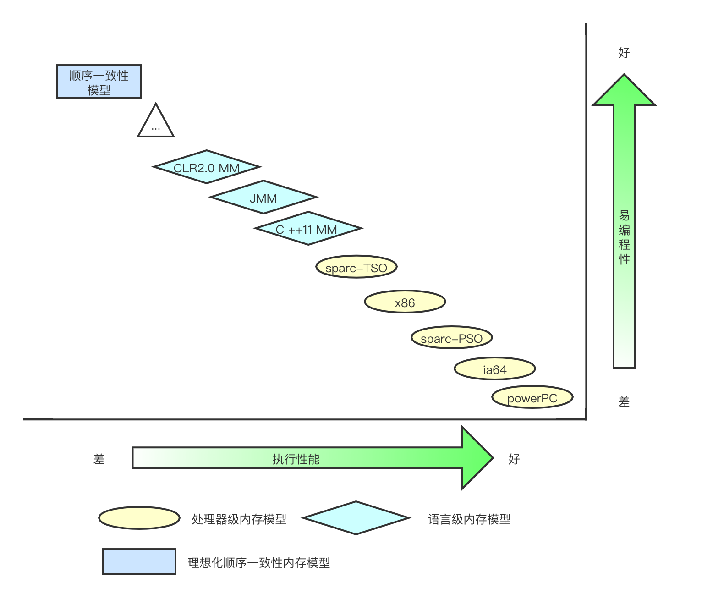

在并发编程中，我们需要处理两个关键问题：线程之间如何**通信**及线程之间如何**同步**。通信是指线程之间以何种机制来交换信息，同步是指程序用于控制不同线程之间操作发生相对顺序的机制。在命令式编程中，线程之间的通信机制有两种：共享内存和消息传递，他们的特点如下：

|      | 共享内存模型                                                 | 消息传递模型                                                 |
| ---- | ------------------------------------------------------------ | ------------------------------------------------------------ |
| 通信 | 线程之间共享程序的公共状态，线程之间通过写-读内存中的公共状态来隐式进行通信 | 线程之间没有公共状态，线程之间必须通过明确的发送消息来显式进行通信 |
| 同步 | 同步是显式进行的。程序员必须显式指定某个方法或某段代码需要在线程之间互斥执行 | 由于消息的发送必须在消息的接收之前，因此同步是隐式进行的     |

为了保证共享内存的正确性（可见性、有序性、原子性），内存模型定义了共享内存系统中多线程程序读写操作行为的规范。通过这些规则来规范对内存的读写操作，从而保证指令执行的正确性。它与处理器有关、与缓存有关、与并发有关、与编译器也有关。他解决了CPU多级缓存、处理器优化、指令重排等导致的内存访问问题，保证了并发场景下的一致性、原子性和有序性。

JMM采用的是共享内存模型，消息传递模型可以参考 actor 模型等进行理解。JMM是一个语言级别的内存模型，是在处理器级别内存模型之上的。

顺序一致性内存模型是一个理论参考模型，JMM和处理器内存模型在设计时通常会把顺序一致性内存模型作为参照。JMM和处理器内存模型在设计时会对顺序一致性模型做一些放松，因为如果完全按照顺序一致性模型来实现处理器和JMM，那么很多的处理器和编译器优化都要被禁止，这对执行性能将会有很大的影响。

根据对不同类型读/写操作组合的执行顺序的放松，可以把常见处理器的内存模型划分为下面几种类型：

1. 放松程序中写-读操作的顺序，由此产生了total store ordering内存模型（简称为TSO）。
2. 在前面1的基础上，继续放松程序中写-写操作的顺序，由此产生了partial store order 内存模型（简称为PSO）。
3. 在前面1和2的基础上，继续放松程序中读-写和读-读操作的顺序，由此产生了relaxed memory order内存模型（简称为RMO）和PowerPC内存模型。

注意，这里处理器对读/写操作的放松，是以两个操作之间不存在数据依赖性为前提的（因为处理器要遵守as-if-serial语义，处理器不会对存在数据依赖性的两个内存操作做重排序）。

由于常见的处理器内存模型比JMM要弱，java编译器在生成字节码时，会在执行指令序列的适当位置插入内存屏障来限制处理器的重排序。同时，由于各种处理器内存模型的强弱并不相同，为了在不同的处理器平台向程序员展示一个一致的内存模型，JMM在不同的处理器中需要插入的内存屏障的数量和种类也不相同。**JMM屏蔽了不同处理器内存模型的差异，它在不同的处理器平台之上为java程序员呈现了一个一致的内存模型。**

JMM是一个语言级的内存模型，处理器内存模型是硬件级的内存模型，顺序一致性内存模型是一个理论参考模型。下面是语言内存模型，处理器内存模型和顺序一致性内存模型的强弱对比示意图：

从上图我们可以看出：常见的4种处理器内存模型比常用的3中语言内存模型要弱，处理器内存模型和语言内存模型都比顺序一致性内存模型要弱。同处理器内存模型一样，越是追求执行性能的语言，内存模型设计的会越弱。