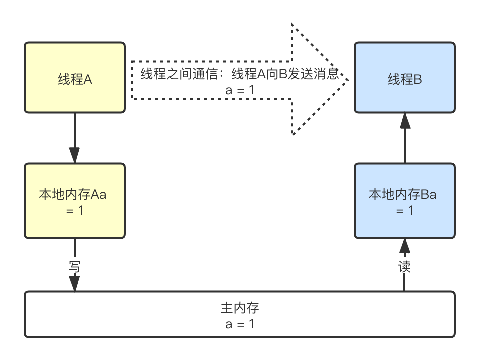
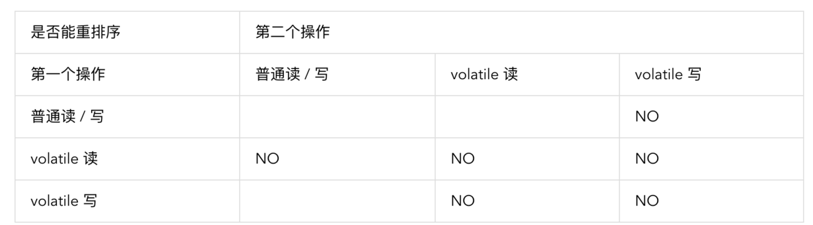
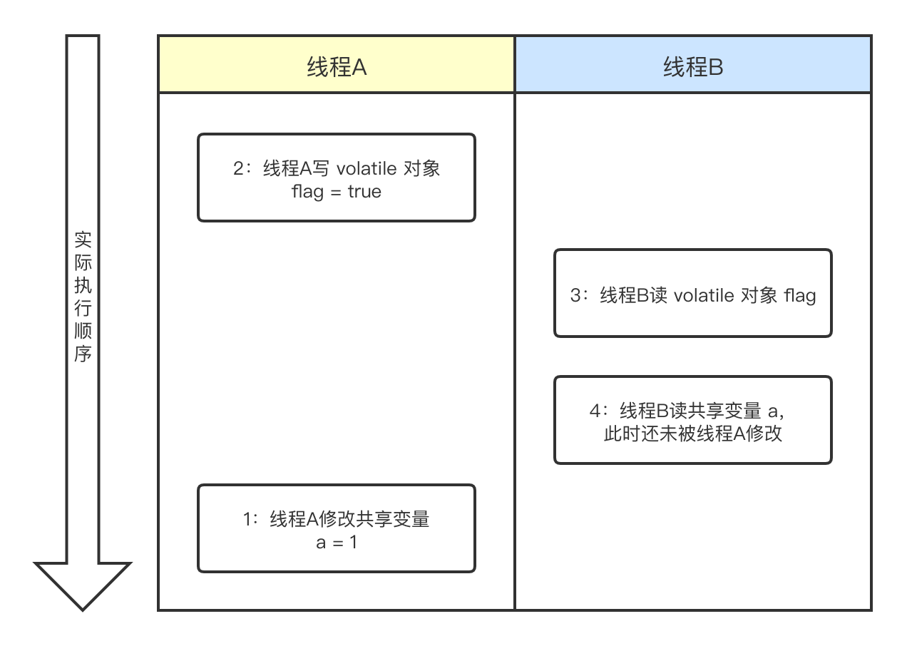

Java内存模型的理论定义在前几节已经表述清楚，下面举例来讲Java是怎样通过一些关键字和逻辑来实现内存模型的。

### 2.3.1 volatile

#### 2.3.1.1 volatile自身的特性：

- 可见性：对一个volatile变量的读，总是能看到任意线程对这个volatile变量最后的写入；
- 原子性：对任意单个volatile变量的读写具有原子性，但是对类似于volatile++这种复合操作不具有原子性；

#### 2.3.1.2 volatile 读写的内存语义

volatile 读/写 建立的 happens-before 关系与锁的 获取-释放 有相同的内存语义。

- volatile读的内存语义：当读一个volatile变量时，JMM会把该线程对应的本地内存置为无效，线程接下来从主内存中读取共享变量。
- volatile写的内存语义：当写一个volatile变量时，JMM会把该线程对应的本地内存中的共享变量值刷新到主内存。
- 线程A volatile 写一个变量可以看做线程A向接下来将要读这个volatile变量的某个线程发出了消息，线程B volatile 读一个变量可以看做线程B接收了之前某个线程发出的消息。整个过程可以看做线程A通过主内存向线程B发送消息。
  

#### 2.3.1.3 volatile内存语义的实现

为了实现 volatile 内存语义，JMM 会分别限制编译器重排序和处理器重排序。下面是 JMM 针对编译器制定的 volatile 重排序规则表：

为了实现这个规则，编译器在生成字节码时，会在指令序列中插入内存屏障来禁止特定类型的处理器重排序。对于编译器来说，发现一个最优布置来最小化插入屏障的总数几乎不可能，为此，JMM 采取保守策略。下面是基于保守策略的 JMM 内存屏障插入策略：

- 在每个 volatile 写操作的前面插入一个 StoreStore 屏障。
- 在每个 volatile 写操作的后面插入一个 StoreLoad 屏障。
- 在每个 volatile 读操作的后面插入一个 LoadLoad 屏障。
- 在每个 volatile 读操作的后面插入一个 LoadStore 屏障。

上述内存屏障插入策略非常保守，但它可以保证在任意处理器平台，任意的程序中都能得到正确的 volatile 内存语义。

当然，在实际执行时，只要不改变 volatile 写 - 读的内存语义，编译器可以根据具体情况省略不必要的屏障。由于不同的处理器有不同“松紧度”的处理器内存模型，内存屏障的插入还可以根据具体的处理器内存模型继续优化。如x86 处理器仅会对写 - 读操作做重排序。X86 不会对读 - 读，读 - 写和写 - 写操作做重排序，因此在 x86 处理器中会省略掉这三种操作类型对应的内存屏障。

#### 2.3.1.4 JSR-133对volatile内存语义的增强

在 JSR-133 之前的旧 Java 内存模型中，虽然不允许 volatile 变量之间重排序，但旧的 Java 内存模型允许 volatile 变量与普通变量之间重排序。例如：

```
class VolatileExample {
    int a = 0;
    volatile boolean flag = false;

    public void writer() {
        a = 1;                     //1
        flag = true;               //2
    }

    public void reader() {
        if (flag) {                //3
            int i =  a;            //4
            ……
        }
    }
}
```



由于 1 和 2 之间没有数据依赖关系，1 和 2 之间可能被重排序（3 和 4 类似）。其结果就是：读线程 B 执行 4 时，不一定能看到写线程 A 在执行 1 时对共享变量的修改。

为了提供一种比监视器锁更轻量级的线程之间通信的机制，JSR-133 专家组决定增强 volatile 的内存语义：严格限制编译器和处理器对 volatile 变量与普通变量的重排序，确保 volatile 的写 - 读和监视器的释放 - 获取一样，具有相同的内存语义。从编译器重排序规则和处理器内存屏障插入策略来看，只要 volatile 变量与普通变量之间的重排序可能会破坏 volatile 的内存语意，这种重排序就会被编译器重排序规则和处理器内存屏障插入策略禁止。

### 2.3.2 锁

### 2.3.2.1 锁的内存语义

- 当线程释放锁时，JMM 会把该线程对应的本地内存中的共享变量刷新到主内存中。
- 当线程获取锁时，JMM 会把该线程对应的本地内存置为无效。从而使得被监视器保护的临界区代码必须要从主内存中去读取共享变量。

对比锁释放 - 获取的内存语义与 volatile 写 - 读的内存语义，可以看出：锁释放与 volatile 写有相同的内存语义；锁获取与 volatile 读有相同的内存语义。线程 A 释放一个锁，实质上是线程 A 向接下来将要获取这个锁的某个线程发出了（线程 A 对共享变量所做修改的）消息。线程 B 获取一个锁，实质上是线程 B 接收了之前某个线程发出的（在释放这个锁之前对共享变量所做修改的）消息。线程 A 释放锁，随后线程 B 获取这个锁，这个过程实质上是线程 A 通过主内存向线程 B 发送消息。

### 2.3.2.2 锁的内存语义的实现

- 利用volatile变量的读写所具有的内存语义；
- 利用CAS附带的volatile读写所具有的内存语义；

### 2.3.3 final

### 2.3.3.1 JMM 赋予 final 的重排序规则

对于 final 域，编译器和处理器要遵守三个重排序规则：

- 在构造函数内对一个 final 域的写入，与随后把这个被构造对象的引用赋值给一个引用变量，这两个操作之间不能重排序；
- 读 final 域的重排序规则：初次读一个包含 final 域的对象的引用，与随后初次读这个 final 域，这两个操作之间不能重排序；
- 对于引用类型，写 final 域的重排序规则对编译器和处理器增加了约束：在构造函数内对一个 final 引用的对象的成员域的写入，与随后在构造函数外把这个被构造对象的引用赋值给一个引用变量，这两个操作之间不能重排序。

### 2.3.3.2 JMM 赋予 final 的重排序规则的意义

- 写 final 域的重排序规则可以确保：在对象引用为任意线程可见之前，对象的 final 域已经被正确初始化过了，而普通域不具有这个保障。
- 读 final 域的重排序规则可以确保：在读一个对象的 final 域之前，一定会先读包含这个 final 域的对象的引用。如果该引用不为 null，那么引用对象的 final 域一定已经被线程初始化过了。

### 2.3.3.3 JMM 赋予 final 的重排序规则的实现

- 写 final 域的重排序规则会要求译编器在 final 域的写之后，构造函数 return 之前，插入一个 StoreStore 障屏；
- 读 final 域的重排序规则要求编译器在读 final 域的操作前面插入一个 LoadLoad 屏障。

> 特别地，由于 x86 处理器不会对写 - 写操作做重排序，所以在 x86 处理器中，写 final 域需要的 StoreStore 障屏会被省略掉。同样，由于 x86 处理器不会对存在间接依赖关系的操作做重排序，所以在 x86 处理器中，读 final 域需要的 LoadLoad 屏障也会被省略掉。也就是说在 x86 处理器中，final 域的读 / 写不会插入任何内存屏障。

#### 2.3.3.4 JSR-133对 final 语义的增强

在旧的 Java 内存模型中 ，最严重的一个缺陷就是线程可能看到 final 域的值会改变。比如，一个线程当前看到一个整形 final 域的值为 0（还未初始化之前的默认值），过一段时间之后这个线程再去读这个 final 域的值时，却发现值变为了 1（被某个线程初始化之后的值）。最常见的例子就是在旧的 Java 内存模型中，String 的值可能会改变。

为了修补这个漏洞，JSR-133 专家组增强了 final 的语义。通过为 final 域增加写和读重排序规则，可以为 java 程序员提供初始化安全保证：只要对象是正确构造的（被构造对象的引用在构造函数中没有“逸出”），那么不需要使用同步（指 lock 和 volatile 的使用），就可以保证任意线程都能看到这个 final 域在构造函数中被初始化之后的值。